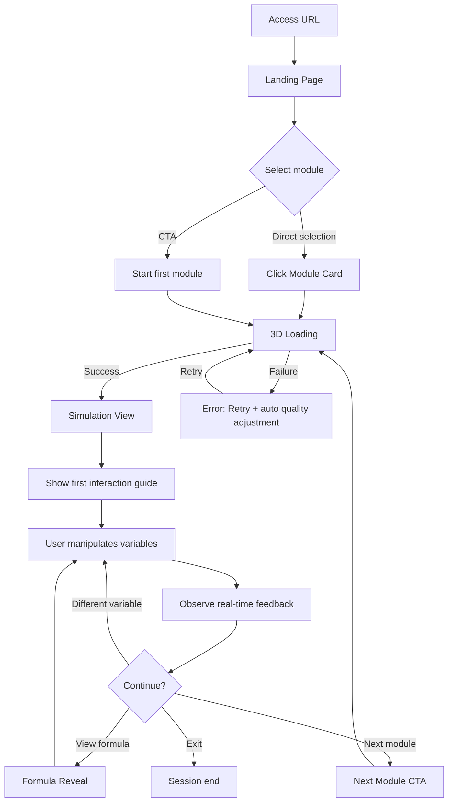
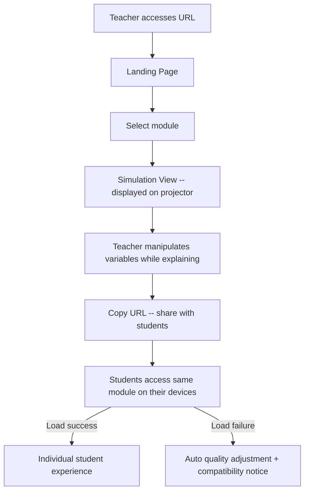
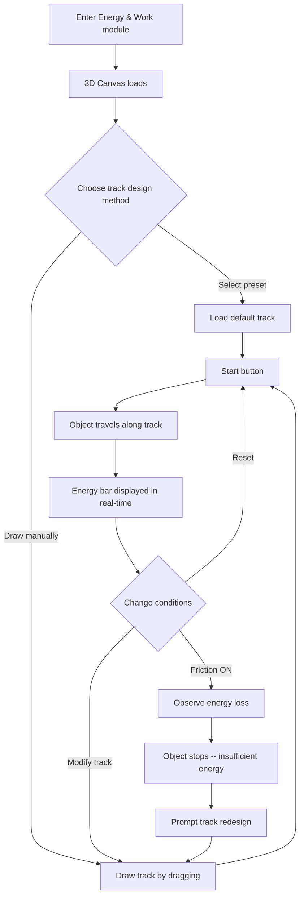

# PhysPlay -- UX Design

**Status:** Draft
**Last Updated:** 2026-03-02
**Input:** [PRD](./prd.md) | [Phase 1 PRD](./prd-phase-1.md) | [Product Brief](./product-brief.md) | [Client Structure](./client-structure.md)

---

## 1. Context

### 1.1 User Goal (JTBD)

**Primary:**

> "I want to understand what the concepts I learned in science class actually mean -- not through equations, but by touching and feeling them with my own hands."

**Supporting JTBD:**

> "I need a teaching aid that lets students directly manipulate variables and observe physics laws during class. It must work by simply sharing a URL -- no installation or cost." (Teacher)

> "To read quantum computing papers, I need quantum mechanics fundamentals, but the textbook is too steep for self-study. I want to build intuition by manipulating things in 3D." (Adult Learner)

### 1.2 User Context

| Aspect | Description |
|--------|-------------|
| Device | Mobile (smartphone) 50%+, Desktop/Laptop 30%, Tablet 15%, XR 5% |
| Environment | School study hall, home desk, on-the-go (mobile), classroom projector (teacher) |
| Mental State | Curiosity + slight anxiety (science = hard preconception), exploratory, time-limited during class |
| Time Pressure | Free exploration: none. Classroom use: must complete demo within 50-min class |
| Network | School Wi-Fi (potentially unstable), home broadband, mobile data (3G-LTE) |

### 1.3 Proto-Personas

```
Name:         Minjun (16, 10th grade)
Role:         Student -- weak in math but curious about science
Goal:         Understand science concepts without equations
Context:      Access via smartphone during study hall, explore on laptop at home
Frustrations: Loses interest when equations come first, "it's just math after all" frustration
Tech comfort: Medium-High (mobile native, gaming experience)
```

```
Name:         Mr. Park (35, physics teacher)
Role:         Teacher -- needs visual teaching aids for class
Goal:         A tool that students can experience instantly during class
Context:      Classroom projector + individual student devices
Frustrations: Limitations of 2D materials, cost/complexity of installable tools
Tech comfort: Medium (basic web usage, avoids complex setup)
```

---

## 2. Information Architecture

### 2.1 Navigation Pattern

**Choice: Flat Hub + Stack Navigation (Drill-Down)**

- Rationale: PhysPlay has a clear content hierarchy (Track > Module > Simulation), and core content is reachable within 2 levels max. Top-level sections are 3-4, which don't suit a Tab Bar (need to maximize 3D view space on mobile); a Hub page with branching structure is more appropriate. [Hick's Law] Minimize choices while showing the full vision.
- Core content reachable within 3 levels: Landing(1) > Module selection(2) > Simulation(3). In practice, direct module entry from Landing is possible, making it 2 levels.

### 2.2 Sitemap

```
[PhysPlay]
|
+-- / (Landing Page) [Phase 1]
|   |-- Hero: Interactive 3D demo
|   |-- Module Cards (Phase 1: 3, Phase 2+: expanded)
|   |-- Track Overview (Coming Soon) [Phase 1 P1]
|   +-- CTA: Start first module
|
+-- /tracks [Phase 1 P1]
|   |-- Track 1: Classical Physics [Phase 1]
|   |   |-- 1-1 Motion & Force [Phase 1]
|   |   |-- 1-2 Energy & Work [Phase 1]
|   |   |-- 1-3 Waves [Phase 1]
|   |   |-- 1-4 Sound & Light [Phase 2]
|   |   |-- 1-5 Electricity & Magnetism [Phase 2]
|   |   +-- 1-6 Electromagnetic Waves [Phase 2]
|   |-- Track 2: Chemistry [Phase 3]
|   |-- Track 3: Space Science [Phase 4]
|   +-- Track 4: Quantum Mechanics [Phase 5]
|
+-- /module/:trackId/:moduleId (Simulation View) [Phase 1]
|   |-- 3D Canvas (full screen)
|   |-- HUD Layer (overlay)
|   |   |-- Control Panel (sliders, toggles)
|   |   |-- Playback Controls (play/pause/reset)
|   |   |-- Physics Overlay Toggle
|   |   |-- Module Info (learning objectives) [Phase 1 P1]
|   |   +-- Formula Reveal [Phase 1 P1]
|   +-- Next Module CTA
|
+-- /paths (Recommended Learning Paths) [Phase 3+]
|   |-- Curiosity-first
|   |-- Foundations-first
|   +-- Highlights
|
+-- /dashboard (Teacher Dashboard) [Phase 3+]
|   |-- Class management
|   |-- Learning progress
|   +-- Custom path configuration
|
+-- /account [Phase 3+]
|   |-- Profile
|   |-- Learning history
|   +-- Settings
|
+-- (Utility -- Footer/Header)
    |-- Language toggle (ko/en) [Phase 1]
    |-- Theme toggle (light/dark) [Phase 1 P1]
    +-- About / Contact
```

### 2.3 URL Structure

```
/                              Landing
/tracks                        Track Overview (all tracks at a glance)
/tracks/classical-physics      Track 1 detail
/module/1/1                    Module 1-1: Motion & Force
/module/1/2                    Module 1-2: Energy & Work
/module/1/3                    Module 1-3: Waves
/paths                         Recommended Learning Paths [Phase 3+]
/dashboard                     Teacher Dashboard [Phase 3+]
```

- Rationale: The `/module/:trackId/:moduleId` structure makes it easy for teachers to copy and share URLs with students (REQ-026), and deep linking feels natural. [Front Doors Principle] Users must be able to identify their current location and navigation from any URL.

### 2.4 Cross-linking Strategy

- After module completion, recommend "Next module" (within the same track)
- After module completion, recommend "Related module" (cross-track linking) [Phase 2+]
  - Example: After Waves (1-3) -> "Try the double-slit experiment in Quantum Mechanics" (4-2)
- On Landing revisit, recommend previously experienced module based on sessionStorage [Phase 1]
- Breadcrumb at top of every Simulation View showing Track/Module location

---

## 3. Core User Flows

### 3.1 Flow A: Student's First Visit [Phase 1]



**Screen-by-screen:**

1. **Landing Page** -- Select from 3 module cards (Phase 1 has 3 modules only)
2. **3D Loading** -- Progress bar + loading tips (estimated 1-3 seconds)
3. **Simulation View** -- 3D Canvas + HUD overlay
4. **First interaction guide** -- Contextual tooltip, shown only on first visit (auto-hides after one display)
5. **Next Module CTA** -- Next module card within or below the simulation

**Drop-off risks & mitigations:**

| Point | Risk | Mitigation |
|-------|------|------------|
| Step 2 (Loading) | Drop-off if 3D loading is slow | Skeleton + progress bar + loading tip text. [Doherty Threshold] |
| Step 3 (First entry) | Drop-off if user doesn't know what to do | Contextual first-action guide. "Try moving this slider" [Cognitive Load] |
| Step 5 (Module complete) | Drop-off if nothing to do next | Next module recommendation + related module card [Goal Gradient] |

### 3.2 Flow B: Teacher's Classroom Use [Phase 1]



**Key design decisions:**

- URL sharing is critical, so a URL copy button is exposed within Simulation View (share icon). [Fitts's Law] Frequently used actions should be in accessible locations.
- Projector mode: A "Presentation mode" toggle on desktop Simulation View that minimizes the HUD [Phase 1 P1]. Maximizes the 3D scene display.

### 3.3 Flow C: Roller Coaster Design Experience [Phase 1]



**Key design decisions:**

- If the track-drawing UX isn't intuitive, it causes critical drop-off (PRD Risk). Mitigations:
  - **Provide 3 preset tracks** (basic loop, S-curve, big hill) -- instant start [Hick's Law: provide defaults]
  - **Allow modification on top of presets** -- drag handles to move control points
  - **Drawing from blank canvas** separated as an "advanced" option
- Energy bar (kinetic energy: blue, potential energy: red) attached to the object (head-up) to minimize gaze shifting [Cognitive Load]
- Friction ON/OFF toggle placed near the energy bar -- visual connection of cause and effect [Proximity Principle]

---

## 4. Page/Screen Designs

### 4.1 Landing Page [Phase 1]

**Route:** `/`
**Primary Action:** Start first module (ONE)

#### Content Hierarchy

1. **Hero area** -- Interactive 3D mini demo (throw an object or wave synthesis)
   - Purpose: Convey the core value of "hands-on education" through experience, not words
   - Rationale: [Aesthetic-Usability Effect] Show 3D interaction quality at first impression. Immediately feel that it's about "touching", not "watching"
   - Anti-pattern warning: Do not explain value with marketing copy. The 3D demo itself is the proof of value
   - One line below the demo: "Touch science, feel it" (en) / "Touch science, feel it" (ko)
2. **Module Cards** -- 3 module cards (Phase 1)
   - Each card: Module thumbnail (3D preview still), module name, one-line description
   - CTA: "Start exploring" (specific verb) [UX Writing: specific verb rule]
3. **Track Overview** -- Overview of all 4 tracks [Phase 1 P1]
   - Modules outside Phase 1 shown as "Coming Soon" + email notification signup
   - Rationale: [Zeigarnik Effect] Showing incomplete content creates revisit motivation
4. **Footer** -- Language toggle, About, Contact

#### ASCII Wireframe -- Landing (Desktop)

```
+------------------------------------------------------------------+
| [PhysPlay Logo]                              [ko/en] [Light/Dark] |
+------------------------------------------------------------------+
|                                                                    |
|   +------------------------------------------------------------+  |
|   |                                                            |  |
|   |           [Interactive 3D Mini Demo]                       |  |
|   |           (drag to rotate, click to throw)                 |  |
|   |                                                            |  |
|   +------------------------------------------------------------+  |
|                                                                    |
|   Touch science, feel it                                           |
|                                                                    |
|   +------------------+ +------------------+ +------------------+  |
|   | [3D Preview]     | | [3D Preview]     | | [3D Preview]     |  |
|   |                  | |                  | |                  |  |
|   | Motion & Force   | | Energy & Work    | | Waves            |  |
|   | Throw objects    | | Design a roller  | | Create waves and |  |
|   | and feel forces  | | coaster          | | observe          |  |
|   |                  | |                  | | interference     |  |
|   | [Start exploring]| | [Start exploring]| | [Start exploring]|  |
|   +------------------+ +------------------+ +------------------+  |
|                                                                    |
|   --- More science experiences coming soon ---                     |
|                                                                    |
|   +--------+ +--------+ +--------+ +--------+                    |
|   |Classical| |Chem-   | |Space   | |Quantum |                    |
|   |Physics  | |istry   | |Science | |Mech.   |                    |
|   |3/6      | |Coming  | |Coming  | |Coming  |                    |
|   |         | |Soon    | |Soon    | |Soon    |                    |
|   +--------+ +--------+ +--------+ +--------+                    |
|                                                                    |
+------------------------------------------------------------------+
| Language: ko | en     |     About     |     Contact               |
+------------------------------------------------------------------+
```

#### ASCII Wireframe -- Landing (Mobile)

```
+-----------------------------+
| [Logo]        [ko/en] [  ] |
+-----------------------------+
|                             |
| +-------------------------+ |
| |                         | |
| |   [3D Mini Demo]       | |
| |   (touch to interact)  | |
| |                         | |
| +-------------------------+ |
|                             |
| Touch science, feel it      |
|                             |
| +-------------------------+ |
| | [3D Preview]            | |
| | Motion & Force          | |
| | Throw objects and       | |
| | feel forces             | |
| | [Start exploring]       | |
| +-------------------------+ |
|                             |
| +-------------------------+ |
| | [3D Preview]            | |
| | Energy & Work           | |
| | Design a roller coaster | |
| | [Start exploring]       | |
| +-------------------------+ |
|                             |
| +-------------------------+ |
| | [3D Preview]            | |
| | Waves                   | |
| | Create waves and        | |
| | observe interference    | |
| | [Start exploring]       | |
| +-------------------------+ |
|                             |
| --- More coming soon ---    |
|                             |
| [Classical] [Chemistry]     |
| [Space Sci] [Quantum]       |
|    (Coming Soon)            |
|                             |
+-----------------------------+
```

#### States

| State | Design |
|-------|--------|
| Empty | N/A -- Landing always has content |
| Loading | Page structure renders immediately + skeleton shimmer in 3D mini demo area. Skeleton on module card images |
| Loaded | Wireframe as above |
| Error | 3D mini demo load failure: replaced with static screenshot + module cards display normally. "Could not load 3D preview" inline message |
| Partial | Some module cards only loaded: show loaded ones first, skeleton for the rest |
| Refreshing | N/A -- static content |
| Offline | Display cached Landing + top banner "You are offline. Internet connection is required to run simulations." |

### 4.2 Simulation View [Phase 1]

**Route:** `/module/:trackId/:moduleId`
**Primary Action:** Variable manipulation (slider/toggle/drag)

This screen is the core of PhysPlay. Users spend most of their time here.

#### Screen Structure

The 3D Canvas occupies the full screen, with a HUD (Head-Up Display) overlaid on top. The key challenge is maximizing 3D scene immersion while providing controls without obstruction.

#### ASCII Wireframe -- Simulation View (Desktop)

```
+------------------------------------------------------------------+
| [< Back]   Motion & Force                  [Share] [?] [ko/en] [Settings] |
+------------------------------------------------------------------+
|                                                                    |
|                                                                    |
|                                                                    |
|         [        3D Canvas (full screen)        ]                  |
|                                                                    |
|     +-- Physics Overlay (when toggled) --+                         |
|     |  --> Velocity vector                |                         |
|     |  --> Acceleration vector            |                         |
|     +------------------------------------+                         |
|                                                                    |
|                                                                    |
|                                                                    |
+-----+----------------------------------------------------+--------+
      |                                                    |
      |  Control Panel (collapsible)                       |
      |                                                    |
      |  Force magnitude  [======O==========] 50 N        |
      |  Friction coeff.  [===O==============] 0.3        |
      |  Mass             [==========O======] 5 kg        |
      |                                                    |
      |  Gravity env.    [Earth] [Moon] [Zero-G]          |
      |  Friction         [ON / OFF]                      |
      |  Show vectors     [ON / OFF]                      |
      |                                                    |
      +----------------------------------------------------+
      |  [|<]  [>||]  [>|]        [Show formula]          |
      |  Reset  Play   Next module                         |
      +----------------------------------------------------+
```

#### ASCII Wireframe -- Simulation View (Mobile)

```
+-----------------------------+
| [<]  Motion & Force  [?] [..]|
+-----------------------------+
|                             |
|                             |
|    [3D Canvas]              |
|    (full screen)            |
|                             |
|    [Physics Overlay]        |
|                             |
|                             |
|                             |
+-----------------------------+
| [|<] [>||]  [Vectors] [Formula]|
+-----------------------------+
| Force [======O======] 50 N |
| Fric. [===O=========] 0.3  |
|                             |
| Gravity: [Earth][Moon][Zero-G]|
| Friction: [ON/OFF]         |
+-----------------------------+
```

#### HUD Layout Detail

The HUD consists of 5 areas:

**A. Top Bar (Navigation + Utility)**

- Left: Back button (to Landing or Track Overview)
- Center: Module name
- Right: Share button, Help (?), Language toggle, Settings (more)
- Semi-transparent background -- visually separates from 3D scene while maintaining immersion
- Rationale: [Front Doors Principle] Users can identify their current location from anywhere

**B. Control Panel (Sliders + Toggles)**

- Desktop: Fixed panel on right side or bottom (collapse/expand supported)
- Mobile: Bottom panel (Bottom Sheet form, shrink/expand supported)
- When collapsed, 3D scene expands to full screen
- Each slider displays label + current value + unit
- Rationale: [Cognitive Load] Show only what's needed, but always display current values to eliminate recall burden

**C. Playback Controls**

- Reset / Play (Pause) / Next Module
- Desktop: Integrated at bottom of Control Panel
- Mobile: Fixed bar between 3D Canvas and Control Panel
- Rationale: [Fitts's Law] Frequently used play/pause should be in easily accessible locations

**D. Physics Overlay Controls**

- ON/OFF toggles for vector display, energy bar, probability distribution, etc.
- Desktop: Toggle group within Control Panel
- Mobile: Integrated as icon toggles in playback bar
- Rationale: [Progressive Disclosure] Default OFF, users activate when needed

**E. Module Info / Formula Reveal [Phase 1 P1]**

- Learning objectives: Displayed as overlay for 3 seconds on module entry, then auto-hides. Tap to reopen
- Show formula: Bottom Sheet shows related formulas and laws on button click
- Formulas hidden by default -- optional verification after hands-on experience (REQ-004a)
- Rationale: "Interaction -> Intuition -> Formula" reverse learning design. Showing formulas first is the cause of Minjun's drop-off

#### Control Panel -- Per-Module Configuration

**Module 1-1: Motion & Force**

| Control | Type | Range | Default |
|---------|------|-------|---------|
| Force magnitude | Slider | 0-200 N | 50 N |
| Force direction | 3D drag (arrow) | 360 | Horizontal right |
| Friction coefficient | Slider | 0-1.0 | 0.3 |
| Mass | Slider | 0.1-100 kg | 5 kg |
| Gravity environment | Segmented Control | Earth/Moon/Zero-G | Earth |
| Friction | Toggle | ON/OFF | ON |
| Air resistance [P1] | Toggle | ON/OFF | OFF |
| Velocity vector | Toggle | ON/OFF | OFF |
| Acceleration vector | Toggle | ON/OFF | OFF |

**Module 1-2: Energy & Work**

| Control | Type | Range | Default |
|---------|------|-------|---------|
| Track preset | Segmented Control | Basic loop/S-curve/Big hill/Draw custom | Basic loop |
| Friction | Toggle | ON/OFF | OFF |
| Starting height | Slider (or drag) | 1-20 m | 10 m |
| Energy bar display | Toggle | ON/OFF | ON (default on) |

**Module 1-3: Waves**

| Control | Type | Range | Default |
|---------|------|-------|---------|
| Amplitude | Slider | 0.1-5.0 | 1.0 |
| Wavelength | Slider | 0.5-10.0 | 3.0 |
| Dual source spacing | Slider | 1-20 | 5 |
| Number of sources | Segmented Control | 1/2 | 1 |
| Superposition mode | Toggle | ON/OFF | OFF |

#### States

| State | Design |
|-------|--------|
| Empty | N/A -- Simulation always starts in initial state |
| Loading | 3D loading screen: Progress bar (0-100%) + rotating loading tip text. Background is module theme color gradient. "Preparing your 3D experience..." |
| Loaded | Wireframe as above. Simulation in initial state. First-time interaction guide overlay on first visit |
| Error | 3D load failure: Full-screen error message. "Could not load the 3D scene. Please check if your browser supports WebGL." + [Try again] + [View other modules]. Shown only after auto quality adjustment also fails |
| Partial | 3D scene loaded but some assets (textures, etc.) missing: Auto-switch to lower quality replacement assets + "Some elements are displayed in lower quality" inline notice (toast, auto-hides after 3 seconds) |
| Refreshing | N/A -- real-time simulation, no refresh concept |
| Offline | When offline detected, simulation continues running (client-side). Analytics queued. Top banner "You are offline. You can continue the experience, but some features may be limited." |

### 4.3 Track Overview [Phase 1 P1]

**Route:** `/tracks`
**Primary Action:** Select a module and start exploring

#### Structure

Visual overview of 4 tracks. In Phase 1, only Track 1 is active; the rest are "Coming Soon".

#### ASCII Wireframe (Desktop)

```
+------------------------------------------------------------------+
| [< Home]   All Science Experiences                [ko/en] [Settings] |
+------------------------------------------------------------------+
|                                                                    |
|  Track 1: Classical Physics -- Force & Energy                      |
|  +------+ +------+ +------+ +------+ +------+ +------+           |
|  | 1-1  | | 1-2  | | 1-3  | | 1-4  | | 1-5  | | 1-6  |         |
|  |Motion| |Energy| |Waves | |Sound | |Elec- | |EM    |           |
|  |&Force| |&Work | |      | |&Light| |trtic.| |Waves |           |
|  |      | |      | |      | |Coming| |Coming| |Coming|           |
|  |[Start]| |[Start]| |[Start]| |[Soon]| |[Soon]| |[Soon]|        |
|  +------+ +------+ +------+ +------+ +------+ +------+           |
|                                                                    |
|  Track 2: Chemistry -- World of Molecules           Coming Soon    |
|  +------+ +------+ +------+ +------+ +------+ +------+           |
|  | 2-1  | | 2-2  | | 2-3  | | 2-4  | | 2-5  | | 2-6  |         |
|  |      | |      | |      | |      | |      | |      |           |
|  +------+ +------+ +------+ +------+ +------+ +------+           |
|                                                                    |
|  Track 3: Space Science -- Space Exploration        Coming Soon    |
|  ...                                                               |
|                                                                    |
|  Track 4: Quantum Mechanics -- Quantum World        Coming Soon    |
|  ...                                                               |
|                                                                    |
+------------------------------------------------------------------+
```

#### States

| State | Design |
|-------|--------|
| Empty | N/A -- track structure always exists |
| Loading | Card skeleton shimmer |
| Loaded | Wireframe as above |
| Error | "Could not load track information. Please try again." + [Try again] |
| Offline | Display cached track structure + "Offline -- Internet connection is required to run simulations" |

---

## 5. Interaction Design

### 5.1 3D Interaction Patterns

#### Orbit / Zoom / Pan (REQ-006)

| Device | Orbit (Rotate) | Zoom | Pan |
|--------|----------------|------|-----|
| Desktop | Left-click + drag | Scroll wheel | Right-click + drag |
| Mobile | One-finger drag | Pinch | Two-finger drag |
| Tablet | One-finger drag | Pinch | Two-finger drag |

- Rationale: [Jakob's Law] Standard gestures for Three.js OrbitControls. Patterns expected by 3D app (CAD, game) users
- Constraint: Min/max zoom range set to prevent escaping the scene
- Smooth deceleration (rubber-band) when reaching min distance on zoom. Not an abrupt stop
- [prefers-reduced-motion] Disable orbit inertia

#### Slider Interaction (REQ-007)

| Property | Spec |
|----------|------|
| Touch area | Handle 48x48px, track 40px touch area height (visual track height is 8px) |
| Feedback | Value displayed in real-time above handle during drag + simulation reflects within <100ms |
| Step | Continuous. Snap option at meaningful units (e.g., 1N increments) |
| Keyboard | Operable via Arrow keys (accessibility). Step = 1% of full range |
| Label | Variable name on left, current value + unit on right. Always visible |
| Haptic | Light haptic on handle grab on mobile, light haptic at snap points |

- Rationale: [Fitts's Law] 48px touch area ensures accurate manipulation on mobile. [Doherty Threshold] <100ms feedback maintains real-time feel

#### Toggle Interaction (REQ-008)

| Property | Spec |
|----------|------|
| Size | 52x32px (touch area 52x48px) |
| Transition | Instant toggle on tap. Toggle slide animation 150ms |
| State display | ON: filled color + label change. OFF: inactive color. Triple indication via color + position + text |
| Feedback | Simulation reflects immediately on toggle + light haptic (mobile) |
| Accessibility | `role="switch"`, `aria-checked`, explicit label |

- Rationale: [Von Restorff] ON/OFF states are visually distinct. Accessibility ensured through position + text, not just color

#### Object Drag & Throw (REQ-009)

| Property | Spec |
|----------|------|
| Grab | 0.1-second hold after touch/click activates grab. Cursor changes (grab -> grabbing) |
| Drag | Object follows pointer. Physics laws (gravity, collision) applied in real-time |
| Throw | Quick drag then release while grabbed. Velocity vector at release point is applied to object |
| Feedback | Grab: object highlight (outline glow). Drag: trajectory trail (faint line). Throw: velocity arrow briefly displayed |
| Constraint | Manipulation only within scene bounds. Soft repulsion at boundary |
| Mobile | One-finger drag may conflict with orbit -> Start on object = drag, start on empty space = orbit |

- Rationale: Object vs. empty space distinction is determined by raycast. This is the standard pattern for mobile 3D interaction [Jakob's Law]

#### Segmented Control (Gravity Environment Toggle, etc.)

| Property | Spec |
|----------|------|
| Size | Each segment minimum 44px height |
| Transition | Instant toggle on tap. Selection indicator slide animation 200ms |
| State | Selected: filled background. Unselected: text only |
| Feedback | Simulation reflects immediately on switch (object position/velocity retained, only gravity changes) |
| Accessibility | `role="radiogroup"`, Arrow keys to move selection |

### 5.2 First-time Interaction Guidance

**Principle:** "If the UI is self-evident, no guide is needed. 3D interaction is not self-evident, so provide minimal contextual guidance" [Onboarding: Contextual > Sequential]

**Implementation:**

1. **First visit only** (controlled by sessionStorage flag)
2. **Contextual tooltip** -- Only for the single most important interaction after simulation load
3. **One at a time** -- Never display multiple guides simultaneously [Cognitive Load]
4. **Auto-dismiss when user performs the interaction** -- No separate "OK" button needed
5. **"Skip" always visible** -- Guide can be ignored

**Per-module first guide:**

| Module | Guide content | Target element |
|--------|--------------|----------------|
| 1-1 Motion & Force | "Try moving the slider to change the force" | Force magnitude slider |
| 1-2 Energy & Work | "Select a track and press the start button" | Track preset + start button |
| 1-3 Waves | "Try moving the amplitude slider to change wave size" | Amplitude slider |

**Tooltip design:**

```
+-----------------------------------+
|  -> [Slider Handle]               |
|                                   |
|  +-----------------------------+  |
|  | Try moving the slider to    |  |
|  | change the force            |  |
|  |                      [Skip] |  |
|  +-----------------------------+  |
```

- Arrow points to target element
- Background dimming (slightly darken the rest of the 3D scene) -- focus guidance
- If user hasn't interacted after 3 seconds, tooltip gently pulses (attention prompt)
- Rationale: [Von Restorff] Visually isolate the guide target to increase noticeability

### 5.3 3D Scene Navigation Aids

**Reset viewpoint button:**
- Button to return to initial viewpoint when lost after rotating/zooming the 3D scene
- Location: Small icon at bottom-left of 3D Canvas (home icon or cube icon)
- Behavior: 0.5-second ease-in-out transition back to initial camera position/orientation on tap
- Rationale: [Forgiveness] Getting lost in 3D scenes is a common error. Immediate recovery must be possible

**Zoom controls:**
- Pinch zoom may not be obvious on mobile
- +/- buttons at bottom-left of 3D Canvas (optional -- visible alternative to pinch)
- Rationale: [Gesture Design Rules] Gestures are invisible, so always provide a visible alternative

---

## 6. Responsive Strategy

### 6.1 Breakpoint Definitions

| Breakpoint | Width | Layout |
|-----------|-------|--------|
| Mobile | 320-767px | Single column. HUD bottom panel. 3D Canvas top 70% |
| Tablet | 768-1023px | Extended single column. HUD bottom panel expanded. 3D Canvas top 75% |
| Desktop | 1024px+ | 3D Canvas full screen. HUD right side panel or bottom panel |

### 6.2 2D Pages (site/) -- Landing, Track Overview

| Element | Mobile | Tablet | Desktop |
|---------|--------|--------|---------|
| Module Cards | Vertical stack (1 column) | 2-column grid | 3-column grid |
| Track Overview | 2-column grid | 4-column single row | 4-column single row |
| Hero 3D demo | Height 250px, touch interaction | Height 350px | Height 450px |
| Navigation | Simplified (logo + icons) | Logo + text menu | Full navigation bar |
| Content max-width | 100% - 16px padding each side | 100% - 24px | 1200px centered |
| Font size (body) | 16px | 16px | 16px |
| Card spacing | 16px | 20px | 24px |

### 6.3 3D Experience (experience/) -- Simulation View

This is the most challenging part. The 3D Canvas must be as wide as possible, while HUD controls must be accessible without obscuring the 3D scene.

**Desktop (1024px+):**

```
+---------------------------------------------+---------+
|                                             | Control |
|                                             | Panel   |
|              3D Canvas                      |         |
|              (left ~75%)                    | Sliders |
|                                             | Toggles |
|                                             |         |
+---------------------------------------------+---------+
|  [|<] [>||] [>|]  [Vectors] [Energy bar] [Formula] | [Collapse] |
+---------------------------------------------+---------+
```

- Control Panel is a right side panel (width 300-360px)
- Collapse button to switch to 3D full screen
- Playback controls integrated in bottom bar

**Tablet (768-1023px):**

```
+----------------------------------+
|                                  |
|         3D Canvas                |
|         (top ~65%)               |
|                                  |
+----------------------------------+
| [|<] [>||] [>|]  [Vectors] [Formula] |
+----------------------------------+
| Control Panel (bottom, scrollable) |
| Sliders / Toggles                |
+----------------------------------+
```

- Control Panel is a bottom panel (height ~35%)
- Swipe up to expand, swipe down to collapse

**Mobile (320-767px):**

```
+-----------------------------+
| [<] Module name    [?] [..] |
+-----------------------------+
|                             |
|        3D Canvas            |
|        (top ~55-60%)        |
|                             |
+-----------------------------+
| [|<] [>||]  [Vectors] [Formula] |
+-----------------------------+
| Force [======O======] 50N  |
| Fric. [===O=========] 0.3  |
| Gravity: [Earth][Moon][Zero-G] |
+-----------------------------+
```

- Control Panel is a fixed bottom panel (~40%)
- Drag handle at top of panel for shrink/expand
- When minimized, only first slider visible; rest require scrolling
- At maximum minimization, only playback bar remains -> 3D Canvas maximized
- Rationale: [Thumb Zone] Controls at bottom enable one-handed operation. [Fitts's Law] Frequently manipulated sliders within thumb reach

**Mobile 3D Canvas interaction vs. HUD scroll conflict prevention:**

- Control Panel area: Vertical scroll consumed by panel scroll
- 3D Canvas area: Touch events consumed by 3D orbit/drag
- Boundary marked by clear visual divider + drag handle
- Rationale: Touch event conflict is the most common UX issue in 3D web apps. Area separation is the only solution

### 6.4 Performance-Responsive Adaptation

UX guidelines for implementing REQ-017 (auto quality adjustment):

| Performance Level | Detection Criteria | Auto Adjustment | User Notice |
|-------------------|-------------------|-----------------|-------------|
| High | GPU Tier 3+, WebGPU support | Max quality: high-res textures, shadows, post-processing | None |
| Medium | GPU Tier 2, WebGL 2 | Medium quality: reduced textures, simplified shadows | None (auto-switch, no notification needed) |
| Low | GPU Tier 1, WebGL 1 | Min quality: basic textures, no shadows, no post-processing | "Quality has been adjusted for optimal performance" (toast, first time only) |
| Unsupported | No WebGL support | Not possible | Error screen: "Your browser does not support 3D. Please use Chrome, Edge, or Safari." |

- Rationale: Auto quality adjustment is best when users don't notice it [Doherty Threshold]. Even in low-quality mode, core interactions (sliders, toggles, drag) must function 100%

---

## 7. HUD Design Detail

### 7.1 HUD Visual Design Principles

1. **Semi-transparent** -- Overlaid on 3D scene without obscuring it. Background blur + semi-transparent
2. **Minimal area** -- Control area within 40% of screen (desktop), 45% (mobile)
3. **Collapsible** -- All panels can collapse/expand. Collapse gives 3D full screen
4. **Consistent position** -- Same HUD layout across all modules [Jakob's Law]
5. **Light/Dark independent** -- HUD is 2D UI, so light/dark theme applies. 3D scene is fixed per module (REQ-021)

### 7.2 Control Panel Component Specs

**Slider:**

```
+------------------------------------------+
|  Force magnitude                    50 N  |
|  [============================O========]  |
|  0                                  200   |
+------------------------------------------+
```

- Label: Top-left
- Current value: Top-right (with unit)
- Track: Full width
- Handle: Circular, 24px visual size, 48px touch area
- Min/max display: Below track, left/right

**Toggle:**

```
+------------------------------------------+
|  Friction                    [===( O )]  |
+------------------------------------------+
```

- Label: Left
- Toggle: Right
- ON: Accent color, handle right
- OFF: Neutral color, handle left
- State text displayed alongside label (ON/OFF or "Show/Hide")

**Segmented Control:**

```
+------------------------------------------+
|  Gravity environment                      |
|  [ Earth ] [ Moon ] [ Zero-G ]           |
+------------------------------------------+
```

- Label: Top
- Segments: Equal width, selected item has filled background
- Minimum touch height: 44px

### 7.3 Playback Controls

```
  [|<]     [>||]     [>|]
  Reset    Play/Pause  Next Module

  Or horizontal (mobile space-saving):

  [|<] [>||]     [Vectors] [Energy bar] [Show formula]
```

- **Reset**: Return simulation to initial state. Reset all object positions/velocities. Slider/toggle values retained
  - Icon: Left arrow + vertical bar (rewind icon)
  - aria-label: "Reset simulation"
- **Play/Pause**: Start/stop simulation time progression
  - Icon: Play (triangle) / Pause (double vertical bar) toggle
  - Show pause icon while playing, and vice versa
  - aria-label: "Play" / "Pause"
- **Next Module**: Navigate to next module
  - Icon: Right arrow + vertical bar (fast-forward icon) or text "Next module"
  - If last module: "View all modules" or hidden

### 7.4 Physics Overlay System (REQ-013)

Physics overlay is physics quantity visualization drawn directly on the 3D scene.

**Vector overlay (Module 1-1):**

- Velocity vector: Blue arrow, originating from object center, length proportional to speed magnitude
- Acceleration vector: Red arrow, same origin point, length proportional to acceleration magnitude
- Vector magnitude value: Numeric label at arrow tip (e.g., "5.2 m/s")
- Triple distinction via color + label + direction (position) -> Distinguishable even for color-blind users

**Energy bar (Module 1-2):**

- Vertical bar graph next to object
- Kinetic energy (KE): Blue, filled from bottom
- Potential energy (PE): Red, filled from top
- Total: KE + PE = always constant (when friction OFF). When friction ON, heat energy shown in gray
- Numeric labels: Each energy value (in J)

**Interference pattern (Module 1-3):**

- Top-down view of ripple tank: Brightness (intensity) visualizes constructive/destructive interference
- Constructive interference: Bright bands
- Destructive interference: Dark bands
- Uses brightness (intensity) instead of color -> Meets accessibility by default

---

## 8. Onboarding & First-time UX

### 8.1 Strategy

**Principle:** "Delay onboarding as long as possible. Let users explore first, then guide contextually." [Onboarding Rules: Delay as long as possible]

PhysPlay has **no separate onboarding screen.** Instead:

1. **Landing Page itself is onboarding** -- Interactive 3D mini demo shows "hands-on education" through experience
2. **Contextual tooltip on first module entry** -- Only for one key interaction (see Section 5.2)
3. **Progressive discovery** -- Toggles, overlays, etc. are default OFF. Users discover when they're curious enough to tap [Progressive Disclosure]

### 8.2 Landing -> First Module Entry Path

```
Landing Page
  |
  |-- Hero 3D demo: Objects respond to touch/click
  |   (This alone conveys the value of "hands-on education")
  |
  |-- Module Cards: Click "Start exploring"
  |
  v
Simulation View
  |
  |-- 3D loading (progress bar + tip)
  |
  |-- Load complete: Initial state + Contextual tooltip
  |   "Try moving the slider to change the force"
  |
  |-- User manipulates slider -> tooltip auto-dismiss
  |
  |-- Free exploration thereafter (no additional guides)
```

### 8.3 Help (?) Button

- Tapping the (?) icon in Simulation View top bar opens a Bottom Sheet with the module's interaction guide
- Content: Brief description of each control's role + 3D manipulation instructions (rotate/zoom/pan)
- Always accessible -- for users who missed the first-visit tooltip or want to check later
- Rationale: [Multiple Classification] Multiple access paths to the same information

### 8.4 Returning Users [Phase 1]

- Store last experienced module ID in sessionStorage
- On Landing revisit: Display "Last time you explored [module name]. Try [another module] too!" card above Module Cards
- Rationale: [Zeigarnik Effect] Remind of incomplete experience + [Goal Gradient] Present next goal

---

## 9. Error States & Loading

### 9.1 3D Loading

**Loading stages and UX:**

| Stage | Estimated Time | UX |
|-------|---------------|-----|
| 1. Routing + basic UI | <300ms | Immediately render Top Bar + Control Panel structure. 3D area shows background color |
| 2. WebGPU/WebGL detection | <100ms | Silent (background) |
| 3. 3D asset download | 1-5 sec | Progress bar (0-100%) + loading tips |
| 4. Physics engine initialization | <500ms | Final segment of progress bar |
| 5. Rendering start | <100ms | 3D scene fade-in (300ms) |

**Loading screen design:**

```
+-----------------------------+
|                             |
|                             |
|    [Module icon/illustration]|
|                             |
|    Preparing your 3D        |
|    experience...            |
|                             |
|    [====O==================] |
|    37%                      |
|                             |
|    TIP: You can change the  |
|    force with the slider    |
|                             |
+-----------------------------+
```

- Progress bar reflects actual download progress (not fake progress)
- Loading tips randomly display 3-4 options (hints about the module's key interactions)
- Rationale: [Goal Gradient] Progress bar creates "almost there" feeling. [Doherty Threshold] Progress indicator is essential for 1-5 second range

**3G network handling (REQ-018):**

- Goal: Show first meaningful content within 5 seconds
- Strategy: Load low-resolution assets first -> progressively replace with high-resolution assets (progressive loading)
- If still loading after 5 seconds: "Your network is slow. Switching to low-quality mode." notice + force low-quality mode
- After 15 seconds: "Loading is taking longer than expected. Please check your network connection." + show [Try again] button

### 9.2 Error Types and Responses

**E1. WebGL/WebGPU not supported:**

```
+-----------------------------+
|                             |
|    Your browser does not    |
|    support 3D experiences   |
|                             |
|    Please use one of these  |
|    browsers:                |
|    - Chrome 80+             |
|    - Safari 15+             |
|    - Firefox 85+            |
|    - Edge 80+               |
|                             |
|    [View other modules]     |
|                             |
+-----------------------------+
```

**E2. 3D asset load failure (network error):**

```
+-----------------------------+
|                             |
|    Could not load the       |
|    3D scene                 |
|                             |
|    Please check your        |
|    network connection.      |
|                             |
|    [Try again]              |
|    [View other modules]     |
|                             |
+-----------------------------+
```

- [Try again] is Primary button (filled)
- [View other modules] is Secondary button (text)
- Rationale: [Error Message Formula] What went wrong + how to fix it. Provide 2 recovery paths

**E3. Simulation runtime crash:**

```
The simulation encountered an unexpected issue.
[Reset and restart]  [View other modules]
```

- Displayed as inline overlay on the 3D Canvas area
- Error log automatically sent to analytics

**E4. Coming Soon module access (accessing unreleased module via deep link):**

```
This module is coming soon.
Try an available module first.

[Explore Motion & Force]  [Explore Energy & Work]  [Explore Waves]
```

- Rationale: [Empty State Formula] Why it's empty + what you can do next

### 9.3 Offline Handling

PhysPlay is a client-side simulation, so once loaded it can run offline.

| Situation | Response |
|-----------|----------|
| Offline during simulation | Simulation continues. Top banner "You are offline" (non-intrusive). Analytics queued |
| Attempting to navigate to another module while offline | "Internet connection is required to load this module. [Continue current experience]" |
| Accessing Landing while offline | Display Service Worker cached Landing + "Offline" banner + module entry disabled |

---

## 10. Accessibility

### 10.1 WCAG 2.1 AA Compliance Scope

Per REQ-022, accessibility is guaranteed for UI elements outside 3D content. The 3D simulation itself is inherently visual, making full screen reader support difficult, but HUD controls and 2D pages have full accessibility.

### 10.2 Specific Requirements

**Contrast:**

- All text: 4.5:1 minimum (regular text), 3:1 minimum (large text 18pt+)
- HUD controls: 3:1 minimum (contrast with adjacent colors)
- HUD semi-transparent background must be opaque enough to guarantee contrast (opacity 0.8+)

**Focus Management:**

- Modal (Help Bottom Sheet, Formula view) opens: Move focus to first element inside modal
- Modal closes: Return focus to trigger button
- Tab order within Simulation View: Top Bar -> Playback Controls -> Control Panel (sliders -> toggles -> segments)
- Focus trap: Tab cycles within modal

**Keyboard Navigation:**

| Key | Action |
|-----|--------|
| Tab | Move to next interactive element |
| Shift+Tab | Move to previous element |
| Enter/Space | Activate button, toggle switch |
| Arrow Left/Right | Adjust slider value, move segment selection |
| Escape | Close modal, exit full screen |
| Home/End | Slider min/max value |

**Screen Reader:**

- All sliders: `role="slider"`, `aria-valuemin`, `aria-valuemax`, `aria-valuenow`, `aria-valuetext` (with unit, e.g., "50 newtons")
- All toggles: `role="switch"`, `aria-checked`, explicit `aria-label`
- 3D Canvas: `role="img"`, `aria-label="[Module name] 3D simulation"` + state description aria-live region
- Simulation state change announcements: `aria-live="polite"` region with key state change text updates (e.g., "Object moving at 5.2 m/s", "Energy conversion: kinetic 30%, potential 70%")
- Physics quantities in 3D communicated as text via aria-live region (1-second debounce)

**Reduced Motion:**

- When `prefers-reduced-motion: reduce` detected:
  - 3D camera transitions: Instant switch instead of animation
  - UI transitions (panel collapse/expand, toggle): Instant switch
  - Simulation physics animations preserved (core content)
  - Loading shimmer: Disabled, static placeholder shown instead

**Color Independence:**

- Velocity vector (blue) vs. acceleration vector (red): Triple distinction via color + arrow style (solid vs. dashed) + label text
- Energy bar: Triple distinction via color + position (top/bottom) + label text
- Toggle ON/OFF: Triple distinction via color + position (left/right) + text
- Rationale: Indicating state through color alone is an anti-pattern

### 10.3 3D Accessibility Limitations and Mitigations

3D simulation is inherently visual, making full non-visual accessibility limited. However:

1. **HUD controls 100% accessible** -- All sliders/toggles operable via keyboard
2. **Physics quantities as text** -- Region that outputs simulation state as text (aria-live)
3. **Alternative content** -- Each module's learning objectives and key concept explanations are accessible as text

---

## 11. i18n UX Patterns

### 11.1 Phase 1 Languages: ko, en

### 11.2 Language Toggle UI

**Location:**

- Landing Page: Top-right navigation bar
- Simulation View: Top bar, right side (next to or inside settings icon)

**Behavior:**

- Language selector: Dropdown or segmented control (segmented is appropriate for Phase 1 with 2 languages)
- [ko] [en] -- Currently selected language highlighted
- Entire page switches immediately on toggle (SPA, no reload needed)
- Selected language saved to localStorage. Auto-applied on revisit
- Initial language: Auto-detected based on `navigator.language` -> ko if starts with ko-, otherwise en

**URL Strategy:**

- Language not included in URL (only 2 languages in Phase 1). Client-side toggle
- Phase 3+ (expanding to 6 languages): Review SEO-friendly format like `/ko/module/1/1`, `/en/module/1/1`

### 11.3 i18n Content Guidelines

| Area | i18n Scope | Notes |
|------|-----------|-------|
| 2D UI (Landing, Track Overview, HUD labels) | Full translation | Recommend bilingual notation for physics terms: "Force (힘)" |
| Button labels | Full translation | Verify button width after translation. Reserve 120% text length for future languages like German |
| Slider labels | Translation + unit localization | Units (N, kg, m/s) use SI units as-is. No localization needed |
| Error messages | Full translation | Minimize technical terminology |
| Physics quantities/units | Not translated | SI units are international standard. No conversion needed |
| Formula/law names [P1] | Translation + original language | "Newton's Second Law (뉴턴의 제2법칙)" |
| Labels within 3D scene | Translated | Vector labels, energy bar labels, etc. |

### 11.4 Text Expansion Handling

Text length may change when switching between ko and en.

- Buttons: Set min-width, center-align text
- Slider labels: Flex layout instead of fixed width
- Module name in top bar: Ellipsis (...) for long names + full name tooltip
- Rationale: [Ergonomics] Flexible layouts accounting for translation expansion are fundamental to i18n

---

## 12. UX Copy

### 12.1 Voice & Tone

**Voice (consistent):**

- Clear: Break down science terms into simple language
- Concise: Keep sentences under 15 words (en) / 15 characters (ko)
- Friendly: Casual polite tone. "Try moving...", "Start exploring..."

**Tone (contextual):**

| Situation | Tone | Example (en) | Example (ko) |
|-----------|------|-------------|-------------|
| Exploration prompt | Curiosity-sparking, friendly | "Touch science, feel it" | "Touch science, feel it" |
| Interaction guide | Direct, action-oriented | "Try moving the slider" | "Try moving the slider" |
| Success/Discovery | Encouraging, light celebration | "Energy is conserved!" | "Energy is conserved!" |
| Error | Calm, solution-oriented | "Could not load the 3D scene. Please try again." | "Could not load the 3D scene. Please try again." |
| Loading | Maintain anticipation | "Preparing your 3D experience..." | "Preparing your 3D experience..." |

### 12.2 Key UX Copy

**Button Labels:**

| Location | ko | en |
|----------|-----|-----|
| Landing CTA | 체험 시작 | Start exploring |
| Playback: Play | 재생 | Play |
| Playback: Pause | 일시정지 | Pause |
| Playback: Reset | 초기화 | Reset |
| Next Module | 다음 모듈 | Next module |
| Formula Reveal | 수식 보기 | Show formula |
| Share | 공유 | Share |
| Help | 도움말 | Help |
| Retry (Error) | 다시 시도 | Try again |
| Alt Action (Error) | 다른 모듈 보기 | View other modules |

**Empty States:**

| Situation | ko | en |
|-----------|-----|-----|
| Coming Soon module | 이 모듈은 아직 준비 중입니다. 체험 가능한 모듈을 먼저 해보세요. | This module is coming soon. Try an available module first. |
| No search results [Phase 3+] | 해당 모듈을 찾을 수 없습니다. | No modules found. |

**Error Messages:**

| Error | ko | en |
|-------|-----|-----|
| WebGL not supported | 이 브라우저에서는 3D 체험을 지원하지 않습니다. Chrome, Safari, Firefox, Edge를 사용해주세요. | Your browser does not support 3D. Please use Chrome, Safari, Firefox, or Edge. |
| Network error | 3D 장면을 불러올 수 없습니다. 네트워크 연결을 확인해주세요. | Could not load the 3D scene. Please check your network connection. |
| Runtime crash | 시뮬레이션이 예상치 못한 문제로 중단되었습니다. | The simulation encountered an unexpected issue. |
| Offline | 오프라인 상태입니다. | You are offline. |
| Low quality switch | 최적 성능을 위해 품질이 조정되었습니다. | Quality has been adjusted for optimal performance. |

**Loading Tips (Module 1-1):**

- en: "You can change the force with the slider"
- en: "Try grabbing and throwing the object"
- en: "Switch gravity to the Moon or zero gravity"
- ko: "슬라이더로 힘의 크기를 바꿀 수 있어요"
- ko: "물체를 직접 잡아서 던져보세요"
- ko: "중력 환경을 달이나 무중력으로 바꿔보세요"

---

## 13. Design Rationale

### 13.1 Key Design Decisions and Principles

| Decision | Rationale Principle | Description |
|----------|-------------------|-------------|
| Interactive 3D mini demo on Landing | Aesthetic-Usability Effect, Peak-End Rule | Convey the core value of "hands-on education" through direct experience at first impression, not marketing copy. If the first experience (peak) is positive, overall impression improves |
| No separate onboarding screen, only contextual tooltip | Cognitive Load, Onboarding Rules | Minimal guidance needed since 3D interaction isn't self-evident, but a separate tutorial screen is an unnecessary barrier. "Don't show, let them do" |
| HUD Control Panel collapse/expand | Cognitive Load, Progressive Disclosure | Balance between 3D immersion and control accessibility. Always showing all controls reduces 3D area + causes cognitive overload. Collapse gives 3D full screen |
| Roller coaster preset tracks + modification approach | Hick's Law, Goal Gradient | Blank canvas causes "don't know what to do" problem. Presets enable instant start + modification option maintains freedom |
| Formulas hidden by default, revealed optionally after experience | Core Product Insight (reverse learning) | Showing formulas first causes Minjun (primary persona) to drop off. Interaction -> Intuition -> Formula order is the product's key differentiator |
| Next module recommendation after completion | Goal Gradient, Zeigarnik Effect | Guide "what to do next" to achieve 30% target for revisit rate and inter-module navigation |
| HUD as bottom panel on mobile | Fitts's Law, Thumb Zone | Bottom is easier to reach for one-handed operation. Top placement is outside thumb reach |
| Touch on object = drag, touch on empty space = orbit | Jakob's Law | Standard pattern for 3D apps. Target determined by raycast |
| Auto quality adjustment (silent) | Doherty Threshold | Don't force users to choose "which quality to view". Automatic optimization |
| Language toggle as segmented control | Hick's Law | With 2 languages, segmented is faster than dropdown. Review switch to dropdown when expanding to 6 languages |

### 13.2 What Was Removed

| Removed Element | Reason |
|----------------|--------|
| Mandatory signup/login | Phase 1 is anonymous access. 100% functionality must be available without an account (REQ-028). Signup wall violates "zero-barrier access" |
| Separate onboarding tutorial (3-5 step slides) | Anti-pattern: "If UI is self-evident, onboarding is unnecessary". Replaced with contextual tooltip |
| Marketing copy section on Landing | Anti-pattern: "Marketing copy inside product flows". The 3D demo itself proves the value |
| Always-visible all HUD controls | Cognitive Load overload. Changed to collapsible |
| "Are you sure?" reset confirmation | Anti-pattern: Reset is non-destructive (slider values retained, only objects reset). Undo unnecessary -- just restart |
| Complex settings menu | Phase 1 only needs language/theme toggle. Smart defaults are sufficient |
| Inter-module progress bar/percentage | Only 3 modules in Phase 1. "60% complete" is meaningless. Revisit in Phase 3+ |

### 13.3 Open Questions

| Question | Impact | Resolution |
|----------|--------|-----------|
| What is the optimal 3D Canvas to HUD Panel ratio on mobile? | 3D immersion vs. control accessibility | A/B test in Phase 1 Beta (55/45 vs 60/40 vs 65/35) |
| How does Landing 3D mini demo loading time affect Landing bounce rate? | First impression vs. loading time | Make mini demo lightweight (low-poly). Replace with static image if loading fails within 3 seconds |
| Is HUD visibility sufficient when teachers use projectors? | Teacher experience | Validate with 5 teachers in Beta testing. Determine need for Presentation mode (enlarged HUD) |
| Is mobile precision sufficient for track drawing (roller coaster)? | Mobile experience quality of killer content | Validate with Discovery prototype. Consider guiding mobile users toward presets, recommending Draw Custom for Desktop |

---

## 14. Validation

### 14.1 Five-User Usability Test Plan

**Participants:** 3 high school students + 1 teacher + 1 adult learner

**Tasks:**

1. "You're visiting PhysPlay for the first time. Try experiencing a physics simulation."
   - Measure: Time from Landing to Module entry, first-click accuracy
2. "Change the force to make the object move faster."
   - Measure: Time to discover slider, interaction success
3. "Switch gravity to the Moon."
   - Measure: Time to discover Segmented Control, accuracy
4. "Check the physics formula for this simulation."
   - Measure: Time to discover "Show formula" button (especially important since it's a hidden feature)
5. "Navigate to a different module."
   - Measure: Time to discover Next Module CTA, navigation success

**Success Criteria:**

- 80%+ task success rate
- First action within 3 seconds per task
- 0 Critical issues

### 14.2 Quick Checklist Validation

- [x] User's ONE goal clearly identified (JTBD statement written)
- [x] Every element passes "does this help the goal?" test
- [x] Information architecture validated (2-3 taps to core content)
- [x] Navigation pattern appropriate for content type
- [x] Primary action is ONE and visually dominant per screen
- [x] Information shown is only what's needed for current decision
- [x] All 7 screen states designed (empty, loading, loaded, error, partial, refreshing, offline)
- [x] Content hierarchy: most important first
- [x] Feedback exists for every user action (visual + haptic)
- [x] Destructive actions require confirmation; reversible actions offer undo
- [x] Loading pattern matches expected wait time
- [x] Gestures have visible alternatives
- [x] Button labels are specific verbs
- [x] Error messages: what happened + how to fix
- [x] Empty states: explanation + actionable CTA
- [x] No jargon, no technical language
- [x] Mobile: primary actions in thumb zone
- [x] Responsive: designed for 320px minimum
- [x] Contrast ratios specified
- [x] Color not sole indicator of state
- [x] Focus states and keyboard navigation specified
- [x] Screen reader labels specified
- [x] `prefers-reduced-motion` respected
- [x] Checked against Anti-patterns list

---

## Phase Implementation Summary

### Phase 1

**Screens:**
- Landing Page (Hero 3D demo + 3 Module Cards)
- Simulation View (3D Canvas + HUD)
- 3D Loading Screen
- Error States (WebGL not supported, network error, runtime crash)

**Key Flows:**
- Flow A: Student first visit (Landing -> Module -> Simulation -> Next Module)
- Flow B: Teacher classroom use (Landing -> Module -> Projector demo -> URL share)
- Flow C: Roller coaster design (Module 1-2 track design -> simulation -> iterate)

**P0 Features:** i18n (ko, en), responsive, 3D orbit/zoom/pan, sliders, toggles, drag/throw, real-time feedback, 60fps, play/pause/reset, physics overlay, auto quality adjustment, analytics

**P1 Features:** Track Overview (Coming Soon), learning objectives display, formula reveal, Light/Dark mode, performance metrics

### Phase 2 (Classical Physics Completion)

**New Screens:** None (3 modules added to existing Simulation View: 1-4, 1-5, 1-6)
**Flow Changes:** Next module recommendation includes all 6 modules. Track Overview shows full Track 1 active.
**New Features:** Enhanced mobile lightweight mode auto-switching

### Phase 3+ (Chemistry, Space, Quantum + Accounts/Teacher)

**New Screens:**
- Track Overview expanded (all 4 tracks active)
- Recommended Learning Path selection screen (`/paths`)
- Teacher Dashboard (`/dashboard`)
- Account management (`/account`)
- Class management (teacher)

**New Flows:**
- Follow recommended learning paths (3 paths)
- Returning users -- account-based progress tracking
- Teacher class management -- invite students, check progress
- XR transition experience

**Flow Changes:**
- Landing revisit recommendation enhanced with account-based persistence (sessionStorage -> permanent storage)
- Language expansion (6 languages) -> Review URL-based i18n strategy
- Cross-track linking activated ("After Waves, try the Double-Slit Experiment" etc.)
