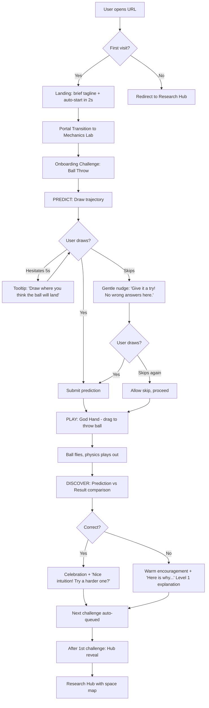
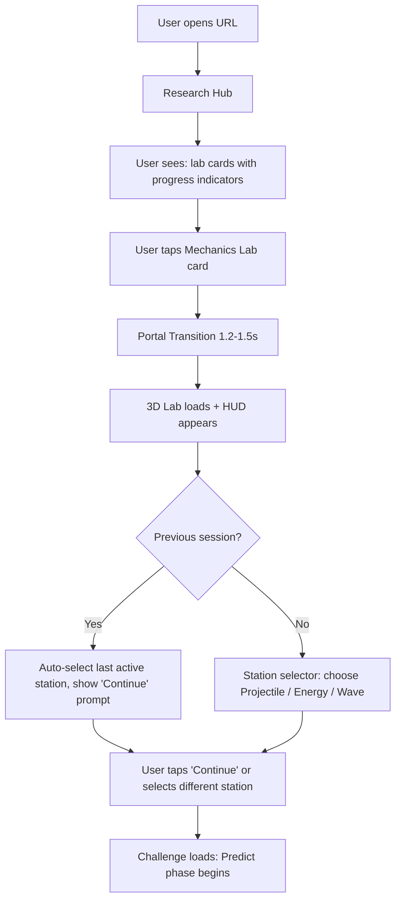
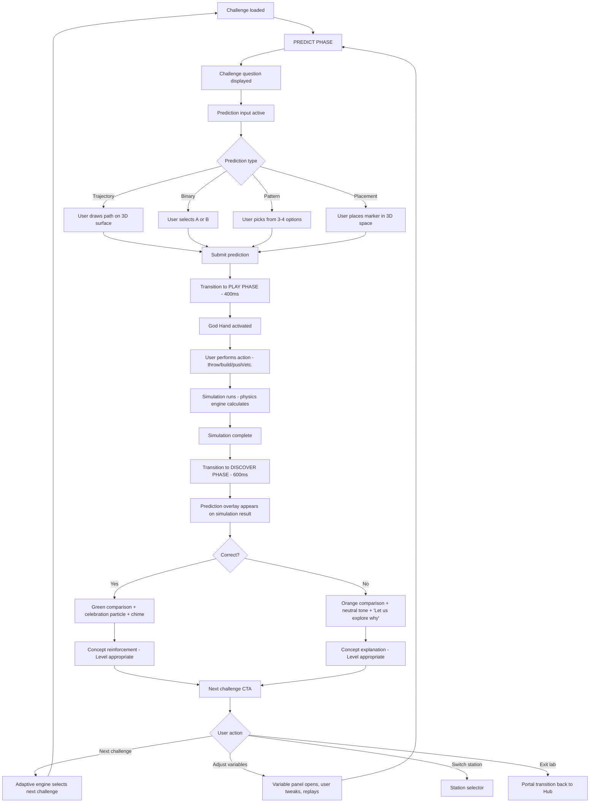
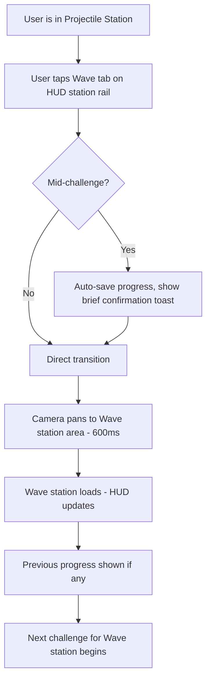
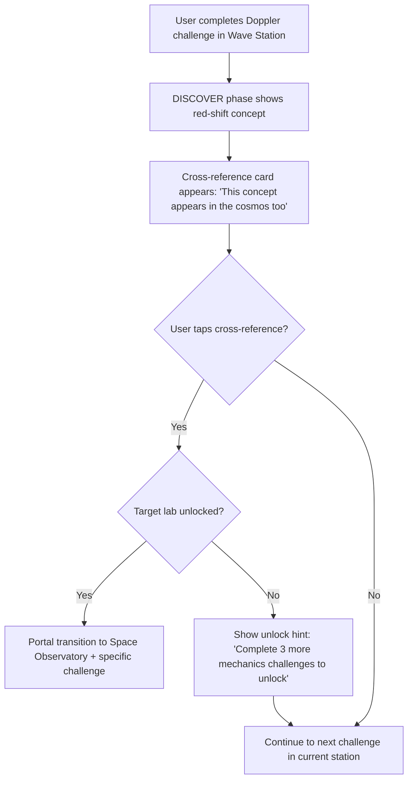

# PhysPlay -- UX Design

**Status:** Draft
**Author:** --
**Last Updated:** 2026-03-04
**Related:** [Product Brief](./product-brief.md) | [PRD](./prd.md) | [Phase 1 PRD](./prd-phase-1.md) | [Client Structure](./client-structure.md)

---

## Table of Contents

1. [Context and User Goal](#1-context-and-user-goal)
2. [Design Principles](#2-design-principles)
3. [Visual Design Language](#3-visual-design-language)
4. [Information Architecture](#4-information-architecture)
5. [Screen Inventory](#5-screen-inventory)
6. [User Flows](#6-user-flows)
7. [Screen-by-Screen UX Specs](#7-screen-by-screen-ux-specs)
8. [HUD System Design](#8-hud-system-design)
9. [God Hand Interaction Design](#9-god-hand-interaction-design)
10. [3D Lab Visual Design](#10-3d-lab-visual-design)
11. [Prediction Type UX](#11-prediction-type-ux)
12. [Discover Phase UX](#12-discover-phase-ux)
13. [Onboarding UX](#13-onboarding-ux)
14. [Responsive Design](#14-responsive-design)
15. [Accessibility](#15-accessibility)
16. [I18n](#16-i18n)
17. [Phase Implementation Summary](#17-phase-implementation-summary)

---

## 1. Context and User Goal

### JTBD Statement

> When I encounter a science concept I don't understand, I want to predict, experiment, and see the result myself, so I can build real intuition instead of memorizing formulas.

### User Context

- **Devices:** PC desktop/laptop (primary), mobile phone/tablet (secondary), XR headset (future)
- **Environment:** Study room, classroom, commute (mobile), casual exploration
- **Mental state:** Ranges from curious-playful (10-year-old) to focused-learning (29-year-old adult). Common thread: wants to *do*, not *read*
- **Time pressure:** Varies. Micro-session (5 min, one challenge) to deep session (30+ min, station completion)

### Proto-Personas

```
Name:         Seoyeon (10, 4th grader)
Goal:         Make science feel like a game
Context:      After school on a laptop, distracted easily
Frustrations: Too much text, boring diagrams
Tech comfort: Medium (plays Roblox, uses YouTube)
```

```
Name:         Minjun (16, 10th grader)
Goal:         Understand physics intuitively, not just formulas
Context:      Evening study session on a desktop, focused
Frustrations: PhET has no goals, textbooks are formula-first
Tech comfort: High
```

```
Name:         Jiyoung (29, developer)
Goal:         Build quantum mechanics intuition for career pivot
Context:      Weekend exploration on laptop, self-motivated
Frustrations: Online courses have too high a math barrier
Tech comfort: Very High
```

---

## 2. Design Principles

Five principles derived from PhysPlay's core vision. Every design decision must serve at least one.

### P1. Prediction First, Never Passive

The product exists because "thinking before touching" is the mechanism for learning. Every interaction must begin with the user committing a prediction. If the prediction step feels like a chore, the product fails.

*Derived from: Core Insight ("생각하지 않고 만지기 때문"), Goal Gradient (commitment increases completion), Cognitive Load (prediction is germane load -- the useful kind).*

### P2. The Wrong Answer Is the Product

Being wrong is not a failure state -- it is the moment of maximum learning value. The UX must make "wrong" feel safe, interesting, and motivating rather than punishing. The Discover phase exists to turn every wrong prediction into a discovery.

*Derived from: Peak-End Rule (the discovery moment must be the "peak"), Aesthetic-Usability Effect (visual polish on the comparison moment forgives frustration).*

### P3. Game Stage, Not Educational Tool

The 3D labs must feel like entering a new level in a game, not opening an educational app. Distinct visual identities per lab, dramatic transitions, ambient soundscapes, and reward ceremonies are features, not decoration.

*Derived from: REQ-041 (Semi-Stylized 3D Sandbox tone), Aesthetic-Usability Effect, Jakob's Law (game conventions, not LMS conventions).*

### P4. Get Out of the Way

During the Play phase, the user is a scientist with God Hand powers. UI must recede. HUD elements are minimal, translucent, and peripheral. The 3D simulation owns the screen. Every overlay element must pass the removal test: "Does this block the experiment?"

*Derived from: Cognitive Load (reduce extraneous load), First Principles (minimum needed to achieve goal), Fitts's Law (don't place UI where it competes with 3D interaction targets).*

### P5. 30-Second First Loop

A first-time user must complete one full Predict-Play-Discover cycle within 30 seconds of opening the URL. No signup, no tutorial, no track selection. The first challenge is the onboarding.

*Derived from: REQ-036, Doherty Threshold (perceived latency kills engagement), Goal Gradient (completing something fast creates momentum).*

---

## 3. Visual Design Language

### 3.1 Two-Layer Design System

PhysPlay has two distinct visual layers that must feel like they belong to the same product while serving different purposes.

#### Layer 1: 2D Pages -- Soft-Tech Educational (REQ-039)

**Personality:** Trustworthy, inviting, clean. A modern science museum lobby -- bright, well-organized, welcoming to all ages.

| Token | Light Theme | Dark Theme |
|-------|------------|------------|
| `background-primary` | `#FAFBFD` (almost white, subtle cool) | `#0F1117` (deep navy-black) |
| `background-secondary` | `#F0F3F8` (light blue-gray) | `#1A1D27` (dark slate) |
| `surface-card` | `#FFFFFF` | `#22252F` |
| `surface-elevated` | `#FFFFFF` + shadow | `#2A2D3A` + subtle glow |
| `text-primary` | `#1A1D27` | `#E8EBF0` |
| `text-secondary` | `#6B7280` | `#9CA3AF` |
| `accent-primary` | `#4F6BF6` (electric indigo) | `#6B82FF` (lighter indigo) |
| `accent-secondary` | `#22C997` (mint green -- discovery/correct) | `#34DBA8` |
| `accent-warning` | `#F59E0B` (amber) | `#FBBF24` |
| `accent-error` | `#EF4444` | `#F87171` |
| `border-default` | `#E5E7EB` | `#2D3040` |

**Shape Language:**
- Border radius: `12px` for cards, `8px` for buttons, `20px` for badges/pills
- Shadows: soft, diffused (no hard drop shadows)
- Spacing: generous -- layout-lg (48px) between major sections, layout-md (32px) between cards

**Typography:**
- System font stack: `Inter, -apple-system, BlinkMacSystemFont, "Segoe UI", sans-serif`
- Korean: `"Pretendard Variable", "Noto Sans KR", sans-serif`
- Scale: follows 1.250 modular scale (Major Third)

| Style | Size | Weight | Use |
|-------|------|--------|-----|
| Display | 36px / 2.25rem | 700 | Landing hero only |
| H1 | 28px / 1.75rem | 700 | Page titles |
| H2 | 22px / 1.375rem | 600 | Section headers |
| H3 | 18px / 1.125rem | 600 | Card titles |
| Body | 16px / 1rem | 400 | Paragraph text |
| Body-small | 14px / 0.875rem | 400 | Secondary info |
| Caption | 12px / 0.75rem | 500 | Labels, badges |

**Iconography:** Outlined, 1.5px stroke, rounded joins. Simple, geometric. 24px default grid.

#### Layer 2: 3D Labs -- Semi-Stylized 3D Game Style (REQ-041)

**Personality:** Each lab is a game stage. Not photorealistic, not cartoon -- a stylized middle ground that feels tactile, inviting, and playful. Think *Monument Valley* meets *Kerbal Space Program* meets a well-designed science toy.

**Shared 3D conventions:**
- Materials: soft PBR with subtle toon shading edge. Not flat-shaded, not hyper-realistic
- Geometry: slightly rounded edges on all objects (chamfered/beveled). No perfectly sharp edges
- Scale: tabletop perspective. Objects are small enough to feel like toys the user controls
- Lighting: strong key light + soft fill + rim light. Always readable, never dark or obscure
- Particles: used for feedback (launch trails, collision sparks, wave ripples) and atmosphere (dust motes, energy particles)
- Post-processing: subtle bloom on emissive elements, light depth-of-field on background, no heavy filters

Each lab's unique visual design is detailed in [Section 10: 3D Lab Visual Design](#10-3d-lab-visual-design).

#### Layer Bridge: Portal Transition (REQ-040)

The 2D-to-3D transition is not a page navigation -- it is a *threshold crossing*. It signals: "You are leaving the lobby and entering the lab."

**Transition sequence (1.2-1.5 seconds total):**

1. **Trigger:** User taps a lab card on the Hub screen
2. **Zoom-in (0-400ms):** The lab card expands to fill the viewport. Background dims. Card content fades out, replaced by a swirling portal effect in the lab's signature color
3. **Portal pass (400-800ms):** A tunnel/warp effect in the lab's color palette rushes toward the camera. Ambient sound crossfades from Hub music to lab ambient
4. **3D reveal (800-1200ms):** The portal dissolves to reveal the 3D lab environment. Camera settles at the default position with a gentle ease-out
5. **HUD fade-in (1200-1500ms):** HUD elements appear with staggered fade-in (100ms apart)

**Reduced motion alternative:** Card expands, cross-fades directly to 3D scene (no tunnel effect). 500ms total.

**Reverse transition (lab exit):** Lab fades to portal, collapses back to card position on Hub. 800ms.

### 3.2 Color System

#### Semantic Colors (Shared Across Layers)

| Semantic | Purpose | Value (Light) | Value (Dark) |
|----------|---------|---------------|--------------|
| `correct` | Prediction was right | `#22C997` (mint) | `#34DBA8` |
| `incorrect` | Prediction was wrong | `#F97316` (warm orange, NOT red) | `#FB923C` |
| `prediction-line` | User's drawn prediction | `#4F6BF6` (indigo) | `#6B82FF` |
| `result-line` | Actual simulation result | `#22C997` (mint) | `#34DBA8` |
| `interactive` | Clickable/tappable 3D objects | Outlined glow in lab accent color | Same |
| `destructive` | Reset, clear prediction | `#EF4444` (red) | `#F87171` |

**Key decision:** `incorrect` uses warm orange, not red. Red implies danger/failure. Orange implies "interesting -- let's find out why." This supports P2 (The Wrong Answer Is the Product).

*Principle: Peak-End Rule -- the moment of seeing an incorrect prediction must not feel punishing. Color contributes to emotional framing.*

#### Lab-Specific Accent Palettes

| Lab | Primary Accent | Secondary Accent | Glow/Particle |
|-----|---------------|-----------------|---------------|
| Mechanics Lab (역학 실험실) | `#4F9CF5` (sky blue) | `#F5A623` (warm amber) | Light blue trails |
| Molecular Lab (분자 실험실) | `#7C3AED` (violet) | `#06B6D4` (cyan) | Electron orbital glow |
| Space Observatory (우주 관측소) | `#1E3A5F` (deep space blue) | `#F59E0B` (star gold) | Stardust particles |
| Quantum Lab (양자 연구소) | `#EC4899` (magenta-pink) | `#06B6D4` (quantum cyan) | Probability cloud shimmer |

### 3.3 Motion Principles

| Context | Duration | Easing | Notes |
|---------|----------|--------|-------|
| Micro-interaction (button press, toggle) | 100-150ms | ease-out | Immediate feedback |
| HUD element appear/dismiss | 200-300ms | ease-out (appear), ease-in (dismiss) | Staggered by 60ms per element |
| Phase transition (Predict to Play) | 400-600ms | ease-in-out | Camera repositions, HUD swaps |
| Portal transition (2D to 3D) | 1200-1500ms | custom bezier | See Portal Transition above |
| Simulation playback (e.g., ball flight) | Physics-driven | N/A | Real-time physics, no easing -- must feel authentic |
| Prediction overlay comparison | 600-800ms | ease-out | Prediction line draws in, then result line draws in |

**Reduced motion (`prefers-reduced-motion: reduce`):**
- All transitions become instant cross-fades (150ms max)
- Portal transition becomes simple fade (500ms)
- Auto-rotation and particle effects disabled
- Simulation playback unaffected (it is the content, not decoration)

### 3.4 Sound Design Principles

| Layer | Category | Behavior |
|-------|----------|----------|
| 2D pages | UI sounds | Subtle clicks and soft tones on navigation. Optional -- can be muted globally |
| Portal transition | Transition SFX | Whoosh + ambient crossfade. Spatial audio if available |
| 3D lab ambient | Background atmosphere | Continuous loop, unique per lab. Volume adjustable. Fades in/out on lab enter/exit |
| 3D lab BGM | Background music | Unique per lab. Low volume. Adjustable. Can be disabled independently |
| God Hand SFX | Interaction feedback | Spatially positioned at the object. Throw whoosh, collision impact, wave pulse |
| Prediction feedback | Correct/Incorrect | Correct: bright chime + particle burst. Incorrect: neutral tone (NOT failure buzzer) + subtle visual cue |

**User controls:** Master volume, SFX volume, BGM volume, Ambient volume. Accessible from HUD settings gear.

---

## 4. Information Architecture

### 4.1 Site Map

```
[PhysPlay Root]
|
+-- Landing Page [Phase 1]
|   (first-time: auto-redirect to onboarding challenge)
|   (returning: auto-redirect to Research Hub)
|
+-- Research Hub (연구소 허브) [Phase 1]
|   |-- Space Map (공간 맵)
|   |   |-- Mechanics Lab (역학 실험실) [Phase 1]
|   |   |-- Molecular Lab (분자 실험실) [Phase 3] [locked]
|   |   |-- Space Observatory (우주 관측소) [Phase 4] [locked]
|   |   +-- Quantum Lab (양자 연구소) [Phase 5] [locked]
|   |
|   |-- Progress Overview (진도 개요) [Phase 1]
|   +-- Settings (설정) [Phase 1]
|
+-- 3D Lab Experience (실험실 경험) [Phase 1]
|   |-- [Portal Transition]
|   |-- Station Select (HUD) [Phase 1]
|   |   |-- Station A
|   |   |-- Station B
|   |   +-- Station C
|   |
|   |-- Challenge Loop (HUD) [Phase 1]
|   |   |-- Predict Phase
|   |   |-- Play Phase
|   |   +-- Discover Phase
|   |
|   |-- Variable Controls (HUD) [Phase 1]
|   |-- Lab Settings (HUD) [Phase 1]
|   +-- Exit to Hub
|
+-- Settings [Phase 1]
|   |-- Language (en/ko)
|   |-- Theme (Light/Dark/System)
|   |-- Sound (Master, SFX, BGM, Ambient)
|   |-- Graphics Quality (Auto/Low/Medium/High)
|   +-- Motion (Full/Reduced)
|
+-- Account [Phase 3]
|   |-- Profile
|   |-- Progress Sync
|   +-- Data Export/Delete
|
+-- Challenge Editor [Phase 3+]
+-- Station Editor [Phase 4+]
+-- Space Editor [Phase 5+]
```

### 4.2 Navigation Pattern

| Context | Pattern | Justification |
|---------|---------|---------------|
| 2D pages (Hub, Settings) | Top navigation bar (web) | Simple, few top-level destinations. Follows web conventions (Jakob's Law) |
| 3D lab (inside) | HUD overlay -- no traditional nav | 3D viewport must dominate. Traditional nav would compete with the experience (P4: Get Out of the Way) |
| Station switching (inside lab) | HUD tab rail (left edge) | Persistent access without leaving 3D. Minimal footprint. Inspired by game sidebar menus |
| Phase switching (Predict/Play/Discover) | Automatic progression with HUD phase indicator | Not user-navigated -- follows the core loop sequence. User sees where they are but doesn't "navigate" phases |

### 4.3 Depth Validation

| User Goal | Taps/Clicks from Hub | Passes <= 3 Rule? |
|-----------|---------------------|--------------------|
| Start a challenge | Hub -> Lab card (1) -> Station (2) -> Challenge starts auto (2) | Yes (2) |
| Resume progress | Hub -> Lab card (1) -> "Continue" (auto-selected station) (2) | Yes (2) |
| Change language | Hub -> Settings icon (1) -> Language toggle (2) | Yes (2) |
| Switch stations inside lab | HUD station tab (1) | Yes (1) |
| Adjust variable mid-experiment | HUD variable panel toggle (1) -> Slider (2) | Yes (2) |

*Principle: IA Principle of Disclosure -- core content reachable in 2 taps. Settings and secondary content in 2-3.*

---

## 5. Screen Inventory

### 2D Screens

| # | Screen | Route | Phase | Description |
|---|--------|-------|-------|-------------|
| S01 | Landing Page | `/` | 1 | Product entry point. First-time: immediate redirect to onboarding. Returning: redirect to Hub |
| S02 | Research Hub | `/hub` | 1 | Home screen. Space map with lab cards, progress overview, quick-resume |
| S03 | Settings | `/settings` | 1 | Language, theme, sound, graphics, motion preferences |
| S04 | Progress Detail | `/progress` | 1 | Detailed per-station progress, accuracy charts, concept mastery |
| S05 | Account | `/account` | 3 | Profile, sync, data management |
| S06 | Challenge Editor | `/editor/challenge` | 3+ | UGC challenge creation |
| S07 | Station Editor | `/editor/station` | 4+ | UGC station sequencing |
| S08 | Space Editor | `/editor/space` | 5+ | UGC space creation |

### 3D Screens (HUD States)

| # | HUD State | Phase | Description |
|---|-----------|-------|-------------|
| H01 | Lab Entry | 1 | Post-portal arrival. Station selector visible. Welcome-back context |
| H02 | Predict Phase | 1 | Prediction input active. Challenge question visible. Timer optional |
| H03 | Play Phase | 1 | God Hand active. Minimal HUD. Variable display if relevant |
| H04 | Discover Phase | 1 | Comparison overlay. Concept explanation panel. Next challenge CTA |
| H05 | Station Complete | 1 | Celebration sequence. New station unlock hint. Progress summary |
| H06 | Lab Settings | 1 | Sound, graphics quality. Accessible without leaving 3D |
| H07 | Variable Panel | 1 | Adjustable parameters for current challenge (gravity, mass, etc.) |
| H08 | Cross-Engine Suggestion | 3+ | Discover phase: link to related concept in another lab |
| H09 | Pause/Exit Overlay | 1 | Pause simulation. Options: resume, restart, exit to Hub |

---

## 6. User Flows

### 6.1 First Visit Onboarding



**Target time:** Landing to Discover = 30 seconds. Landing to Hub reveal = 60 seconds.

### 6.2 Returning User: Hub to Lab



### 6.3 Core Loop: Predict -- Play -- Discover



### 6.4 Station Switching Within Lab



### 6.5 Cross-Engine Discovery [Phase 3+]



---

## 7. Screen-by-Screen UX Specs

### S01: Landing Page [Phase 1]

**Route:** `/`
**Primary action:** Enter the experience (for first-time users, this is automatic)

**Layout:**

```
+-------------------------------------------------------+
|  [PhysPlay logo]                    [en/ko] [Settings] |
+---------------------------------------------------------+
|                                                         |
|   "Predict. Experiment. Discover."                      |
|   (과학을 예측하고, 실험하고, 발견하세요)                    |
|                                                         |
|   [Start Experimenting]  <-- Primary CTA                |
|                                                         |
|   (First-time users: auto-starts in 2 seconds           |
|    with a gentle countdown indicator)                   |
|                                                         |
+---------------------------------------------------------+
```

**States:**
- **First visit:** Auto-redirects to onboarding challenge after 2 seconds. "Start Experimenting" button available immediately for impatient users. Countdown indicator shows remaining time
- **Returning visit:** Immediately redirects to Research Hub (no landing page shown)
- **Loading:** Skeleton shimmer on the CTA area. 3D assets preloading in background
- **Error (3D not supported):** "Your browser doesn't support 3D experiences. Try Chrome, Firefox, or Safari on a recent device." + link to supported browser list
- **Offline:** "You're offline. PhysPlay needs an internet connection to load for the first time. Once loaded, experiments work offline."

**Copy:**
- Heading: "Predict. Experiment. Discover." / "예측하고, 실험하고, 발견하세요"
- CTA: "Start Experimenting" / "실험 시작하기"
- Subtext: "No signup needed. Jump right in." / "가입 필요 없음. 바로 시작하세요."

**Design rationale:** The landing page's only job is to get the user into the first challenge as fast as possible (P5: 30-Second First Loop). No feature tour, no testimonials, no pricing. First-time users bypass it entirely after 2 seconds. Returning users never see it.

*Principle: Removal Test -- everything that isn't "start the experience" was removed. Doherty Threshold -- 2-second auto-start prevents idle drop-off.*

### S02: Research Hub (연구소 허브) [Phase 1]

**Route:** `/hub`
**Primary action:** Enter a lab

**Layout:**

```
+---------------------------------------------------------------+
|  [PhysPlay logo]     Research Hub       [Progress] [Settings]  |
+---------------------------------------------------------------+
|                                                                |
|  Welcome back, Researcher.           Session: 12 challenges    |
|  Continue where you left off?        Accuracy: 68%             |
|                                                                |
|  +------------------+  +------------------+                    |
|  |  MECHANICS LAB   |  |  MOLECULAR LAB   |                   |
|  |  역학 실험실       |  |  분자 실험실       |                   |
|  |                  |  |                  |                    |
|  | [lab thumbnail]  |  | [locked icon]    |                   |
|  |                  |  | Phase 3          |                   |
|  | Progress: 40%    |  | [silhouette]     |                   |
|  | 3 stations       |  |                  |                   |
|  |                  |  |                  |                   |
|  | [Enter Lab]      |  | [Locked]         |                   |
|  +------------------+  +------------------+                    |
|                                                                |
|  +------------------+  +------------------+                    |
|  | SPACE            |  |  QUANTUM LAB     |                   |
|  | OBSERVATORY      |  |  양자 연구소       |                   |
|  | 우주 관측소        |  |                  |                   |
|  |                  |  | [locked icon]    |                   |
|  | [locked icon]    |  | Phase 5          |                   |
|  | Phase 4          |  | [silhouette]     |                   |
|  | [silhouette]     |  |                  |                   |
|  |                  |  |                  |                   |
|  | [Locked]         |  | [Locked]         |                   |
|  +------------------+  +------------------+                    |
|                                                                |
+---------------------------------------------------------------+
```

**Lab cards:** Each card shows:
- Lab name (en + ko)
- Thumbnail: stylized 3D preview of the lab environment (rendered as a static image, not live 3D)
- Progress indicator: percentage bar + station count
- Status: "Enter Lab" (unlocked) or "Locked" with silhouette and unlock hint
- Locked labs show a subtle shimmer animation hinting at what is inside

**States:**
- **Empty (first visit, post-onboarding):** Only Mechanics Lab unlocked. Others show as mysterious silhouettes with "???" labels that reveal the name on hover. Copy: "Complete challenges in the Mechanics Lab to unlock new spaces."
- **Loading:** Card skeletons matching layout. Progress data loads from IndexedDB
- **Loaded:** Full cards with progress data
- **Error (IndexedDB read fail):** "We couldn't load your progress. Your data might still be saved locally. Try refreshing." + retry button
- **Partial (some data loads):** Show loaded cards, inline error on failed cards
- **Offline:** Show cached progress data. Labs still accessible for offline play. Banner: "You're offline. Your progress will be saved locally."

**Interactions:**
- Hover on lab card: subtle elevation increase (4px lift), shadow deepens. Card thumbnail animates subtly (parallax tilt)
- Click on unlocked lab card: initiates Portal Transition
- Click on locked lab card: shows bottom sheet with unlock requirements and preview content
- Click on Progress: navigates to Progress Detail page
- Click on Settings gear: navigates to Settings page

**Copy:**
- Welcome line (returning): "Welcome back, Researcher." / "연구원님, 돌아오셨네요."
- Resume prompt: "Continue where you left off?" / "이어서 실험할까요?"
- Locked lab hint: "Complete [N] more challenges to unlock" / "[N]개 더 도전하면 해금됩니다"

*Principle: Zeigarnik Effect -- showing progress percentage and locked labs with silhouettes creates motivation to continue. Von Restorff Effect -- the unlocked lab card is visually distinct from locked ones.*

### S03: Settings [Phase 1]

**Route:** `/settings`
**Primary action:** Adjust preferences

**Layout:**

```
+---------------------------------------------------------------+
|  [<- Back to Hub]          Settings                            |
+---------------------------------------------------------------+
|                                                                |
|  Language / 언어                                                |
|  [EN] [KO]  <-- segmented control                             |
|                                                                |
|  Theme / 테마                                                   |
|  [Light] [Dark] [System]  <-- segmented control                |
|                                                                |
|  Sound / 사운드                                                  |
|  Master     [----------o------] 80%                            |
|  SFX        [----------o------] 80%                            |
|  BGM        [------o----------] 50%                            |
|  Ambient    [--------o--------] 60%                            |
|                                                                |
|  Graphics / 그래픽                                               |
|  [Auto] [Low] [Medium] [High]  <-- segmented control           |
|                                                                |
|  Motion / 모션                                                   |
|  [Full] [Reduced]  <-- segmented control                       |
|                                                                |
|  Data / 데이터                                                   |
|  [Clear Local Progress]  <-- destructive, requires confirmation |
|                                                                |
+---------------------------------------------------------------+
```

**States:**
- **Loaded:** All preferences loaded from localStorage/IndexedDB
- **Error:** "Settings couldn't be saved. Try again." + retry
- **Offline:** All settings work offline (local storage)

**Interactions:**
- All changes apply immediately (no "Save" button needed -- settings are non-destructive)
- "Clear Local Progress" requires confirmation dialog: "Delete all your progress? This removes all challenge history, accuracy data, and unlocks. This cannot be undone." Buttons: [Cancel] [Delete Progress]

*Principle: Jakob's Law -- standard settings patterns. Removal Test -- no "Save" button because all changes are instant and reversible (except data deletion).*

### S04: Progress Detail [Phase 1]

**Route:** `/progress`
**Primary action:** Understand learning progress

**Layout:**

```
+---------------------------------------------------------------+
|  [<- Back to Hub]        My Progress                           |
+---------------------------------------------------------------+
|                                                                |
|  Overall: 42 challenges completed | 68% accuracy              |
|                                                                |
|  +-- Mechanics Lab --+                                         |
|  |                   |                                         |
|  |  Projectile Station                                         |
|  |  [==========-------] 70%  |  Accuracy: 72%                 |
|  |  10/14 challenges                                           |
|  |                                                             |
|  |  Energy Station                                             |
|  |  [======-----------] 45%  |  Accuracy: 65%                 |
|  |  5/11 challenges                                            |
|  |                                                             |
|  |  Wave Station                                               |
|  |  [===--------------] 20%  |  Accuracy: 60%                 |
|  |  2/10 challenges                                            |
|  |                                                             |
|  +-------------------+                                         |
|                                                                |
|  Concept Mastery                                               |
|  +-- Gravity: Strong (85%)                                     |
|  +-- Momentum: Growing (62%)                                   |
|  +-- Wave Interference: New (30%)                              |
|                                                                |
+---------------------------------------------------------------+
```

**States:**
- **Empty (no challenges completed):** "No progress yet. Start your first experiment!" + CTA: "Go to Mechanics Lab"
- **Loaded:** Per-station progress bars, accuracy percentages, concept mastery list
- **Offline:** Shows cached progress data

*Principle: Goal Gradient -- showing completion percentages motivates continued engagement. Zeigarnik Effect -- incomplete stations are prominently displayed.*

---

## 8. HUD System Design

The HUD (Heads-Up Display) is the UI layer that floats on top of the 3D viewport inside labs. It must be minimal, translucent, and never obstruct the simulation.

### 8.1 HUD Layout Principles

```
+---------------------------------------------------------------+
|  [Phase Indicator]          [Station Name]     [Settings] [X]  |  <- Top bar (always visible)
|                                                                |
|  +---+                                                         |
|  |P  |                                                         |  <- Station rail (left edge)
|  |---|                                                         |     P = Projectile
|  |E  |               3D VIEWPORT                               |     E = Energy
|  |---|               (simulation)                              |     W = Wave
|  |W  |                                                         |
|  +---+                                                         |
|                                                                |
|                                                                |
|                                                                |
|  [Context-specific bottom panel -- changes per phase]          |  <- Bottom panel (phase-specific)
+---------------------------------------------------------------+
```

**HUD element rules:**
- **Opacity:** Default 85% opacity. Fades to 40% during Play phase when user is interacting with 3D. Returns to 85% on pause or when cursor leaves 3D viewport
- **Background:** Frosted glass effect (backdrop-blur) matching the lab's ambient color
- **Position:** Top bar and station rail are persistent. Bottom panel changes per phase
- **Hit areas:** All HUD buttons are 44x44px minimum
- **Z-order:** HUD always renders on top of 3D content. Uses HTML overlay on top of WebGL canvas (not rendered in 3D space)

### 8.2 Top Bar

Persistent across all phases. Minimal information.

| Element | Content | Position |
|---------|---------|----------|
| Phase indicator | "Predict" / "Play" / "Discover" with step dots (1 of 3) | Left |
| Station name | Current station + challenge number (e.g., "Projectile #7") | Center |
| Settings gear | Opens Lab Settings overlay | Right |
| Exit button | "X" -- returns to Hub via reverse portal | Far right |

**Phase indicator animation:** Active phase name fades in, step dots fill left-to-right as user progresses. Smooth color transition between phases.

### 8.3 Station Rail (Left Edge)

Vertical tab rail. Always visible inside a lab. Each tab is an icon + abbreviated label.

```
+------+
| [/]  |  Projectile  (active: filled icon + accent underline)
|------|
| [O]  |  Energy      (inactive: outlined icon)
|------|
| [~]  |  Wave        (locked: dimmed icon + lock badge)
+------+
```

**Behavior:**
- Tap to switch stations. Transition: camera pans to new station area (600ms)
- Active station: filled icon, accent-colored left border
- Locked station: dimmed, lock icon overlay, tap shows unlock requirement tooltip
- Hover (desktop): tooltip with full station name + progress

### 8.4 Predict Phase HUD

```
+---------------------------------------------------------------+
|  PREDICT  [o--]                 Projectile #7    [gear] [X]    |
|                                                                |
|  +---+                                                         |
|  |P* |                                                         |
|  |---|                                                         |
|  |E  |               3D VIEWPORT                               |
|  |---|               (static scene setup)                      |
|  |W  |                                                         |
|  +---+                                                         |
|                                                                |
|  +-------------------------------------------------------------+
|  | "Where will the ball land?"                                  |
|  | 이 공은 어디에 떨어질까요?                                       |
|  |                                                              |
|  | [Draw your prediction on the surface]                        |
|  |                                            [Skip] [Submit]   |
|  +-------------------------------------------------------------+
```

**Bottom panel contents by prediction type:**

| Prediction Type | Panel Content |
|-----------------|---------------|
| Trajectory | Instruction: "Draw the path" + visual hint (faint dotted guide showing draw area). Submit becomes active after user draws |
| Binary | Two large option cards side by side. Tap to select, tap again to deselect. Submit becomes active on selection |
| Pattern | 3-4 option thumbnails (small 3D previews or diagrams). Tap to select. Submit becomes active on selection |
| Placement | Instruction: "Place the marker where you think [X] will be" + draggable 3D marker. Submit becomes active after placement |

**Key interactions:**
- "Skip" is always available but visually secondary (text link, not button)
- First-time skip: shows gentle nudge ("Predictions make the experiment more fun. Give it a try?" / "예측하면 실험이 더 재밌어요. 한번 해볼까요?") with [Try] and [Skip Anyway]
- "Submit" is primary button, disabled until prediction input is provided
- After submit: brief confirmation animation (prediction locks in, line/selection pulses once), then transition to Play phase

*Principle: Goal Gradient -- prediction is step 1 of 3, visually shown. Cognitive Load -- only the question and input method are shown, nothing else. Hick's Law -- binary/pattern choices limited to 2-4 options.*

### 8.5 Play Phase HUD

```
+---------------------------------------------------------------+
|  PLAY  [-o-]                    Projectile #7    [gear] [X]    |
|                                                                |
|  +---+                                                         |
|  |P* |                                                         |
|  |---|                                                         |
|  |E  |               3D VIEWPORT                               |
|  |---|               (interactive simulation)                  |
|  |W  |                                                         |
|  +---+                                                         |
|                                                                |
|                               [Variable display: g=9.8 m/s^2]  |
|                                                                |
|  +-------------------------------------------------------------+
|  | Drag the ball to throw it                                    |
|  | 공을 드래그해서 던지세요                                         |
|  +-------------------------------------------------------------+
```

**HUD minimization during Play:**
- Bottom panel shows only a single-line instruction, then fades to 40% opacity after 3 seconds
- Variable display (bottom-right corner) shows current simulation parameters at 60% opacity
- Top bar fades to 40% opacity
- Station rail remains at 60% opacity
- Full HUD opacity returns when: cursor moves to HUD area, user presses Escape, or simulation completes

**Key interactions:**
- God Hand interactions take priority over all HUD interactions
- If user clicks/taps on HUD element, HUD captures the event (no 3D passthrough)
- If user clicks/taps on 3D viewport area, God Hand captures the event
- Simulation plays in real-time. No fast-forward on first play. Replay available after first completion

*Principle: P4 (Get Out of the Way) -- HUD recedes to let the simulation dominate. Doherty Threshold -- God Hand response must be <100ms.*

### 8.6 Discover Phase HUD

```
+---------------------------------------------------------------+
|  DISCOVER  [--o]                Projectile #7    [gear] [X]    |
|                                                                |
|  +---+                                                         |
|  |P* |                                                         |
|  |---|       3D VIEWPORT                                       |
|  |E  |       (result with prediction overlay)                  |
|  |---|                                                         |
|  |W  |                                                         |
|  +---+                                                         |
|                                                                |
|  +-------------------------------------------------------------+
|  | [Correct icon] Nice intuition!                               |
|  |                                                              |
|  | Your prediction was close. The ball follows a parabolic      |
|  | path because gravity pulls it down at a constant rate.       |
|  |                                                              |
|  | [Deeper Explanation v]      [Adjust Variables] [Next ->]     |
|  +-------------------------------------------------------------+
```

**Bottom panel contents:**

| Sub-element | Behavior |
|-------------|----------|
| Result badge | Green checkmark (correct) or orange "Let's explore" (incorrect). NOT a red X |
| Headline | "Nice intuition!" / "잘 맞췄어요!" (correct) or "Interesting! Here's what happened" / "흥미로운 결과네요! 이유를 알아볼까요?" (incorrect) |
| Explanation text | Level-appropriate concept explanation. Scrollable if long. 3 lines visible by default |
| "Deeper Explanation" | Accordion/expandable. Opens Level 2 or Level 3 explanation below. Icon: chevron down |
| "Adjust Variables" | Opens Variable Panel. Allows replay with different parameters |
| "Next" | Primary CTA. Moves to next challenge via adaptive engine |

**3D viewport behavior during Discover:**
- Camera auto-positions to best comparison angle
- User's prediction overlay shown (dashed line in `prediction-line` color)
- Actual result shown (solid line in `result-line` color)
- Overlay draws in sequence: prediction line first (300ms), then result line (300ms), then divergence points highlighted (200ms)
- User can still orbit/zoom the 3D scene to inspect from different angles
- Replay button available (small, bottom-left of viewport): replays simulation at 0.5x speed with prediction overlay visible

*Principle: Peak-End Rule -- the Discover phase is the "end" of each loop. It must be satisfying whether correct or incorrect. Cognitive Load -- explanation starts at Level 1 (germane load), deeper levels available on demand (progressive disclosure).*

### 8.7 Variable Panel (HUD Overlay)

```
+---------------------------------------------------------------+
|                                                                |
|  +---+                                                         |
|  |P* |                                                         |
|  |---|       3D VIEWPORT                 +------------------+  |
|  |E  |                                   | Variables        |  |
|  |---|                                   |                  |  |
|  |W  |                                   | Gravity          |  |
|  +---+                                   | [====o=====] 9.8 |  |
|                                          | m/s^2            |  |
|                                          |                  |  |
|                                          | Mass             |  |
|                                          | [==o========] 1kg|  |
|                                          |                  |  |
|                                          | Presets:         |  |
|                                          | [Earth] [Moon]   |  |
|                                          | [Jupiter]        |  |
|                                          |                  |  |
|                                          | [Reset] [Apply]  |  |
|                                          +------------------+  |
|                                                                |
+---------------------------------------------------------------+
```

**Behavior:**
- Slides in from right edge (300ms ease-out)
- Semi-transparent background (frosted glass)
- Sliders adjust simulation parameters in real-time preview (optimistic update on 3D scene)
- Presets: quick buttons for common environments (Earth, Moon, Jupiter, Mars, etc.)
- "Reset" returns to challenge defaults. "Apply" locks in values and restarts the prediction phase
- Accessible via keyboard: Tab to each slider, arrow keys to adjust

*Principle: Hick's Law -- presets reduce decisions for common cases. Progressive Disclosure -- advanced variables only shown when panel is opened.*

### 8.8 Pause/Exit Overlay

Triggered by pressing Escape or tapping the X button.

```
+---------------------------------------------------------------+
|                                                                |
|                     +-----------------------+                  |
|                     |                       |                  |
|                     |  Experiment paused    |                  |
|                     |  실험이 일시정지됨       |                  |
|                     |                       |                  |
|                     |  [Resume Experiment]  |  <- Primary      |
|                     |  [Restart Challenge]  |                  |
|                     |  [Exit to Hub]        |                  |
|                     |                       |                  |
|                     +-----------------------+                  |
|                                                                |
+---------------------------------------------------------------+
```

**Behavior:**
- 3D scene pauses (physics stops, render continues at reduced frame rate)
- Background dims to 50% opacity
- Modal centered in viewport
- "Resume" is primary (filled button). "Restart" and "Exit" are secondary (outlined)
- Keyboard: Escape also resumes (close modal). Enter activates focused button
- "Exit to Hub" triggers reverse portal transition

*Principle: Confirmation Dialog -- only shown for pause (which has context loss implications). "Exit" does not require extra confirmation because progress auto-saves.*

---

## 9. God Hand Interaction Design

### 9.1 Core Mental Model

The user is a god-like experimenter with an invisible hand. They look down at a tabletop where science experiments happen at toy scale. They can reach in and manipulate objects directly -- no avatar, no cursor, just their hand (mouse/touch/XR hand).

**Perspective:** First-person, slightly above eye-level, looking down at the experiment table at roughly 30-45 degrees.

**Scale:** Objects are small enough to feel like toys (0.5m-2m tabletop), large enough to see clearly and interact with (minimum 44px screen projection for smallest interactive object).

### 9.2 Interaction Pattern Catalog

| Pattern | Description | Used In |
|---------|-------------|---------|
| **Throw/Launch** | Grab object, pull back (like slingshot), release to launch | Projectile, Collision |
| **Assemble/Build** | Pick up components, place them together to construct | Collision/Energy (marble run), Molecular |
| **Push/Pull** | Apply force to object in a direction | Collision, Wave |
| **Place/Install** | Position object at specific location in 3D space | Wave (emitter placement), Orbital, Quantum |
| **Remove** | Pick up and discard an object | Energy (remove track piece) |
| **Shake Space** | Shake/vibrate the experiment space itself | Wave (create disturbance) |
| **Rotate** | Rotate object around its axis | Molecular (rotate molecule) |
| **Scale Switch** | Zoom into microscopic or out to cosmic scale | Molecular (atom to molecule), Orbital (planet to system) |
| **Toggle** | Flip a switch or toggle a state | Quantum (observer ON/OFF) |
| **Measure** | Place measurement tool, read value | Quantum (measure position/momentum) |
| **Time Manipulation** | Speed up, slow down, or reverse time | Orbital (see long-period orbits) |

### 9.3 PC Mouse + Keyboard Mappings

| Action | Mouse | Keyboard | Visual Feedback |
|--------|-------|----------|----------------|
| **Orbit camera** | Right-click + drag | Arrow keys | Cursor: grab/grabbing. Smooth damping on release |
| **Zoom** | Scroll wheel | +/- keys | Smooth zoom with limits (min/max distance) |
| **Pan camera** | Middle-click + drag | Shift + Arrow keys | Smooth pan with boundaries |
| **Select object** | Left-click on object | Tab to cycle, Enter to select | Object highlight glow (outline + subtle scale pulse) |
| **Grab object** | Left-click + hold on object | -- | Object lifts slightly, shadow updates, cursor: grabbing |
| **Throw/Launch** | Drag back + release (slingshot) | -- | Direction arrow appears during drag. Trail preview. Release = launch |
| **Place object** | Drag to position + release | -- | Snap guides visible. Green highlight = valid position. Red = invalid |
| **Rotate object** | R key + mouse move | R + Arrow keys | Rotation gizmo appears around object |
| **Toggle** | Left-click on switch | Space (when switch focused) | Switch flips with animation + audio click |
| **Draw (prediction)** | Left-click + drag on surface | -- | Smooth line follows cursor. Undo with Ctrl+Z |
| **Reset view** | Double-click on empty space | Home key | Camera smoothly returns to default position (500ms) |
| **Undo** | Ctrl/Cmd + Z | -- | Last action reversed with visual feedback |
| **Pause** | -- | Escape | Pause overlay appears |

**Cursor states:**

| State | Cursor |
|-------|--------|
| Default (over 3D viewport) | `crosshair` |
| Hovering interactive object | `pointer` + object glow |
| Grabbing object | `grabbing` + object follows |
| Dragging to throw | `grabbing` + direction arrow + power indicator |
| Drawing prediction | `crosshair` + trail line |
| Over HUD element | `pointer` (standard) |
| Camera orbit | `grab` then `grabbing` |

### 9.4 Mobile Touch Gesture Mappings

| Action | Touch Gesture | Visual Feedback |
|--------|--------------|----------------|
| **Orbit camera** | One-finger drag on empty space | Smooth damping rotation |
| **Zoom** | Two-finger pinch | Smooth zoom with limits |
| **Pan camera** | Two-finger drag | Smooth pan with boundaries |
| **Select object** | Tap on object | Object highlight glow + subtle haptic |
| **Grab object** | Long-press on object (300ms) | Object lifts, haptic pulse on grab |
| **Throw/Launch** | Long-press + drag + release (slingshot) | Direction arrow, power indicator. Haptic on release |
| **Place object** | Drag to position + lift finger | Snap guides. Haptic on snap |
| **Rotate object** | Two-finger twist on selected object | Rotation gizmo |
| **Toggle** | Tap on switch | Switch animation + haptic click |
| **Draw (prediction)** | One-finger drag on designated draw surface | Smooth line. Undo button visible |
| **Reset view** | Double-tap on empty space | Camera resets (500ms) |

**Touch conflict resolution:**
- Draw surface is designated (slightly different shade/outline). One-finger drag on draw surface = draw. One-finger drag elsewhere = orbit
- If ambiguous, default to camera orbit. Drawing mode is explicitly entered via HUD "Draw" button
- Bottom 15% of viewport reserved for HUD -- touch here never triggers 3D interaction

*Principle: Gesture Design Rules -- never override system gestures. Always provide visible alternatives. Haptic feedback reinforces spatial interaction.*

### 9.5 XR Hand Tracking Mappings [Phase 2+]

| Action | Hand Gesture | Feedback |
|--------|-------------|----------|
| **Select object** | Gaze at object + pinch (thumb + index) | Object highlight + spatial audio tick |
| **Grab object** | Reach + close hand around object | Object follows hand. Haptic resistance at boundaries |
| **Throw/Launch** | Grab + wind up + open hand to release | Trail follows hand path. Spatial whoosh on release |
| **Place object** | Grab + position + open hand | Snap to surface + settle animation. Spatial "click" sound at object position |
| **Rotate object** | Grab with both hands + twist | Object rotates with hands. Haptic resistance at snap angles |
| **Draw (prediction)** | Index finger extended + draw in air or on surface | Glowing trail follows fingertip. Spatial drawing sound |
| **Toggle** | Reach + flip switch with finger | Physical switch animation + haptic click + spatial sound |
| **Scale switch** | Two-hand pinch outward (zoom) or inward (shrink) | World scales around hands. Spatial depth sound |
| **Reset view** | Open palm toward scene + push away | Scene resets with whoosh |

**XR God Hand design rules:**
- Objects are at tabletop height (waist level when standing, desk level when seated)
- All interactions reachable from seated position
- No sustained arm-raised positions -- objects within comfortable reach
- Voice commands available as fallback: "throw", "place", "undo", "next"

*Principle: XR Comfort Zones -- interactive content at 0.5-1.2m (personal zone). Cybersickness Prevention -- user initiates all motion. Accessibility -- seated use, one-handed alternatives.*

### 9.6 Throw/Launch Mechanic Detail

The throw is PhysPlay's signature interaction. It must feel physical and satisfying.

**PC (Mouse):**
1. User left-clicks on throwable object. Object lifts slightly (visual grab)
2. User drags backward (opposite of throw direction). A direction arrow extends from the object showing the throw vector
3. Arrow length = power (short = gentle, long = powerful). Color gradient: green (low) to amber (high)
4. A faint dotted arc shows the *estimated* trajectory (not the full simulation -- just enough to hint at direction). This arc does NOT match the user's prediction -- it only helps with aiming
5. User releases mouse button. Object launches. Camera may pan slightly to follow the object
6. If object lands off-screen, camera auto-adjusts to show the landing zone

**Mobile (Touch):**
1. Long-press (300ms) on throwable object. Haptic pulse confirms grab
2. Drag backward. Same arrow/power indicator as PC
3. Release finger. Object launches. Haptic burst on release
4. Camera follows as needed

**Physics feel:**
- Launch velocity = drag distance * power multiplier (capped at engine-defined max)
- Object inherits realistic physics from the moment of release
- Satisfying trajectory: objects leave a faint trail (color-matched to lab accent)
- Impact: collision particles + sound effect spatially positioned at impact point

---

## 10. 3D Lab Visual Design

Each lab is a distinct game stage with its own visual identity, atmosphere, and personality. Users should immediately know which lab they are in from visuals alone.

### 10.1 Mechanics Lab (역학 실험실) [Phase 1]

**Theme: Industrial Workshop Playground**

A stylized workshop/garage where physics experiments happen. Think a cross between a clean Japanese workshop, a pinball machine's internals, and a science toy store. Warm, bright, inviting -- this is where everyone starts, so it must feel accessible.

**Environment:**
- **Setting:** An open workshop with high ceilings, large windows letting in warm afternoon light. Wooden workbenches, metal rails, pegboard walls with tools
- **Floor:** Warm wood planks with subtle grid lines etched in (visual reference for measurement). Slightly worn, lived-in feel
- **Walls:** White-tiled lower half (like a laboratory), exposed brick upper half with pegboard tool displays. Large blackboard on one wall with chalk physics diagrams (decorative, not interactive)
- **Ceiling:** Exposed wooden beams with industrial pendant lights. Skylights cast warm volumetric light shafts
- **Tabletop:** Each station has its own experiment table. Projectile Station: a flat launching platform with trajectory measurement rails. Energy Station: an elevated marble-run framework. Wave Station: a shallow water table with ripple generators

**Lighting:**
- Key light: Warm directional (late afternoon sun through windows). Color temperature: 5500K
- Fill: Cool ambient bounce from blue sky through windows. Subtle
- Rim: Strong rim light from skylights, separating objects from background
- Accent: Edison-style pendant bulbs above each station (point lights, warm glow)
- Overall mood: Bright and warm. No dark corners. Legibility is paramount

**Materials:**
- Wood: warm oak tone with subtle grain. Semi-stylized (visible grain but not photorealistic)
- Metal: brushed steel with soft reflections. Slightly exaggerated specular highlights for game feel
- Glass: used for measurement markings, slightly frosted. Emissive edges (faint glow)
- Rubber: for ball objects and bumpers. Matte, saturated colors (red ball, blue bumpers)
- Chalk: for decorative wall formulas. Slightly glowing for readability

**Interactive objects style:**
- Slightly oversized relative to the tabletop (toy-like proportion)
- Bright, saturated colors distinct from the neutral environment
- Subtle hover glow (sky blue outline, 2px) for interactive objects
- Selected objects: brighter glow + gentle pulse (scale 100% to 102% at 2Hz)

**Particles/VFX:**
- Dust motes floating in light shafts (subtle atmosphere)
- Launch trails: faint blue smoke/vapor trail behind thrown objects
- Collision sparks: small burst of warm amber particles at impact points
- Energy conservation: glowing energy indicators (like neon markers) showing kinetic/potential energy
- Wave ripples: concentric ring effects on the water table surface

**Sound:**
- Ambient: Quiet workshop hum. Occasional distant metallic clink. Clock ticking softly
- BGM: Light, curious, slightly playful. Acoustic instruments (xylophone, soft piano, gentle percussion). 90-100 BPM. Think "science curiosity" not "epic adventure"
- SFX: Wooden clunks for placement, metallic pings for collisions, whoosh for throws, water plops for waves

**Spatial layout:**
```
[Camera default position: slightly above, looking down at center]

         +--BLACKBOARD WALL--+
         |                   |
 [WAVE   |                   | ENERGY
 STATION]|     OPEN SPACE    | STATION]
         |    (camera orbit) |
         |                   |
         +---WINDOWS---------+
              |
         [PROJECTILE STATION]
              |
         [ENTRANCE / PORTAL]
```

Stations are spaced around the workshop. Camera pans between them during station switching (600ms). Each station has its own workbench and distinctive equipment.

### 10.2 Molecular Lab (분자 실험실) [Phase 3]

**Theme: Neon Bio-Laboratory**

A futuristic clean-room laboratory with bioluminescent aesthetics. Where the Mechanics Lab is warm and homey, the Molecular Lab is cool, precise, and awe-inspiring -- like looking inside a cell under a blacklight.

**Environment:**
- **Setting:** A sleek, circular clean room. White floor and walls with recessed lighting channels. A central holographic display pedestal where molecules float and rotate
- **Floor:** Glossy white with subtle hexagonal pattern (molecular grid). Emissive lines in deep violet trace paths between stations
- **Walls:** Smooth white panels with recessed LED strips in violet and cyan. Display screens showing molecular data (decorative). Curved glass partitions between stations
- **Ceiling:** Low, domed, with a central emissive ring that changes color based on the active molecule (reflects element colors)
- **Tabletop:** The experiment "table" is a holographic projection field -- a translucent, glowing platform where molecular models float above a dark surface. Objects hover magnetically

**Lighting:**
- Key light: Cool overhead wash (6500K, blue-white)
- Fill: Bioluminescent glow from molecular models themselves -- objects are light sources
- Rim: Violet edge light from wall LED strips
- Accent: Cyan spotlights on station pedestals. Deep violet underglow from floor channels
- Overall mood: Cool, precise, awe-inspiring. Dark background with bright, glowing objects

**Materials:**
- Atoms: Smooth, translucent spheres with inner glow. CPK-inspired colors but more saturated and luminous (carbon = deep blue-black with teal glow, oxygen = vibrant red-orange with warm glow, nitrogen = deep indigo with purple glow, hydrogen = white with soft pearl luminescence)
- Bonds: Glowing cylindrical connections between atoms. Single bonds = solid glow, double bonds = twin parallel glow, triple bonds = helix pattern
- Electron clouds: Semi-transparent volume with subtle animated texture (like aurora borealis inside an orbital shape)
- Lab surfaces: Frosted glass, brushed chrome, matte black. Clinical precision feel
- Holographic platform: Translucent with grid-line projection. Objects cast no shadow on it (they float)

**Interactive objects style:**
- Atoms and molecules glow from within. Selected atoms pulse their glow brighter
- Grabbing an atom: connected bonds stretch elastically, other atoms trail behind with physics spring
- Scale-switch: zooming in reveals electron clouds; zooming out shows the full molecular structure. Transition is continuous and smooth
- Snap feedback: when atoms bond correctly, a satisfying "click" animation -- bond snaps into place with a flash

**Particles/VFX:**
- Electron orbital visualization: faint particle paths tracing orbital shapes around atoms
- Bond formation: burst of photons (small bright particles) when bonds form
- Bond breaking: sparks + brief shockwave ripple
- Ambient: floating molecular fragments, slowly rotating background structures
- Reaction kinetics: energy heat-map glow on molecules during reactions

**Sound:**
- Ambient: Deep electronic hum. Occasional crystalline chime. "Digital biology" atmosphere
- BGM: Electronic ambient. Pulsing bass, crystalline synth pads, gentle arpeggiators. 80-90 BPM. Think "microscopic wonder" -- Nils Frahm meets science documentary
- SFX: Magnetic snap for bonds forming, glass chime for electron transitions, deep resonance for molecular vibrations, bubble pop for bond breaking

### 10.3 Space Observatory (우주 관측소) [Phase 4]

**Theme: Cosmic Observation Deck**

An observation platform floating in space with a massive viewport showing the cosmos. The user is a celestial observer with god-like ability to place stars, launch planets, and manipulate orbits. Vast, awe-inspiring, humbling.

**Environment:**
- **Setting:** A circular observation platform with a transparent dome ceiling showing a stunning nebula/star field skybox. The platform sits in deep space -- no ground, no horizon, just cosmos in every direction
- **Floor:** Dark metallic with embedded star-map projections (constellation lines glow faintly). Subtle holographic grid for measurement reference
- **Walls:** There are no traditional walls. The "boundary" is a low railing with holographic data displays floating along the edge. Beyond the railing: infinite space
- **Ceiling:** Full transparent dome showing the dynamic skybox. Stars move subtly (parallax on camera orbit). Nebulae glow with subtle color shifts
- **Tabletop:** The experiment space is a large orrery (solar system model) floating at the center of the platform. Planets and stars are miniaturized to tabletop scale but maintain relative proportions. The orrery can be expanded/contracted by the user

**Lighting:**
- Key light: Star light -- a dominant point light at the center of the orrery (the "sun"), casting warm directional light. Color temperature varies by scenario (young blue star vs old red giant)
- Fill: Nebula light -- subtle colored ambient from the skybox. Changes with active scenario
- Rim: Observatory instrument glow -- accent lights from the platform railings
- Accent: Star twinkle points in the skybox. Planet surfaces have self-illumination on the sun-facing side
- Overall mood: Dark and vast, with brilliant focal points. High contrast between the dark void and glowing celestial objects

**Materials:**
- Planets: Stylized spheres with painted surface textures (not photorealistic terrain, more like painted globes). Atmosphere halos around gas giants. Ring systems with translucent particles
- Stars: Emissive spheres with corona flare effect. Pulsing glow at realistic rates for variable stars
- Orbits: Faint glowing elliptical lines (prediction: dashed in indigo, result: solid in mint/gold)
- Platform: Dark brushed metal with emissive inlay patterns (star maps, coordinates)
- Holographic displays: Floating panels with data readouts (velocity, period, distance). Translucent cyan on dark background

**Interactive objects style:**
- Celestial objects glow and have visible gravitational influence zones (faint radial gradient around massive objects)
- Grabbing a planet: orbit path highlights, velocity vector arrow appears
- Placing a planet: gravitational interaction preview shows where other objects will be affected (subtle field distortion visualization)
- Time manipulation: scrubbing a timeline slider fast-forwards/rewinds orbits. Objects leave trail paths showing their orbital history

**Particles/VFX:**
- Star field: thousands of distant stars in the skybox, some twinkling
- Comet tails: glowing particle trails on fast-moving objects
- Gravitational lensing: subtle light bending near massive objects (simplified but visually striking)
- Galaxy collision: particle spray of displaced stars during galaxy merger scenarios
- Tidal forces: visible stretching/compression particles on affected bodies
- Launch: rocket flame effect when placing a planet with initial velocity

**Sound:**
- Ambient: Deep space drone. Low-frequency rumble suggesting cosmic scale. Distant stellar wind. Occasional radio-telescope pulses (like real space sounds converted to audible frequency)
- BGM: Ambient orchestral. Deep strings, ethereal choir pads, gentle brass swells. 60-70 BPM. Think "cosmic contemplation" -- Interstellar score meets planetarium show
- SFX: Deep gravitational throb when placing massive objects, high-pitched streak for fast-moving objects, resonant chime for orbital resonance, bass impact for collisions

### 10.4 Quantum Lab (양자 연구소) [Phase 5]

**Theme: Probability Dreamscape**

A surreal, dreamlike laboratory where certainty dissolves. The visual language itself embodies uncertainty -- objects shimmer between states, edges blur, particles exist as probability clouds. This lab should feel like no other -- entering it should provoke wonder and slight disorientation (controlled). It is the final lab, the capstone experience, and visually the most bold.

**Environment:**
- **Setting:** An abstract space that is neither a room nor outdoors -- something in between. A platform of dark matter with floating equipment, surrounded by a shifting, iridescent void. Think the inside of a quantum computer's logic, visualized as a space you can stand in
- **Floor:** Semi-transparent dark surface with probability density patterns flowing underneath like an ocean current. When the user steps (moves camera), ripples form -- the "observer effect" visualized. Grid lines appear and dissolve continuously
- **Walls:** None in the traditional sense. The "boundary" is a horizon where reality becomes blurred -- shapes dissolve into probability smears. Color shifts between magenta, cyan, and deep violet at the edges
- **Ceiling:** An infinite gradient from dark center to luminous edges. Occasional "quantum fluctuation" bursts -- brief flashes of light that pop in and out of existence at random positions
- **Tabletop:** The experiment apparatus varies dramatically by challenge: double-slit barrier, particle emitter, measurement devices, Schrodinger box. Each floats on its own anti-gravity platform

**Lighting:**
- Key light: Diffuse, directionless. Objects are lit from all sides equally -- no strong shadows. This reinforces the "uncertainty" feel (you cannot pin down where the light comes from)
- Fill: Emissive objects provide their own light. Particles glow from within
- Rim: Iridescent edge light (shifts color based on viewing angle)
- Accent: Intense localized glow at measurement points (when the user "observes," light concentrates)
- Overall mood: Dreamy, surreal, slightly unsettling in an exciting way. Neither bright nor dark -- existing in superposition

**Materials:**
- Particles: NOT solid spheres. Probability clouds -- translucent, shimmering volumes that condense into points only when "measured." Before measurement: blurred, wave-like. After measurement: sharp, particle-like. This visual transition IS the core teaching moment
- Double-slit apparatus: Dark matter frame with glowing slits. Detection screen shows interference pattern building up particle by particle
- Observer toggle: A physical switch/detector device with glowing "eye" icon. ON state: everything becomes sharp and particle-like. OFF state: everything becomes fuzzy and wave-like. The visual transformation is dramatic and immediate
- Measurement devices: Sleek, minimalist tools with glowing displays. When placed, they "collapse" nearby probability clouds into definite states
- Lab surfaces: Iridescent, semi-transparent. Materials that shift appearance based on viewing angle (like holographic cards)

**Interactive objects style:**
- Objects exist in superposition visually -- they shimmer between 2-3 possible positions/states until interacted with
- Selecting an object "partially collapses" it -- it becomes more defined but not fully
- Measuring an object fully collapses it -- snaps to definite position with a brief flash and "collapse" particle effect
- The observer toggle is the lab's signature interaction: flipping it transforms the entire scene's visual language in 0.5 seconds

**Particles/VFX:**
- Probability clouds: constant, flowing, translucent volumes around all quantum objects
- Wave function: visualized as oscillating, glowing wave patterns that pass through slits and interfere
- Collapse effect: dramatic -- probability cloud implodes into a point with a ring shockwave expanding outward
- Tunneling: particle appears to "phase through" a barrier with a ghostly after-image
- Entanglement: paired particles connected by a shimmering, elastic thread of light that spans any distance
- Quantum fluctuations: random micro-bursts of light in the void (reinforcing "nothing is certain here")

**Sound:**
- Ambient: Ethereal drone with random micro-sounds (clicks, pops, whispers) at random positions -- the audio equivalent of quantum fluctuations. Spatially positioned for XR
- BGM: Experimental ambient electronic. Granular synthesis textures, reversed piano, glitching patterns that occasionally resolve into melody. 70-80 BPM. Think "beautiful uncertainty" -- Boards of Canada meets Ryoji Ikeda
- SFX: Collapse = sharp resonant ping + bass drop. Tunneling = phase-shift sweep. Observer ON = focusing crystalline tone. Observer OFF = dissolving blur sound. Entanglement = harmonic resonance between two spatial positions

---

## 11. Prediction Type UX

### 11.1 Trajectory Drawing

**Use cases:** Projectile motion, orbital paths, wave propagation paths

**PC interaction:**
1. Bottom panel shows instruction: "Draw where you think the ball will go" / "공의 경로를 그려보세요"
2. 3D viewport shows the static experiment setup with a designated "drawing surface" (slightly highlighted plane or the experiment table surface)
3. User left-clicks and drags on the drawing surface. A smooth line follows the cursor in `prediction-line` color
4. Line is rendered as a 3D ribbon/tube on the surface (not a flat overlay -- it exists in 3D space)
5. Ctrl/Cmd+Z to undo last stroke. "Clear" button to erase all
6. "Submit" button activates when at least one stroke is drawn

**Mobile interaction:**
1. Same instruction. A "Draw" button in the bottom panel toggles drawing mode
2. In drawing mode: one-finger drag on viewport = draw (camera orbit disabled). Indicator shows "Drawing mode" with pen icon
3. "Done Drawing" button exits drawing mode (returns to camera orbit on one-finger drag)
4. Undo and clear buttons visible during drawing mode

**Evaluation visualization (Discover phase):**
- User's prediction line stays visible (dashed, indigo)
- Actual trajectory draws in (solid, mint green) alongside the prediction
- Areas where prediction matches (within tolerance): both lines glow green
- Areas where prediction diverges: divergence highlighted with orange gradient between the two lines
- Numerical accuracy shown: "Your prediction was 78% accurate" / "예측 정확도: 78%"

### 11.2 Binary Choice

**Use cases:** "Will it go through or bounce back?", "Left or right?", "Faster or slower?"

**Layout:**

```
+---------------------------------------------------------------+
|                                                                |
|                   3D VIEWPORT                                  |
|                   (static setup)                               |
|                                                                |
|  +-------------------------------------------------------------+
|  | "Will this ball pass through the gap?"                       |
|  | 이 공이 틈 사이를 통과할까요?                                    |
|  |                                                              |
|  |  +-------------------+    +-------------------+              |
|  |  | [illustration A]  |    | [illustration B]  |              |
|  |  |                   |    |                   |              |
|  |  |  Yes, it passes   |    |  No, it bounces   |              |
|  |  |  네, 통과해요        |    |  아니요, 튕겨요      |              |
|  |  +-------------------+    +-------------------+              |
|  |                                                              |
|  |                                          [Skip] [Submit]     |
|  +-------------------------------------------------------------+
```

**Interaction:**
- Two large cards side by side. Each has a small illustration/icon and clear text label
- Tap/click to select (blue outline appears). Tap again to deselect
- Only one selectable at a time (radio behavior)
- Submit activates when one is selected
- On mobile: cards stack vertically if screen is narrow

**Evaluation visualization:**
- Selected option: green border + checkmark (correct) or orange border + "Not quite" (incorrect)
- Correct option highlighted regardless of user's choice
- 3D simulation plays to show the actual outcome

### 11.3 Pattern Selection

**Use cases:** Interference patterns, collision outcomes, energy distribution diagrams

**Layout:**

```
+---------------------------------------------------------------+
|                                                                |
|                   3D VIEWPORT                                  |
|                   (static setup)                               |
|                                                                |
|  +-------------------------------------------------------------+
|  | "Which pattern will the waves create?"                       |
|  | 파동이 어떤 패턴을 만들까요?                                     |
|  |                                                              |
|  |  [A: thumbnail]  [B: thumbnail]  [C: thumbnail]              |
|  |   Constructive    Destructive     Standing                   |
|  |   보강 간섭         상쇄 간섭         정상파                      |
|  |                                                              |
|  |                                          [Skip] [Submit]     |
|  +-------------------------------------------------------------+
```

**Interaction:**
- 3-4 option thumbnails in a horizontal scroll row (mobile) or grid (desktop)
- Each thumbnail is a small diagram or rendered preview showing the possible outcome
- Tap to select (accent border + scale 105%). Tap again to deselect
- Single selection only
- Thumbnails should be visually distinct enough to differentiate at a glance

**Evaluation visualization:**
- Correct option: green border + checkmark + "This one!" label
- User's incorrect selection: orange border + "Your pick" label
- 3D simulation replays showing how the actual pattern emerges

### 11.4 3D Placement

**Use cases:** Orbital placement, wave emitter positioning, quantum detector placement

**Interaction (PC):**
- A draggable 3D marker/object appears at a default position
- User clicks and drags the marker to their predicted position in 3D space
- Snap-to-grid optional (visible grid lines on the experiment surface)
- Position coordinates shown as user drags (for precision)
- For multi-object placement: user places each object sequentially (one active at a time)

**Interaction (Mobile):**
- Same marker but with larger hit area
- Long-press + drag to reposition
- Snap-to-grid with haptic feedback at grid points

**Evaluation visualization:**
- User's placed marker remains visible (indigo ghost)
- Correct position marker appears (green glow) at the actual position
- Distance arrow between them if they differ
- Accuracy: "Your placement was X units off" / "X만큼 차이가 있었어요"

---

## 12. Discover Phase UX

### 12.1 Three-Depth Explanation System

Each concept has three levels of explanation. The user always starts at the appropriate level and can go deeper on demand.

| Level | Name | Target Audience | Content Style | Example (Gravity) |
|-------|------|----------------|---------------|-------------------|
| Level 1 | Intuitive Analogy / 직관적 비유 | Seoyeon (10), first encounter | Visual metaphor, no jargon, relatable comparison | "Gravity is like an invisible rubber band between the Earth and the ball. The heavier the ball, the stronger the rubber band pulls." |
| Level 2 | Concept Explanation / 개념 설명 | Minjun (16), building understanding | Scientific terms introduced, cause-effect logic, diagrams | "Gravity is a force that acts between any two objects with mass. The force is proportional to the mass and inversely proportional to the square of the distance. This is why the ball curves downward." |
| Level 3 | Mathematical / 수식 포함 | Jiyoung (29), formalizing intuition | Equations with explanations, derivations, unit analysis | "F = G(m1*m2)/r^2. At Earth's surface, this simplifies to F = mg where g = 9.8 m/s^2. Your throw gave the ball an initial velocity of v0 at angle theta, creating the parabolic path x(t) = v0*cos(theta)*t, y(t) = v0*sin(theta)*t - (1/2)gt^2." |

### 12.2 Depth Selection Logic

**Phase 1 (rule-based):**
- First encounter with a concept: show Level 1
- After 3+ challenges involving the concept: show Level 2
- After 8+ challenges with high accuracy (>80%): show Level 3
- User can always manually expand to deeper levels ("Deeper Explanation" accordion)
- User can always collapse to shallower levels

**Phase 2+ (AI-based):**
- Model selects level based on user's concept mastery score, accuracy pattern, and time-on-explanation data

### 12.3 Discover Panel Layout

```
+---------------------------------------------------------------+
|                                                                |
|       3D VIEWPORT                                              |
|       (prediction vs result overlay -- interactive)            |
|                                                                |
|  +-------------------------------------------------------------+
|  |                                                              |
|  |  [Correct/Incorrect badge]                                   |
|  |                                                              |
|  |  "Nice intuition!"                                           |
|  |  잘 맞췄어요!                                                  |
|  |                                                              |
|  |  [Concept: Gravity / 중력]                                    |
|  |  Gravity pulls the ball downward at a constant rate,          |
|  |  creating a curved path called a parabola.                    |
|  |  중력은 공을 일정한 속도로 아래로 끌어당겨,                         |
|  |  포물선이라는 곡선 경로를 만듭니다.                                |
|  |                                                              |
|  |  [v Deeper Explanation]  <-- expandable                      |
|  |                                                              |
|  |  +----------+  +-----------------+  +---------+              |
|  |  |  Replay  |  | Adjust Variables|  | Next -> |              |
|  |  +----------+  +-----------------+  +---------+              |
|  |                                                              |
|  +-------------------------------------------------------------+
```

**Correct outcome framing:**
- Badge: green circle with checkmark
- Headline: positive reinforcement, not over-the-top ("Nice intuition!" not "AMAZING!!!")
- Explanation reinforces why the prediction was correct
- CTA emphasis: "Next" challenge (primary) or "Adjust Variables" (explore further)

**Incorrect outcome framing:**
- Badge: orange circle with exploration icon (magnifying glass, not X mark)
- Headline: curious, not punishing ("Interesting! Here's what happened" / "흥미로운 결과네요!")
- Explanation focuses on the divergence: "Your prediction curved less than reality because..."
- CTA emphasis: "Adjust Variables" to try again (primary) or "Next" (secondary) -- wrong answers should encourage re-exploration

*Principle: Peak-End Rule -- this is the "end" of each loop cycle. It must leave a positive emotional imprint regardless of correctness. The UX copy and visual treatment are calibrated to make wrong answers feel like discoveries, not failures (P2: The Wrong Answer Is the Product).*

### 12.4 Cross-Engine Discovery Card [Phase 3+]

When the current concept connects to another lab's content:

```
+---------------------------------------------------------------+
|  [Concept explanation above...]                                 |
|                                                                |
|  +------------------------------+                              |
|  | Related Discovery             |                              |
|  | 관련 발견                       |                              |
|  |                               |                              |
|  | "The Doppler effect you just   |                              |
|  |  saw with waves is how we      |                              |
|  |  measure how fast galaxies     |                              |
|  |  are moving away from us."     |                              |
|  |                               |                              |
|  | [Explore in Space Observatory ->]                            |
|  +------------------------------+                              |
```

- Card appears below the concept explanation with a distinctive border (gold/accent)
- Only shown when the concept has a cross-reference entry in the knowledge graph
- If the target lab is locked: "Complete [N] more to unlock the Space Observatory" (with silhouette preview)
- If unlocked: direct navigation to the related challenge (portal transition)

---

## 13. Onboarding UX

### 13.1 First 30 Seconds (Onboarding Challenge)

The onboarding IS the first challenge. There is no separate tutorial.

**Second 0-2: Landing page appears**
- Minimal: tagline + "Start Experimenting" button
- Background: 3D assets begin preloading

**Second 2-4: Auto-transition (or user clicks)**
- Portal transition begins. Landing fades, portal effect rushes forward
- If 3D assets are still loading: portal effect plays over a progress indicator ("Loading your lab... 73%")

**Second 4-6: Arrive in Mechanics Lab**
- Camera settles at Projectile Station
- A single ball sits on a launch platform. The scene is deliberately simple: one ball, one target area, clear tabletop
- HUD fades in: question appears at bottom

**Second 6-12: Predict**
- Question: "Where will this ball land?" / "이 공은 어디에 떨어질까요?"
- Sub-instruction: "Draw the path you think it will follow" / "공이 날아갈 경로를 그려보세요"
- Visual hint: a faint dotted arc pulses once from the ball to suggest the drawing area
- If user hesitates (5s): tooltip appears next to the ball: "Click and drag to draw" / "클릭해서 그려보세요"

**Second 12-18: Submit prediction**
- User draws a line. "Submit" button pulses gently
- On submit: prediction line locks in with a brief pulse animation

**Second 18-24: Play**
- Instruction: "Now drag the ball to throw it!" / "이제 공을 드래그해서 던지세요!"
- Ball glows with interactive highlight
- If user hesitates (3s): arrow animation appears showing the drag direction
- User drags and throws. Ball flies with physics

**Second 24-30: Discover**
- Prediction overlay appears alongside actual trajectory
- Brief explanation appears
- Celebration effect (correct) or warm encouragement (incorrect)

**Second 30-60: Hub reveal**
- After the first Discover phase, a gentle prompt: "There's more to explore. See your Research Hub." / "더 많은 실험이 기다리고 있어요. 연구소를 확인하세요."
- Transition to Research Hub with a brief lab-overview animation showing all 4 lab silhouettes
- Hub loads with Mechanics Lab unlocked, others as silhouettes

### 13.2 Contextual Hints (Post-Onboarding)

After the first challenge, hints appear only when:
1. The user encounters a NEW interaction type they have not used before
2. The user hesitates for >5 seconds on an action they have never performed
3. The user is in a new station type for the first time

**Hint format:**
- Small tooltip anchored to the relevant object/button
- Arrow pointing to the interaction target
- Brief text (max 8 words): "Pinch to zoom" / "핀치로 확대"
- Auto-dismisses after 5 seconds or on any user interaction
- "Got it" dismiss button for accessibility

**Hints are shown maximum once per interaction type.** Stored in localStorage. Never shown again after dismissed.

*Principle: Onboarding Copy Rules -- contextual over sequential, one concept per step, show don't tell, make it skippable. Doherty Threshold -- 30-second target keeps perceived speed high. Goal Gradient -- completing the first challenge creates momentum.*

---

## 14. Responsive Design

### 14.1 Breakpoint Strategy

PhysPlay is PC-first (REQ-057) but must work on mobile.

| Breakpoint | Width | Layout Strategy |
|------------|-------|-----------------|
| Desktop L | >= 1440px | Full experience. Hub: 2x2 lab card grid. 3D viewport: full-screen. HUD: all elements visible |
| Desktop | 1024-1439px | Standard experience. Hub: 2x2 grid with smaller margins. 3D: full-screen |
| Tablet | 768-1023px | Hub: 2x1 card stack. 3D: full-screen. HUD: station rail collapses to icon-only |
| Mobile L | 428-767px | Hub: single column. 3D: full-screen with simplified HUD. Bottom panel becomes bottom sheet |
| Mobile | 375-427px | Compact Hub. 3D: full-screen. HUD: minimal. Bottom panel = bottom sheet |
| Mobile S | 320-374px | Same as Mobile but with tighter spacing. Minimum supported width |

### 14.2 2D Pages Responsive Behavior

**Research Hub:**
- Desktop: 2x2 lab card grid with generous spacing
- Tablet: 2x1 or 2-column with narrower cards
- Mobile: Single column. Cards are full-width with reduced thumbnail height. Locked cards show smaller preview

**Settings:**
- Desktop/Tablet: Single column, centered, max-width 600px
- Mobile: Full-width with 16px padding

**Progress:**
- Desktop: Station cards in a row with charts
- Mobile: Stacked vertically. Charts simplified to progress bars

### 14.3 3D Viewport Responsive Behavior

The 3D viewport is always full-screen regardless of device. Responsive adaptations happen in the HUD and interaction model.

**HUD adaptations:**

| HUD Element | Desktop | Tablet | Mobile |
|-------------|---------|--------|--------|
| Top bar | Full: phase dots + station name + settings + exit | Same but condensed | Phase dots + hamburger menu (settings + exit) |
| Station rail | Left edge, icon + label | Left edge, icon only | Hidden. Access via hamburger menu or swipe gesture |
| Bottom panel (Predict) | Wide panel with full layout | Same, narrower | Bottom sheet (swipe up to expand) |
| Bottom panel (Play) | Single-line instruction | Same | Same (auto-hides faster -- 2s) |
| Bottom panel (Discover) | Wide panel with explanation | Same, narrower | Bottom sheet. Swipe up for full explanation |
| Variable panel | Right side panel | Right side panel, narrower | Bottom sheet (full-width) |

**Mobile-specific HUD rules:**
- Bottom sheet pattern for all panels (consistent with mobile platform conventions)
- Peek state: 25% screen height (question/instruction visible)
- Half state: 50% (full prediction input or explanation)
- Full state: 90% (expanded explanation with deeper levels)
- Drag handle always visible at top of bottom sheet
- 3D viewport remains visible above the bottom sheet in peek/half states

### 14.4 Touch vs. Mouse Adaptations

| Feature | Desktop (Mouse) | Mobile (Touch) |
|---------|-----------------|----------------|
| Camera orbit | Right-click + drag | One-finger drag |
| Object interaction | Left-click | Tap / Long-press |
| Drawing mode | Click + drag on surface (automatic) | Explicit "Draw" mode toggle (avoids conflict with orbit) |
| Hover states | Present (object glow on hover) | None (glow on tap instead) |
| Variable sliders | Click + drag | Touch + drag (larger hit area: 56px height) |
| Keyboard shortcuts | Available | N/A |
| Scroll in panels | Mouse scroll | Touch scroll (momentum) |

### 14.5 Performance Tiers

| Tier | Device | Target FPS | Adaptations |
|------|--------|------------|-------------|
| High | Desktop with dedicated GPU | 60 fps | Full quality: all particles, post-processing, high-res textures |
| Medium | Laptop / high-end mobile | 30-60 fps | Reduced particles (50%), simplified post-processing, compressed textures |
| Low | Mid-range mobile | 30 fps | Minimal particles, no post-processing, low-res textures, simplified geometry LOD |

Auto-detection: measure average frame time over first 60 frames. If <16ms = High, 16-33ms = Medium, >33ms = Low. User can override in Settings.

*Principle: 3D Loading Experience -- allow interaction during loading. Mobile UX -- separate 3D interaction zones from scrollable areas. Performance adaptation -- automatically adjust quality to maintain smooth interaction.*

---

## 15. Accessibility

### 15.1 WCAG 2.1 AA Compliance (2D Layer)

| Requirement | Implementation |
|-------------|---------------|
| Text contrast (4.5:1) | All text/background combinations verified. Dark theme uses `#E8EBF0` on `#0F1117` (14.5:1). Light theme uses `#1A1D27` on `#FAFBFD` (15.2:1) |
| UI component contrast (3:1) | Buttons, inputs, toggles all meet 3:1 against adjacent backgrounds |
| Focus indicator | 2px solid outline in `accent-primary`, 2px offset. Visible against both light and dark backgrounds |
| Touch targets | 44x44px minimum for all interactive elements. 48x48px for primary actions |
| Text resizing | Rem-based sizing. Tested at 200% browser zoom without layout breakage |
| Keyboard navigation | All 2D pages fully keyboard-navigable. Tab order matches visual order |

### 15.2 3D Viewport Accessibility

3D content presents unique accessibility challenges. PhysPlay takes a layered approach:

**Keyboard navigation within 3D viewport:**
- Tab to enter the viewport. Focus ring appears around the canvas
- Arrow keys: orbit camera (15-degree increments per press)
- +/- keys: zoom in/out
- Tab within viewport: cycle through interactive objects (focus ring on each object)
- Enter: select/interact with focused object
- Space: throw/activate (context-dependent)
- Escape: exit viewport focus (return to HUD navigation)

**Screen reader support:**
- 3D viewport has `role="application"` with `aria-label="3D experiment viewport"`
- On object focus: screen reader announces object name, type, and available actions ("Ball. Throwable object. Press Space to throw, or Enter to grab and drag.")
- Phase changes announced via `aria-live="polite"`: "Now in Predict phase. Draw where you think the ball will land."
- Simulation results announced: "Simulation complete. Your prediction was 78% accurate. The ball landed 2 meters to the right of your prediction."
- All concept explanations are in HTML (not rendered in 3D), fully accessible

**Color independence:**
- Prediction vs. result lines differ in pattern (dashed vs. solid), not just color
- Correct/incorrect badges use icons (checkmark/magnifying glass) plus color
- Interactive objects use shape (glow outline + pulse animation) plus color
- Lab-specific palettes tested with protanopia, deuteranopia, tritanopia simulators

**Motion sensitivity:**
- `prefers-reduced-motion`: all decorative animations disabled (particles, ambient motion, auto-rotation)
- Portal transition becomes simple cross-fade
- Simulation physics still runs (it is content, not decoration) but camera transitions become instant
- Option in Settings to manually set "Reduced Motion" independent of system preference

### 15.3 Cognitive Accessibility

| Concern | Implementation |
|---------|---------------|
| Reading level | All UX copy at 6th-8th grade reading level (en). Korean copy uses standard 초등 vocabulary for Level 1, 고등 for Level 2-3 |
| Consistent navigation | HUD layout is identical across all labs and stations. Only content changes |
| Predictable behavior | Same gesture = same result everywhere. Throw mechanic works identically in every station |
| No unexpected context changes | No auto-redirect without user action (except first-visit onboarding, which has a visible countdown) |
| Error recovery | Every action is undoable or restartable. "Restart Challenge" always available |
| Memory independence | All needed information shown on-screen. Users never need to remember something from a previous screen |

---

## 16. I18n

### 16.1 Supported Languages

| Language | Code | Status | Direction |
|----------|------|--------|-----------|
| English | en | Primary | LTR |
| Korean | ko | Primary | LTR |

### 16.2 Text Considerations

| Concern | Approach |
|---------|----------|
| Text expansion | Korean is generally more compact than English. Design for English length as the longer variant. Reserve 30% extra space in UI elements for safety |
| Line height | Korean requires slightly more line height than English (1.6x vs 1.5x). Use 1.6x as default for both |
| Font fallback | `Inter` (en) -> `Pretendard Variable` (ko) -> `Noto Sans KR` -> system sans-serif |
| Number formatting | en: 1,000.00 / ko: 1,000.00 (same format) |
| Units | en: m/s, kg, N / ko: m/s, kg, N (same scientific units, no localization needed) |
| Date format | en: Mar 4, 2026 / ko: 2026.3.4 |
| Button labels | Translate verbs. en: "Start Experimenting" / ko: "실험 시작하기". Keep both specific |
| Error messages | Full translation, matching tone. en: "We couldn't load your progress." / ko: "진도를 불러올 수 없습니다." |
| Scientific terms | Show both: "Gravity (중력)", "Parabola (포물선)". Bilingual display in concept explanations builds vocabulary |
| HUD labels | Short translations only. en: "Predict" / ko: "예측". Max 6 characters for HUD labels |

### 16.3 Dual-Language Concept Display

In the Discover phase, concept explanations show both languages when helpful:

```
Concept: Gravity / 중력

[en] Gravity pulls the ball downward at a constant rate,
creating a curved path called a parabola.

[ko] 중력은 공을 일정한 속도로 아래로 끌어당겨,
포물선이라는 곡선 경로를 만듭니다.
```

The user selects their primary language in Settings. The secondary language appears as a toggle: "Show Korean / 한국어 보기" or "Show English / 영어 보기."

---

## 17. Phase Implementation Summary

### Phase 1 (역학 실험실 -- Mechanics Lab)

**Screens:**
- S01: Landing Page
- S02: Research Hub (1 lab unlocked, 3 locked silhouettes)
- S03: Settings
- S04: Progress Detail
- H01-H07: All HUD states for Mechanics Lab
- H09: Pause/Exit Overlay

**Key flows:**
- First visit onboarding (30-second loop)
- Returning user Hub -> Mechanics Lab
- Core loop (Predict -> Play -> Discover) for all 3 stations
- Station switching within Mechanics Lab
- Variable adjustment and replay

**3D content:**
- Mechanics Lab environment (Industrial Workshop Playground)
- 3 stations: Projectile, Energy, Wave
- God Hand interactions: throw/launch, assemble/build, push/pull, place/install
- 26 challenges across 3 engines
- Portal transition (2D -> 3D and reverse)

### Phase 2 (역학 확장 + AI)

**New screens:**
- Additional stations added to Mechanics Lab HUD rail

**Flow changes:**
- AI-based adaptive engine replaces rule-based (same UX, better recommendations)
- XR mode activation (same scene, input switches to hand tracking)

### Phase 3 (분자 실험실 -- Molecular Lab)

**New screens:**
- S05: Account (profile, sync)
- S06: Challenge Editor
- H08: Cross-Engine Suggestion card in Discover phase

**New 3D content:**
- Molecular Lab environment (Neon Bio-Laboratory)
- Molecular stations and challenges
- New God Hand patterns: rotate, scale-switch

**Flow changes:**
- Cross-engine discovery flow activates (Mechanics <-> Molecular)
- Hub shows 2 unlocked labs, 2 locked
- Account creation and cloud sync available

### Phase 4 (우주 관측소 -- Space Observatory)

**New screens:**
- S07: Station Editor

**New 3D content:**
- Space Observatory environment (Cosmic Observation Deck)
- Orbital stations and challenges
- New God Hand patterns: time manipulation, launch with velocity vector

**Flow changes:**
- 3-way cross-engine discovery
- Hub shows 3 unlocked, 1 locked (Quantum Lab as the final frontier)

### Phase 5 (양자 연구소 -- Quantum Lab)

**New screens:**
- S08: Space Editor

**New 3D content:**
- Quantum Lab environment (Probability Dreamscape)
- Quantum stations and challenges
- New God Hand patterns: toggle (observer ON/OFF), measure (collapse wave function)

**Flow changes:**
- Full cross-engine discovery across all 4 labs
- All labs unlocked on Hub
- UGC editing flows fully available

---

## Design Rationale Summary

### Key Decisions

| Decision | Rationale |
|----------|-----------|
| Auto-start onboarding (no signup, no tutorial) | P5 (30-Second First Loop). Doherty Threshold -- every second of delay before the first interaction loses users. The first challenge IS the tutorial |
| Orange for incorrect, not red | P2 (The Wrong Answer Is the Product). Peak-End Rule -- red triggers failure/danger associations. Orange triggers curiosity/warmth. This is a fundamental emotional design choice |
| HUD fades during Play phase | P4 (Get Out of the Way). Cognitive Load -- during the most interactive moment, reduce extraneous UI to let the simulation dominate |
| Portal transition (1.2-1.5s dramatic effect) | P3 (Game Stage, Not Educational Tool). Aesthetic-Usability Effect -- the threshold crossing creates psychological separation between "browsing" and "experimenting." Jakob's Law applied to game conventions (loading screens as atmospheric transitions) |
| Bottom sheet pattern on mobile | Jakob's Law -- standard mobile pattern. Fitts's Law -- bottom-positioned elements are in thumb zone |
| Station rail always visible in lab | Miller's Law -- 3 stations is within 4+/-1 chunk limit. Zeigarnik Effect -- seeing other stations creates motivation. IA Principle of Focused Navigation -- separated from phase navigation |
| Prediction is skippable but encouraged | Hick's Law -- forcing prediction adds friction. Goal Gradient -- gentle nudge leverages the user's already-invested attention. Data shows mandatory prediction will be tested via A/B (Assumption A1) |
| Three-depth explanation system | Cognitive Load -- Level 1 is low extraneous load for beginners. Progressive Disclosure -- deeper levels available on demand for advanced learners. Serves all three personas with one system |
| Each lab has a completely distinct visual identity | P3 (Game Stage). Von Restorff Effect -- distinctiveness makes each lab memorable. Serial Position Effect -- first lab (Mechanics) is warm and accessible, last lab (Quantum) is the most visually dramatic |
| God Hand slingshot mechanic for throw | Jakob's Law applied to game conventions (Angry Birds slingshot is universally understood). Fitts's Law -- large drag gesture is more forgiving than small button |

### What Was Removed

| Removed Element | Reason |
|-----------------|--------|
| Feature tour / onboarding carousel | Removal Test -- the first challenge teaches everything needed. Sequential onboarding delays the core experience (P5) |
| Achievement badges / leaderboard on Hub | Removal Test -- external rewards are not needed for Phase 1. Core loop motivation should come from prediction-discovery (intrinsic). Badges are low priority (Open Question from Product Brief) |
| "Are you sure?" on station switch | Removal Test -- station switching auto-saves progress. No data loss. Undo pattern: user can switch back |
| Timer on predictions | Removal Test -- time pressure contradicts "safe to be wrong" (P2). Timer would increase anxiety, not engagement |
| Signup prompt before first challenge | Removal Test -- blocks the 30-second loop (P5). Phase 1 has no account system (REQ-062) |
| Complex settings in HUD | Removal Test -- only essential settings (sound, graphics) in HUD. Full settings in 2D page. Reduces 3D HUD complexity (P4) |
| Tutorial overlays teaching camera controls | Removal Test -- camera controls follow standard 3D viewport conventions (Jakob's Law / 3D design reference). Only shown if user hesitates >5s |

### Open Questions for Testing

- The 2-second auto-start on Landing: does it feel too aggressive? Should it be 3 seconds? Should it wait for explicit click?
- Prediction skip rate: if >30% skip predictions in the first session, the prediction UX needs simplification
- HUD opacity during Play phase (40%): does it become too invisible? Does the user forget the HUD exists?
- Portal transition duration (1.2-1.5s): does it feel too long on repeat visits? Consider shortening to 0.8s for returning users
- Binary prediction card size on mobile: are they large enough to distinguish?
- Variable panel interaction: do users discover it organically, or does it need a hint?
- Sound: should it be off by default (web convention) or on (game convention)?
