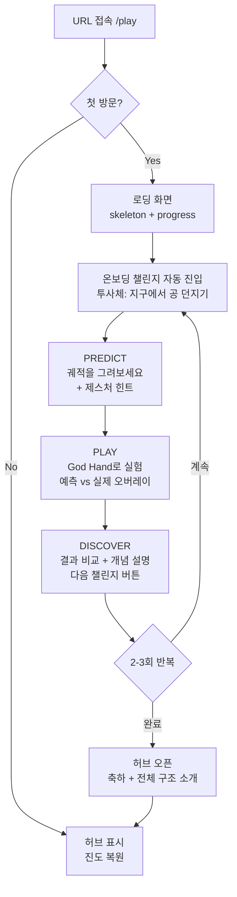
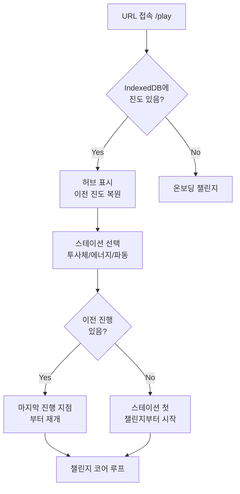
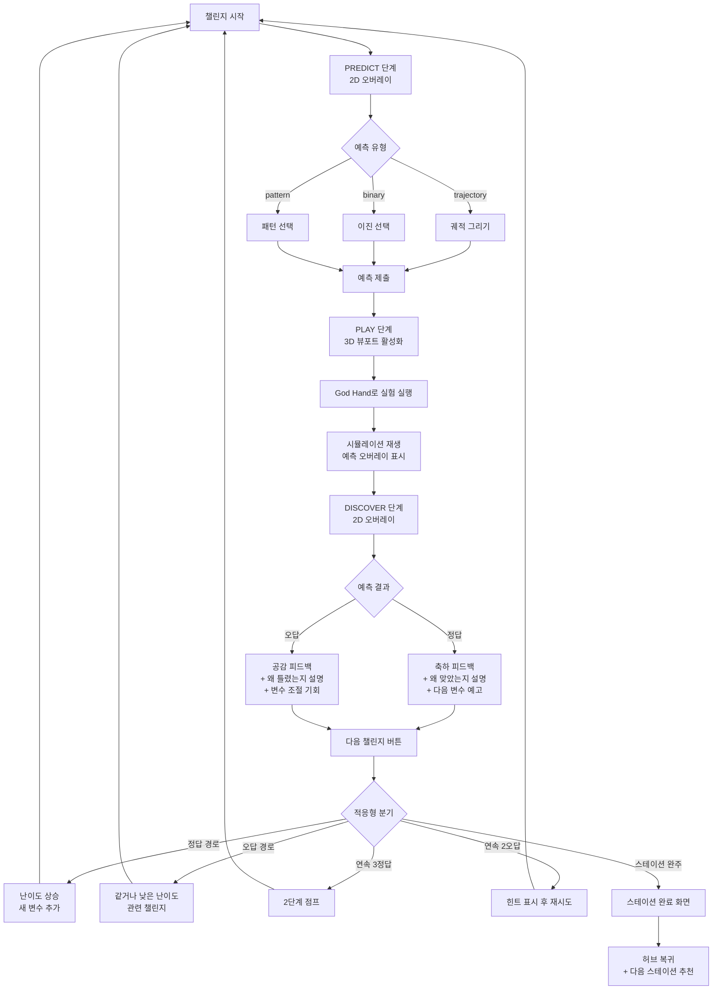
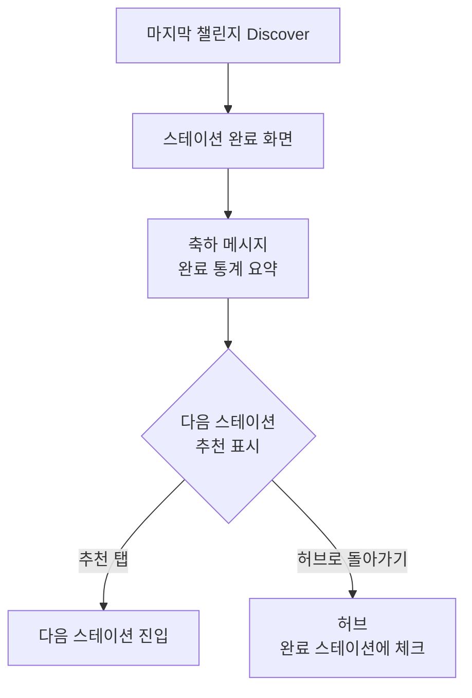

# PhysPlay -- UX Design

**Status:** Draft
**Last Updated:** 2026-03-02
**Related:** [Product Brief](./product-brief.md) | [PRD](./prd.md) | [Phase 1 PRD](./prd-phase-1.md) | [Client Structure](./client-structure.md)

---

## 1. UX Strategy & Principles

### 1.1 User's ONE Goal (JTBD)

> "물리 개념을 내 손으로 실험하고, 내 예측이 맞는지 틀렸는지 즉시 확인하면서, 호기심이 계속 이어지는 경험을 하고 싶다."

이 하나의 목표에서 모든 UX 결정이 출발한다. 이 목표에 기여하지 않는 요소는 제거한다.

### 1.2 Proto-Personas

**Primary -- 민준 (16세, 고1)**
```
Name:         민준
Role:         고등학교 1학년 학생
Goal:         과학이 게임처럼 재밌으면 좋겠다
Context:      스마트폰(세로 모드), 등하교 중 또는 집에서, 짧은 집중 시간(5-10분)
Frustrations: 수식이 먼저 나와서 포기, 물리가 지루함
Tech comfort: High (게임/SNS에 익숙)
```

**Secondary -- 지영 (29세, 개발자)**
```
Name:         지영
Role:         커리어 전환 중인 개발자
Goal:         틀려도 괜찮은 환경에서 양자역학 직관을 잡고 싶다
Context:      데스크톱 또는 태블릿, 집에서, 집중 모드(20-30분)
Frustrations: 기존 교재가 너무 학문적, 자기 수준에 안 맞음
Tech comfort: Very High
```

**Secondary -- 박 선생님 (35세, 물리 교사)**
```
Name:         박 선생님
Role:         고등학교 물리 교사
Goal:         수업 중 URL만 공유하면 학생들이 각자 예측하고 확인하는 수업을 하고 싶다
Context:      교실에서 수업 중, 학생들은 각자 스마트폰으로 접속
Frustrations: 물리 실험 준비 시간 과다, 시각적 교보재 부족
Tech comfort: Medium
```

### 1.3 UX Principles

모든 설계 결정에 적용하는 5가지 원칙. 각 원칙은 인지 과학 원리에 근거한다.

| # | Principle | 설명 | 근거 |
|---|-----------|------|------|
| **P1** | **30초 안에 와우** | URL 열기부터 첫 Predict-Play-Discover 한 바퀴까지 30초. 회원가입, 설명 화면, 트랙 선택 없음 | Peak-End Rule -- 첫 경험이 제품 인상의 80%를 결정한다 |
| **P2** | **예측이 먼저, 항상** | 모든 챌린지는 예측 없이 시작할 수 없다. 예측은 "내 생각을 건다"는 행위이며, 이것이 결과에 대한 관심을 만든다 | Cognitive Load Theory (Germane load) -- 능동적 예측이 학습을 위한 유의미한 인지 부하를 생성한다 |
| **P3** | **3D는 Play에만** | 3D 뷰포트는 실험(Play) 단계에만 사용. 예측/발견은 2D 오버레이, 허브/설정은 순수 2D | Cognitive Load Theory -- 불필요한 3D 렌더링은 extraneous load를 증가시키고 모바일 배터리/발열 문제를 일으킨다 |
| **P4** | **손이 기억한다** | God Hand 인터랙션 -- 1인칭 테이블탑 시점에서 직접 조작. 모든 디바이스에서 "내 손으로 실험한다"는 동일한 멘탈 모델 | Jakob's Law -- 물리적 세계에서 사물을 조작하는 방식과 동일한 패턴을 사용한다 |
| **P5** | **틀림은 보상이다** | 틀린 예측은 처벌이 아니라 발견의 시작. "왜 틀렸을까?"가 자연스럽게 개념 설명으로 이어진다 | Goal Gradient + Zeigarnik Effect -- 인지적 갈등이 해소되지 않은 상태가 다음 챌린지에 대한 동기를 만든다 |

### 1.4 Design Constraints

| Constraint | 영향 |
|-----------|------|
| Mobile-first (Primary: 16세 한국 학생, 거의 100% 스마트폰) | 터치 제스처 기본, 세로 모드 우선, 44pt+ 터치 타깃 |
| Phase 1 계정 없음 | IndexedDB 로컬 저장, 진도 동기화 불가 안내 필요 |
| 60fps on mid-range | 3D 씬 경량화, adaptive quality, 불필요한 3D 렌더링 제거 |
| 3초 이내 초기 로딩 | Progressive loading, poster image, code splitting |
| i18n (ko/en) | 모든 UX copy 양언어, 기본은 브라우저 설정 |
| Dark mode | Light/Dark, 3D 씬은 공간 테마에 맞게 자체 조명 (시스템 테마와 독립) |

---

## 2. Information Architecture

### 2.1 Navigation Model

**Flat hub-and-spoke** 패턴을 사용한다.

- **Hub (허브)**: 중심점. 모든 공간과 스테이션으로의 진입점
- **Spoke (스포크)**: 각 스테이션의 챌린지 시퀀스. 선형 진행(Wizard/Stepper)
- **Depth**: Hub (L1) -> Station (L2) -> Challenge (L3) = 최대 3단계

근거:
- IA Principle of Choices -- 허브에서 3-5개 스테이션 중 선택 (Phase 1은 3개). Miller's Law 범위 내
- IA Principle of Focused Navigation -- 허브(공간/스테이션 탐색)와 챌린지(코어 루프 진행)의 네비게이션을 분리
- IA Principle of Front Doors -- `/play`로 직접 진입 시에도 온보딩이 동작

### 2.2 Screen Hierarchy (Sitemap)

```
[PhysPlay]
|
+-- / (Landing Page) [Phase 1]
|   +-- Email Collection (교사용) [Phase 1]
|
+-- /play [Phase 1]
|   |
|   +-- Onboarding Challenge (첫 방문 시) [Phase 1]
|   |
|   +-- Hub (연구소 허브) [Phase 1]
|   |   +-- 역학 실험실 공간 카드 [Phase 1]
|   |   +-- 분자 실험실 공간 카드 (잠김) [Phase 1: 실루엣]
|   |   +-- 우주 관측소 공간 카드 (잠김) [Phase 1: 실루엣]
|   |   +-- 양자 연구소 공간 카드 (잠김) [Phase 1: 실루엣]
|   |
|   +-- Station View (스테이션) [Phase 1]
|   |   +-- 투사체 스테이션 [Phase 1]
|   |   +-- 에너지 스테이션 [Phase 1]
|   |   +-- 파동 스테이션 [Phase 1]
|   |   +-- (소리/빛 스테이션) [Phase 2]
|   |   +-- (전자기 스테이션) [Phase 2]
|   |
|   +-- Challenge (챌린지 코어 루프) [Phase 1]
|       +-- Predict (예측) [Phase 1]
|       +-- Play (실험) [Phase 1]
|       +-- Discover (발견) [Phase 1]
|       +-- Next (다음 챌린지 전환) [Phase 1]
|
+-- Settings (설정) [Phase 1]
|   +-- Language (ko/en) [Phase 1]
|   +-- Theme (Light/Dark) [Phase 1]
|   +-- Data (로컬 데이터 관리) [Phase 1]
|   +-- (Account) [Phase 3]
|
+-- (Teacher Dashboard) [Phase 3]
+-- (Challenge Editor) [Phase 3+]
```

### 2.3 Entry Points

| Entry Point | 경로 | 행동 |
|------------|------|------|
| SEO/검색 유입 | `/` (Landing) | 제품 설명 -> "시작하기" -> `/play` |
| 친구 공유 링크 | `/play` | 첫 방문: 온보딩 챌린지. 재방문: 허브 |
| 특정 챌린지 공유 | `/play?station=projectile&challenge=moon-45` [Phase 2+] | 해당 챌린지로 직접 진입 |
| 교사 수업 링크 | `/play` | 학생들이 각자 디바이스로 접속 |

### 2.4 Navigation Elements

| 요소 | 위치 | 용도 | 구현 |
|------|------|------|------|
| 뒤로 가기 | 화면 좌상단 | Challenge -> Station, Station -> Hub | Stack Navigation (chevron + 이전 화면명) |
| 설정 | 허브 우상단 | 언어, 테마, 데이터 관리 | Bottom Sheet |
| 스테이션 탭 | 챌린지 화면 하단 | 현재 스테이션 내 진행 상태 | Progress dots (현재 위치 표시) |
| 허브 버튼 | 챌린지 화면 좌상단 | 언제든 허브로 복귀 | Icon button (home) |

---

## 3. User Flows

### 3.1 첫 방문 온보딩 (URL -> 첫 챌린지 -> 허브) [Phase 1]



**설계 근거:**
- 30초 원칙 (P1): 회원가입, 트랙 선택, 튜토리얼 슬라이드 모두 제거. 첫 화면이 곧 첫 챌린지
- Peak-End Rule: 온보딩의 끝이 "와우, 허브가 열렸다!"라는 발견의 순간
- Anti-pattern 회피: 불필요한 온보딩 화면 제거 (UI가 자명하면 설명 불필요)

**온보딩에서 가르치는 것 (최소한):**
1. 예측 방법 (궤적 그리기): "손가락으로 공이 날아갈 궤적을 그려보세요" + 제스처 힌트 애니메이션
2. 시뮬레이션 실행: "실험 시작" 버튼 탭
3. 결과 확인: 예측 궤적과 실제 궤적이 겹쳐 보임

**가르치지 않는 것 (나중에 자연스럽게 발견):**
- 카메라 조작 (회전, 줌)
- 설정 변경
- 다른 스테이션의 존재 (허브에서 발견)

### 3.2 재방문 (허브 -> 스테이션 -> 챌린지) [Phase 1]



**설계 근거:**
- Zeigarnik Effect: "Continue where you left off" -- 미완료 스테이션이 가장 눈에 띄게 표시
- Goal Gradient: 진행률 바를 통해 "거의 다 왔다" 감각 제공

### 3.3 코어 루프 (Predict -> Play -> Discover -> Next) [Phase 1]



**핵심 UX 결정:**

1. **예측은 스킵 가능하되, 명시적 행위로 추적된다** -- 예측을 강제하되, "건너뛰기"는 작고 눈에 덜 띄는 텍스트 버튼으로 제공. 스킵율 30% 초과 시 UX 개선 트리거.
   - 근거: Hick's Law -- 선택지를 줄이되, 탈출구는 항상 존재해야 한다
2. **Play에서 Discover로의 전환은 자동** -- 시뮬레이션 종료 시 자연스럽게 Discover 오버레이 등장. 사용자가 "다음" 버튼을 눌러야 다음 챌린지로 이동 (자동 진행 없음).
   - 근거: Doherty Threshold -- Play->Discover 전환은 300ms 이내. 사용자가 결과를 흡수할 시간 제공
3. **Discover는 짧게, 깊이는 선택적** -- 기본 설명은 1-2문장. "더 알아보기"로 상세 설명 펼치기.
   - 근거: Cognitive Load -- 모바일에서 긴 텍스트는 읽히지 않는다. Progressive disclosure

### 3.4 스테이션 완료 -> 허브 복귀 [Phase 1]



**설계 근거:**
- Peak-End Rule: 스테이션의 끝이 축하와 성취감의 순간
- Goal Gradient: "에너지 스테이션도 도전해 보세요" -- 다음 목표를 즉시 제시
- Serial Position Effect: 추천(다음 스테이션)을 눈에 띄게, "허브로 돌아가기"는 보조 동작으로

### 3.5 크로스-스테이션 내비게이션 [Phase 1]

| 경로 | 트리거 | 행동 |
|------|--------|------|
| 허브 -> 스테이션 | 스테이션 카드 탭 | Stack push (slide right) |
| 스테이션 -> 허브 | 뒤로가기 또는 홈 버튼 | Stack pop (slide left) |
| 스테이션 A -> 스테이션 B | 완료 화면의 추천, 또는 허브 경유 | 허브 경유 (직접 전환은 Phase 1에서 미지원) |
| 챌린지 중 -> 허브 | 좌상단 홈 버튼 | 확인 없이 즉시 이동 (진도는 자동 저장) |

**설계 근거:**
- Anti-pattern 회피: 챌린지 중단 시 "정말 나가시겠습니까?" 확인 대화 없음. 진도가 자동 저장되므로 비파괴적 동작 -> undo 불필요 (interaction-patterns.md: 비파괴적 동작에 확인 대화 금지)

---

## 4. Screen Inventory

### 4.1 Landing Page (`/`) [Phase 1]

**Purpose:** SEO/검색 유입 사용자에게 제품 가치를 전달하고, `/play`로 전환
**Layer:** 2D Page
**Primary Action:** "시작하기" (Start Playing)

| 요소 | 설명 |
|------|------|
| Hero | 제품 핵심 가치 전달 (짧은 데모 GIF/영상) |
| CTA | "지금 시작하기" -> `/play` |
| 교사용 CTA | "교육자이신가요? 이메일 등록" -> Email form |
| 3개 스테이션 미리보기 | 투사체/에너지/파동의 시각적 미리보기 |

**States:**
- Loaded: 기본 상태
- Offline: "인터넷 연결을 확인해 주세요. PhysPlay를 사용하려면 인터넷이 필요합니다." + 재시도 버튼

### 4.2 로딩 화면 [Phase 1]

**Purpose:** 3D 에셋 로딩 중 사용자에게 진행 상태를 전달
**Layer:** 2D -> 3D 전환
**Duration:** 3초 이내 목표

| 요소 | 설명 |
|------|------|
| Skeleton 3D 영역 | 3D 뷰포트 영역의 placeholder (회색 박스 + 로딩 아이콘) |
| Progress indicator | 퍼센트 바 (실제 에셋 크기 기반) |
| 상태 텍스트 | "실험실을 준비하고 있어요..." |

**설계 근거:**
- 3D Loading UX (3d-design.md): poster image 또는 skeleton -> progressive loading -> full quality
- Doherty Threshold: 3초 이내 first meaningful render

### 4.3 Hub (연구소 허브) [Phase 1]

**Purpose:** 전체 공간/스테이션을 탐색하고, 학습 진도를 확인하고, 다음 목표를 선택하는 중심점
**Layer:** 2D Page (3D 씬 비활성화 -- 배터리/발열 절약)
**Route:** `/play` (재방문 시)
**Primary Action:** 스테이션 진입

```
+------------------------------------------+
|  [Gear]                     PhysPlay  [?] |
+------------------------------------------+
|                                          |
|  역학 실험실                              |
|  +-----------+ +-----------+ +-----------+|
|  | 투사체    | | 에너지    | | 파동      ||
|  | [=====  ] | | [==     ] | | [       ] ||
|  | 60%       | | 20%       | | 시작하기  ||
|  +-----------+ +-----------+ +-----------+|
|                                          |
|  Coming Soon                              |
|  +-----------+ +-----------+ +-----------+|
|  | 분자      | | 우주      | | 양자      ||
|  | (잠김)    | | (잠김)    | | (잠김)    ||
|  +-----------+ +-----------+ +-----------+|
|                                          |
+------------------------------------------+
```

**States:**

| State | 설명 | 디자인 |
|-------|------|--------|
| Empty (첫 방문 후) | 온보딩 직후, 모든 스테이션 미시작 | 투사체에 "계속하기" 강조, 나머지 "시작하기" |
| Loaded | 진도 있음 | 각 스테이션 진행률 표시, 미완료 스테이션 강조 |
| Partial | 일부 스테이션 완료 | 완료 체크 + "다음 추천" 뱃지 |
| All Complete | 모든 스테이션 완주 | 축하 + 잠긴 공간으로 관심 유도 |
| Error | IndexedDB 읽기 실패 | "진도를 불러올 수 없습니다. 처음부터 시작합니다." + 재시도 버튼 |
| Offline | 네트워크 끊김 | 로컬 캐시로 허브 표시 + "오프라인 모드" 배너 |

**스테이션 카드 정보:**
- 스테이션 이름
- 아이콘/일러스트레이션 (각 스테이션의 핵심 시각)
- 진행률 바 (0-100%)
- 상태 텍스트: "시작하기" / "계속하기" / "완료"
- 잠긴 스테이션: 실루엣 + "Coming Soon"

**설계 근거:**
- Zeigarnik Effect: 미완료 스테이션이 가장 눈에 띄게 (진행률 바가 시각적으로 "미완료"를 강조)
- Goal Gradient: 진행률 바가 "거의 다 왔다"는 동기를 제공
- Hick's Law: Phase 1에서 선택지는 3개 (활성 스테이션). 잠긴 공간은 호기심은 유발하되 선택을 요구하지 않음
- Von Restorff Effect: 가장 진행이 앞선 스테이션(또는 추천 스테이션)을 시각적으로 구별

### 4.4 Station View (스테이션 진입) [Phase 1]

**Purpose:** 스테이션 소개 + 현재 챌린지 시작점
**Layer:** 2D -> 3D 전환 (3D 씬 로딩 시작)
**Primary Action:** 첫 챌린지 시작 / 이어하기

스테이션에 진입하면 즉시 현재 챌린지의 Predict 단계로 이동한다. 별도의 스테이션 "랜딩" 화면은 두지 않는다.

**설계 근거:**
- Step Reduction (design-process.md 4c): 스테이션 소개 화면은 불필요한 단계. 바로 챌린지로 진입하는 것이 첫 원칙에 부합

### 4.5 Challenge: Predict 단계 [Phase 1]

**Purpose:** 사용자가 결과를 예측하여 인지적 참여를 시작하는 단계
**Layer:** 3D Viewport (배경, 저전력) + 2D Overlay (예측 UI)
**Primary Action:** 예측 제출

3D 뷰포트에는 해당 챌린지의 초기 세팅(공의 위치, 트랙의 형태, 파원의 위치 등)이 정적으로 표시된다. 사용자의 주의는 2D 오버레이의 예측 입력에 집중된다.

**카메라 조작 정책 (예측 유형별):**
- **Trajectory (궤적 그리기):** 카메라 비활성. 드로잉 제스처와 카메라 제스처가 충돌하기 때문. 초기 카메라 앵글이 최적 관찰 시점을 제공
- **Binary / Pattern:** 카메라 활성. 예측 입력이 2D 오버레이(버튼/카드)이므로 3D 제스처 충돌 없음. 에너지 스테이션에서 트랙 루프 높이 확인, 파동 스테이션에서 파원 위치 파악에 카메라 자유도가 필요

```
+------------------------------------------+
| [< Hub]              투사체 스테이션  2/10 |
+------------------------------------------+
|                                          |
|          [3D Viewport -- 정적]            |
|          공이 발사대 위에 놓여 있음         |
|          (trajectory: 카메라 비활성)       |
|          (binary/pattern: 카메라 활성)     |
|                                          |
+------------------------------------------+
|  +--------------------------------------+|
|  |                                      ||
|  |  이 공을 달에서 던지면                 ||
|  |  어디에 떨어질까?                      ||
|  |                                      ||
|  |  [궤적 그리기 캔버스]                  ||
|  |                                      ||
|  |  [예측 제출하기]       건너뛰기         ||
|  |                                      ||
|  +--------------------------------------+|
+------------------------------------------+
```

**예측 유형별 UI:**

#### Trajectory (궤적 그리기) -- 투사체 스테이션

| 요소 | 설명 |
|------|------|
| 드로잉 캔버스 | 3D 뷰포트 위에 반투명 오버레이. 손가락/마우스로 궤적을 그린다 |
| 시작점 표시 | 발사 지점이 명확히 표시 (고정 점) |
| 실시간 선 렌더링 | 사용자가 그리는 동안 부드러운 선이 따라온다 |
| 지우기 버튼 | 다시 그리기 가능 |
| 제스처 힌트 | 첫 챌린지에서만: 손가락 아이콘이 궤적을 그리는 애니메이션 |
| CTA | "예측 제출하기" |

**터치 UX 상세:**
- 시작점 근처에서 터치 시작 -> 손가락을 따라 부드러운 곡선 생성
- 손가락을 떼면 그리기 완료
- 핀치/줌은 비활성 (그리기와 충돌 방지)
- 최소 터치 포인트: 5개 이상이어야 유효한 궤적 (너무 짧은 스트로크 방지)
- 지우기: "다시 그리기" 버튼. 전체 삭제 후 재시작 (부분 삭제 없음 -- 단순성)

**데스크톱 UX:**
- 마우스 클릭+드래그로 궤적 그리기
- 커서: crosshair (그리기 모드임을 표시)

#### Binary (이진 선택) -- 에너지 스테이션

| 요소 | 설명 |
|------|------|
| 질문 텍스트 | "카트가 루프를 통과할 수 있을까?" |
| 선택지 2개 | 크고 명확한 버튼: "통과한다" / "못 한다" |
| 선택 피드백 | 탭 시 버튼이 선택 상태로 변경 (색상 + 체크) |
| CTA | "예측 제출하기" (선택 후 활성화) |

```
+------------------------------------------+
|  카트가 루프를 통과할 수 있을까?           |
|                                          |
|  +------------------+ +------------------+|
|  |                  | |                  ||
|  |   통과한다       | |   못 한다        ||
|  |                  | |                  ||
|  +------------------+ +------------------+|
|                                          |
|  [예측 제출하기]                           |
+------------------------------------------+
```

**설계 근거:**
- Fitts's Law: 선택 버튼은 충분히 크게 (최소 56pt 높이, 화면 너비의 45% 이상)
- Hick's Law: 2개 선택지 = 최소 결정 시간

#### Pattern (패턴 선택) -- 파동 스테이션

| 요소 | 설명 |
|------|------|
| 질문 텍스트 | "두 파원에서 파동이 나오면 어떤 패턴이 생길까?" |
| 패턴 선택지 | 3-4개의 간섭 패턴 이미지/다이어그램 카드 |
| 선택 피드백 | 탭 시 카드가 선택 상태 (테두리 강조) |
| CTA | "예측 제출하기" (선택 후 활성화) |

```
+------------------------------------------+
|  어떤 간섭 패턴이 생길까?                  |
|                                          |
|  +--------+  +--------+  +--------+      |
|  | 패턴 A |  | 패턴 B |  | 패턴 C |      |
|  | [img]  |  | [img]  |  | [img]  |      |
|  +--------+  +--------+  +--------+      |
|                                          |
|  [예측 제출하기]                           |
+------------------------------------------+
```

**설계 근거:**
- Miller's Law: 선택지는 3-4개로 제한. 난이도가 올라가면 4개, 기본은 3개
- Von Restorff Effect: 선택된 카드는 크기가 살짝 확대되고 테두리가 강조

**모든 예측 유형 공통:**

| 요소 | 설명 |
|------|------|
| 챌린지 번호 | "2/10" -- 현재 위치와 전체 수 (Goal Gradient) |
| 환경 정보 | "달 | 중력: 1.63 m/s^2" -- 변수 컨텍스트 (Cognitive Load 감소: 기억 대신 표시) |
| 건너뛰기 | 작은 텍스트 버튼 "건너뛰기". 탭 시 바로 Play로 이동. 예측 값 없이 시뮬레이션 실행 |
| 제출 버튼 | Primary CTA "예측 제출하기". 예측 입력 완료 전에는 비활성(disabled) |

**States:**

| State | 설명 |
|-------|------|
| Empty | 예측 입력 전. CTA 비활성 |
| In Progress | 궤적 그리는 중 / 선택 고민 중 |
| Ready | 예측 입력 완료. CTA 활성 |
| Submitting | 제출 중 (거의 즉시, <100ms) |
| Error | 3D 씬 로딩 실패 시: "실험실을 불러올 수 없습니다. 다시 시도해 주세요." + 재시도 |

### 4.6 Challenge: Play 단계 [Phase 1]

**Purpose:** God Hand로 시뮬레이션을 실행하고, 예측과 결과를 시각적으로 비교
**Layer:** 3D Viewport (전체 활성) + Minimal 2D Overlay
**Primary Action:** 시뮬레이션 관찰 (자동 진행 후 Discover로 전환)

```
+------------------------------------------+
| [< Hub]                           [cam]  |
+------------------------------------------+
|                                          |
|                                          |
|          [3D Viewport -- 전체 활성]       |
|          God Hand 시점                    |
|          카메라 조작 가능                  |
|                                          |
|   예측 궤적 (점선, 반투명)                |
|        .-'''-.                           |
|       /       \  실제 궤적 (실선)         |
|      /    .-'  \___                      |
|     /    /                               |
|    *----                                 |
|                                          |
+------------------------------------------+
| [실험 시작]                               |
+------------------------------------------+
```

**시퀀스:**

1. Predict에서 제출 -> Play 전환 (300ms fade)
2. 3D 뷰포트 전체 활성화, 카메라 조작 가능
3. 사용자가 "실험 시작" 탭 (투사체 기본: 버튼, 에너지/파동: 버튼, 투사체 자유 실험: 스와이프 던지기)
4. 시뮬레이션 재생: 물체가 물리 법칙에 따라 움직임
5. 예측 결과 오버레이: 사용자의 예측(반투명 점선)과 실제 결과(실선)가 동시 표시
6. 시뮬레이션 종료 -> Discover 오버레이 자동 등장 (500ms delay 후)

**스테이션별 Play 상세:**

| 스테이션 | 사용자 조작 | 시뮬레이션 시각화 | 예측 비교 표현 |
|---------|-----------|-----------------|-------------|
| 투사체 (기본) | "실험 시작" 버튼 탭 (변수는 JSON 고정: 각도, 속도) | 포물선 궤적 + 착지점 | 예측 궤적(점선) vs 실제 궤적(실선) 오버레이 |
| 투사체 (자유 실험) | 스와이프로 공 던지기 (방향+힘을 직접 조작) | 포물선 궤적 + 착지점 | 자유 실험이므로 예측 비교 없음. 변수 변경의 효과를 자유롭게 탐색 |
| 에너지 | "발사" 버튼 탭 (트랙은 고정) | 카트 이동 + 에너지 바 실시간 변화 | 루프 통과/실패 여부가 이진 결과 |
| 파동 | "시작" 버튼 탭 (파원은 고정) | 파동 전파 + 간섭 패턴 형성 | 실제 패턴 형성 후, 선택한 패턴과 나란히 비교 |

**States:**

| State | 설명 |
|-------|------|
| Ready | "실험 시작" 버튼 표시. 3D 씬 로딩 완료 |
| Playing | 시뮬레이션 재생 중. "실험 시작" 버튼 숨김, 카메라 조작 가능 |
| Complete | 시뮬레이션 종료. 예측 비교 오버레이 표시. Discover 전환 대기 |
| Loading | 3D 씬 전환 중. Skeleton + 시뮬레이션 설정 중 |
| Error | 시뮬레이션 오류: "실험에 문제가 생겼습니다. 다시 시도해 주세요." + 재시도 |

**카메라 조작 (3d-design.md 기준):**
- 시뮬레이션 재생 중에도 카메라 조작 가능 (다양한 시점에서 관찰)
- Double-tap으로 카메라 리셋
- 카메라 경계: 실험대 범위 내로 제한 (물체 내부 관통 방지)

### 4.7 Challenge: Discover 단계 [Phase 1]

**Purpose:** 예측과 결과를 비교하고, 과학 개념을 발견하는 학습 단계
**Layer:** 3D Viewport (결과 상태 유지) + 2D Overlay (설명 패널)
**Primary Action:** "다음 챌린지" 또는 "다시 해보기"

```
+------------------------------------------+
| [< Hub]                           [cam]  |
+------------------------------------------+
|                                          |
|          [3D Viewport -- 결과 상태]       |
|          예측 vs 실제 오버레이 유지        |
|                                          |
+------------------------------------------+
|  +--------------------------------------+|
|  |  맞았어요!                            ||
|  |                                      ||
|  |  45도가 최대 사거리 각도입니다.        ||
|  |  중력과 초기 속도가 만드는 포물선에서   ||
|  |  45도가 가장 멀리 보내는 최적 각도예요. ||
|  |                                      ||
|  |  [v 더 알아보기]                      ||
|  |                                      ||
|  |  [공기저항을 켜면 어떨까?]              ||
|  |                  허브로 돌아가기        ||
|  +--------------------------------------+|
+------------------------------------------+
```

**정답일 때:**
- 헤더: 축하 텍스트 + 시각적 성공 피드백 (색상 변화, 미세한 파티클)
- 본문: "왜 맞았는지" 간단 확인 (1-2문장)
- CTA: 다음 챌린지 예고 ("공기저항을 켜면 어떨까?")
- 보조: "허브로 돌아가기"

**오답일 때:**
- 헤더: 공감 텍스트 ("아쉽지만, 좋은 시도였어요!" -- 처벌 아님)
- 본문: "왜 틀렸는지" 구체적 설명 (1-2문장)
- 보조 설명: 관련 변수가 결과에 미치는 영향
- CTA: "다음 챌린지로" (오답 경로의 다음 챌린지)
- 보조: "다시 해보기" (같은 챌린지 재시도 가능)

**"더 알아보기" (Progressive Disclosure):**
- 기본 설명 아래에 접을 수 있는 섹션
- 상세 개념 설명 + 수식 (수식은 항상 부차적)
- 근거: Cognitive Load -- 기본은 직관적 비유, 깊이는 사용자 선택

**States:**

| State | 설명 |
|-------|------|
| Correct | 정답 피드백 + 다음 챌린지 프리뷰 |
| Incorrect | 오답 피드백 + 개념 설명 + 재시도/다음 옵션 |
| Hint | 연속 오답 후: 힌트 텍스트가 추가 표시됨 |
| Station Complete | 마지막 챌린지: 스테이션 완료 축하 화면으로 전환 |
| Offline | 캐시된 설명 표시 (설명은 챌린지 JSON에 포함) |

### 4.8 Station Complete 화면 [Phase 1]

**Purpose:** 스테이션 완주를 축하하고, 다음 탐험을 유도
**Layer:** 2D Overlay (3D 씬 위)
**Primary Action:** 다음 스테이션으로 이동 또는 허브 복귀

```
+------------------------------------------+
|                                          |
|          투사체 스테이션 완료!             |
|                                          |
|          정확도: 70%                      |
|          챌린지: 10/10                    |
|                                          |
|  +--------------------------------------+|
|  |  에너지 스테이션도 도전해 보세요       ||
|  |  롤러코스터로 에너지 보존을 실험!      ||
|  |  [에너지 스테이션 시작하기]            ||
|  +--------------------------------------+|
|                                          |
|          허브로 돌아가기                   |
|                                          |
+------------------------------------------+
```

**설계 근거:**
- Peak-End Rule: 끝이 좋아야 전체 경험이 좋다. 축하 + 성취 요약 + 다음 목표
- Goal Gradient: 다음 스테이션을 즉시 제시하여 동기 연결
- UX Writing: CTA가 구체적 ("에너지 스테이션 시작하기", "OK" 아님)

### 4.9 Settings (설정) [Phase 1]

**Purpose:** 언어, 테마, 로컬 데이터 관리
**Layer:** Bottom Sheet (허브 위에 오버레이)
**Primary Action:** 설정 변경

| 설정 항목 | 컨트롤 | 기본값 |
|----------|--------|--------|
| 언어 | Segmented control: 한국어 / English | 브라우저 설정 |
| 테마 | Segmented control: 시스템 / 라이트 / 다크 | 시스템 |
| 데이터 초기화 | 텍스트 버튼: "학습 진도 초기화" | -- |
| 데이터 안내 | 안내 텍스트 | "진도는 이 브라우저에만 저장됩니다. 브라우저 데이터를 삭제하면 진도가 초기화됩니다." |

**데이터 초기화 확인:**
```
"학습 진도를 초기화하시겠습니까?"
"모든 스테이션의 진행 상태와 예측 기록이 삭제됩니다.
이 작업은 되돌릴 수 없습니다."

[취소]  [진도 초기화]  (빨간색)
```

**설계 근거:**
- Bottom Sheet (information-architecture.md): 설정은 컨텍스트 전환 없이 접근. 허브에서 오버레이로 열림
- Confirmation Dialog (interaction-patterns.md): 데이터 초기화는 파괴적+비가역 동작이므로 확인 필요. 버튼 라벨은 구체적 동사 ("진도 초기화", "확인" 아님)

---

## 5. Interaction Design: God Hand

### 5.1 God Hand 인터랙션 원칙

> "나는 실험자이고, 실험 대상은 내 앞에 있다"

모든 인터랙션은 이 프레임 안에서 설계된다. 캐릭터 없음, 아바타 없음, 3인칭 카메라 없음.

### 5.2 디바이스별 인터랙션 매핑

#### Mobile (Primary) -- Touch

| 인터랙션 | 제스처 | 피드백 | 비고 |
|---------|--------|--------|------|
| 물체 던지기 | 물체 위에서 스와이프 (방향+속도가 힘+방향) | 방향 화살표 + 파워 게이지 표시 | 자유 실험 챌린지에서만 활성. 기본 챌린지는 "실험 시작" 버튼. Fitts's Law: 물체 터치 영역 > 시각적 크기 (최소 48pt hit area) |
| 궤적 그리기 | 한 손가락 드래그 | 실시간 선 렌더링 (부드러운 곡선) | Predict 단계에서만 활성 |
| 카메라 회전 | 한 손가락 드래그 (빈 공간) | 관성 적용 (dampingFactor: 0.05) | Play 단계 + Predict(binary/pattern)에서 활성. Predict(trajectory)에서는 비활성 (드로잉 충돌 방지) |
| 카메라 줌 | 두 손가락 핀치 | 부드러운 줌, 경계 제한 | minDistance/maxDistance 설정 |
| 카메라 패닝 | 두 손가락 드래그 | 뷰 이동 | Play 단계 + Predict(binary/pattern)에서 활성 |
| 카메라 리셋 | 더블 탭 (빈 공간) | 초기 시점으로 부드럽게 복귀 (500ms) | 항상 사용 가능 |
| 오브젝트 선택 | 탭 | 하이라이트 + 정보 표시 | Play 단계에서 물체 정보 확인 |

**충돌 방지 규칙:**
- Predict(trajectory) 단계: 카메라 조작 비활성, 드로잉만 활성 -> 충돌 없음
- Predict(binary/pattern) 단계: 카메라 조작 활성. 예측 입력이 2D 오버레이 버튼/카드이므로 3D 제스처와 충돌 없음. 에너지 스테이션(트랙 구조 확인)과 파동 스테이션(파원 위치 파악)에서 카메라 회전/줌이 예측 정확도를 높인다
- Play 단계: 카메라 조작은 빈 공간에서만. 물체 위에서는 선택 우선
- 3D 캔버스 외부: 일반 페이지 스크롤 정상 동작 (`touch-action: none`은 3D 캔버스에만)
- 근거: 3d-design.md -- `touch-action` 설정으로 스크롤과 3D 인터랙션 분리. Cognitive Load -- 사용자가 기억 대신 관찰로 정보를 얻을 수 있어야 한다

#### Desktop -- Mouse + Keyboard

| 인터랙션 | 입력 | 피드백 | 비고 |
|---------|------|--------|------|
| 물체 던지기 | 물체 위에서 클릭+드래그+릴리즈 | 방향 화살표 + 파워 게이지 | 자유 실험 챌린지에서만 활성. 커서: `grab` -> `grabbing` |
| 궤적 그리기 | 클릭+드래그 | 실시간 선 렌더링 | 커서: `crosshair` |
| 카메라 회전 | 좌클릭+드래그 (빈 공간) | 관성 적용 | 커서: `grab` -> `grabbing` |
| 카메라 줌 | 스크롤 휠 / 트랙패드 핀치 | 부드러운 줌 | 경계 제한 |
| 카메라 패닝 | 우클릭+드래그 / 미들클릭+드래그 | 뷰 이동 | -- |
| 카메라 리셋 | 더블클릭 (빈 공간) 또는 `R` 키 | 초기 시점 복귀 | -- |
| 오브젝트 호버 | 마우스 오버 | 아웃라인 글로우 | Raycast 기반 |
| 오브젝트 선택 | 좌클릭 | 하이라이트 + 정보 | -- |

#### XR [Phase 2+] -- Hand Tracking

| 인터랙션 | 입력 | 피드백 | 비고 |
|---------|------|--------|------|
| 물체 던지기 | 손으로 집기 + 던지기 동작 | 물체가 손을 따라감 + 물리 기반 릴리즈 | 가장 직관적인 God Hand |
| 궤적 그리기 | 손가락으로 공중에 그리기 | 공중에 빛나는 선이 그려짐 | Predict 단계 |
| 카메라 조작 | 물리적 머리/몸 이동 | 1:1 tracking | 별도 카메라 조작 불필요 |
| 오브젝트 선택 | 시선 + 핀치 | 하이라이트 + 정보 | visionOS 패턴 |

### 5.3 스테이션별 God Hand 특수 인터랙션

| 스테이션 | Mobile 특수 | Desktop 특수 | 핵심 느낌 |
|---------|-----------|-------------|----------|
| 투사체 (기본 챌린지) | "실험 시작" 버튼 탭. 변수(각도, 속도)는 JSON 고정. 화면에 "45도, 10m/s" 표시 | 동일 | "내 예측과 물리 법칙의 대결" |
| 투사체 (자유 실험) | 스와이프 각도/속도 = 발사 각도/속도 | 드래그 방향/길이 = 발사 | "직접 던지는 느낌" |
| 에너지 | "발사" 버튼 탭 (트랙은 시각적으로만 관찰) | 동일 | "카트를 출발시키는 느낌" |
| 파동 | "시작" 버튼 탭 (파원은 고정) | 동일 | "파동을 발생시키는 느낌" |

**투사체 기본 챌린지 -- 왜 "실험 시작" 버튼인가:**

Predict에서 사용자가 "45도, 10m/s에서 공을 던지면 어디에 떨어질까?"를 예측한다. Play에서 정확히 같은 조건(45도, 10m/s)으로 시뮬레이션이 실행되어야 예측과 결과를 의미 있게 비교할 수 있다. 사용자가 직접 던지면 의도한 각도/속도와 실제 입력이 불일치할 수 있으며, 이 경우 "내 예측이 틀린 건지, 던지기가 잘못된 건지" 구분이 안 된다.

- 근거: Cognitive Load Theory -- 변수를 고정하여 인지 부담을 줄이고, 사용자의 관찰을 물리 현상에 집중시킨다
- 근거: P2 (예측이 먼저) -- 예측 조건과 실험 조건이 동일해야 "예측 vs 결과" 비교가 유효하다

**Throwing Mechanic 상세 (투사체 자유 실험 챌린지):**

자유 실험 챌린지(예: 스테이션 마지막 챌린지 "자유 실험")에서만 사용. 예측 단계가 없거나, "내가 직접 설정한 조건의 결과를 탐색"하는 모드.

1. 사용자가 공을 터치(또는 클릭)하면: 공이 "잡힌" 상태. 시각적 하이라이트 + 미세 진동(haptic)
2. 드래그하면: 드래그 반대 방향으로 "발사 방향" 화살표 표시 + 파워 게이지 (드래그 길이에 비례)
3. 손을 떼면: 공이 발사. 시뮬레이션 시작
4. 발사 중: 카메라가 공을 부드럽게 추적 (자동 회전은 최소한. 사용자 카메라 조작 우선)

```
      잡기           드래그           릴리즈
    [ O ]  -->  [ O ]<----->  -->  [ O ] =====>
     공           공 + 화살표        공 발사!
```

**설계 근거:**
- 3d-design.md: 3D 오브젝트 hit area는 시각적 크기보다 크게 (48pt+ screen projection)
- interaction-patterns.md: 모든 인터랙션에 즉각적 시각 피드백 (<100ms)
- cognitive-principles.md (Doherty Threshold): 터치/클릭 피드백 <100ms, 시뮬레이션 시작 <400ms

### 5.4 던지기 시각 보조 (P1 REQ-303)

방향과 힘을 시각적으로 표현하여, 사용자가 자신의 입력을 인지하고 제어할 수 있게 한다.

| 시각 요소 | 설명 |
|----------|------|
| 방향 화살표 | 드래그 반대 방향으로 표시되는 화살표. 발사 방향 예시 |
| 파워 게이지 | 화살표 길이 또는 색상 변화 (짧은/초록 -> 긴/빨강). 발사 힘 표시 |
| 각도 표시 | 발사 각도가 숫자로 표시 (예: "45도"). 수평선 기준 |
| 궤적 프리뷰 | 없음 -- 발사 전에 궤적을 보여주면 Predict의 의미가 사라짐 |

---

## 6. Prediction UX 상세

### 6.1 공통 UX 패턴

모든 예측 유형에 적용되는 공통 규칙:

| 규칙 | 설명 | 근거 |
|------|------|------|
| 예측 없이 Play 불가 | "예측 제출하기" 또는 "건너뛰기"를 해야 Play 진입 | P2 (예측이 먼저, 항상) |
| 건너뛰기는 항상 가능 | 작은 텍스트 버튼으로 제공 | 사용자 자율성. 강제는 이탈을 유발 |
| 건너뛰기는 추적됨 | predict_skip 이벤트 발생 | 스킵율 30% 초과 시 UX 개선 트리거 |
| 환경 변수 표시 | 현재 챌린지의 핵심 변수가 화면에 표시 | Cognitive Load -- 기억 대신 인식 |
| 챌린지 번호 표시 | "2/10" 형식으로 현재 위치 | Goal Gradient |
| 되돌리기 지원 | 궤적 다시 그리기, 선택 변경 가능 | Forgiveness -- 모든 동작은 수정 가능 |

### 6.2 Trajectory 예측 UX (궤적 그리기)

**인지 과학 근거:** 궤적 그리기는 가장 강력한 인지적 갈등을 만든다. "내가 직접 그린 선"과 "실제 궤적"이 겹쳐 보이는 순간, 차이가 공간적으로 명확히 드러나기 때문이다.

**입력 상세:**

| 항목 | 사양 |
|------|------|
| 캔버스 영역 | 3D 뷰포트 위 반투명 2D 오버레이 |
| 시작 제약 | 발사 지점 근처(반경 40pt)에서 터치를 시작해야 유효 |
| 선 스타일 | 부드러운 곡선 (Bezier smoothing), 색상: 사용자 테마 accent |
| 최소 길이 | 5개 이상 터치 포인트 (너무 짧은 스트로크 방지) |
| 최대 길이 | 화면 밖으로 나가면 자동 종료 |
| 지우기 | "다시 그리기" 버튼 (전체 리셋) |
| 완료 조건 | 손가락/마우스를 떼면 그리기 종료 |

**결과 비교 시각화:**

```
예측 궤적: 점선 (사용자 accent 색)
실제 궤적: 실선 (시스템 색)
차이 영역: 차이가 큰 지점에 반투명 하이라이트
착지점: 예측 착지점(O)과 실제 착지점(X)을 모두 표시
```

**오차 판정:**
- 착지점 기준 +-15% 이내 = 정답
- 판정 결과는 시각적으로 명확히 표시: 정답 = 초록 체크, 오답 = 빨간 X (+ 텍스트 라벨, 색상만으로 판단하지 않음)
- 근거: ergonomics.md -- 색상만으로 상태 표시 금지. 아이콘+텍스트+색상 조합

### 6.3 Binary 예측 UX (이진 선택)

**인지 과학 근거:** 가장 빠른 예측 방식. "될까/안 될까"의 양자택일은 결정 시간이 짧고, 결과가 즉각적이라 인지적 갈등이 날카롭다.

**입력 상세:**

| 항목 | 사양 |
|------|------|
| 선택지 수 | 항상 2개 |
| 버튼 크기 | 각각 화면 너비 45% 이상, 높이 56pt 이상 |
| 선택 피드백 | 탭 시 즉각 색상 변화 + 체크 아이콘 (100ms 이내) |
| 선택 변경 | 다른 버튼 탭으로 변경 가능 |
| 제출 | 선택 후 "예측 제출하기" 활성화 |

**결과 비교:**
- 정답: 선택한 버튼에 초록 테두리 + 체크
- 오답: 선택한 버튼에 빨간 테두리 + X, 정답 버튼에 초록 하이라이트

### 6.4 Pattern 예측 UX (패턴 선택)

**인지 과학 근거:** 패턴 인식은 시각적 사고를 유도한다. 여러 결과 패턴을 비교하는 과정에서 "어떤 원리가 이 패턴을 만드는가?"라는 질문이 자연스럽게 생긴다.

**입력 상세:**

| 항목 | 사양 |
|------|------|
| 선택지 수 | 3개 (기본) / 4개 (고난이도) |
| 카드 레이아웃 | 가로 스크롤 (모바일) / 나란히 배치 (데스크톱) |
| 카드 크기 | 최소 100x100pt (패턴이 식별 가능한 크기) |
| 선택 피드백 | 탭 시 카드 확대 (scale 1.05) + 테두리 강조 |
| 선택 변경 | 다른 카드 탭으로 변경 가능 |
| 제출 | 선택 후 "예측 제출하기" 활성화 |

**결과 비교:**
- 선택한 패턴과 실제 패턴을 나란히 또는 오버레이로 비교
- 정답: 선택 카드에 체크, "이 패턴이 맞아요!"
- 오답: 선택 카드에 X, 정답 카드에 체크 + 차이 설명

---

## 7. 3D Viewport + 2D Overlay 구성

### 7.1 레이어 구조

```
+------------------------------------------+
|          2D Chrome Layer                  |
|  (navigation, status, system UI)         |
+------------------------------------------+
|                                          |
|          3D Viewport Layer               |
|  (Three.js / R3F canvas)                |
|  (God Hand interaction here)             |
|                                          |
+------------------------------------------+
|          2D Overlay Layer                 |
|  (Predict UI, Discover panel)            |
|  (HTML elements over 3D canvas)          |
+------------------------------------------+
```

### 7.2 단계별 레이어 활성 상태

| 단계 | 3D Viewport | 2D Overlay | 2D Chrome |
|------|-------------|------------|-----------|
| Landing (`/`) | OFF | OFF | Full page 2D |
| Hub | OFF (절전) | OFF | Full page 2D |
| Predict | ON (정적, 저전력) | ON (예측 입력 UI) | Minimal (뒤로가기, 진행 번호) |
| Play | ON (전체 활성, 고성능) | OFF 또는 Minimal | Minimal (뒤로가기, 카메라 리셋) |
| Discover | ON (결과 상태 유지, 저전력) | ON (설명 패널) | Minimal (뒤로가기) |
| Settings | OFF | OFF | Bottom Sheet over Hub |

### 7.3 전환 애니메이션

| 전환 | 애니메이션 | Duration | 이징 |
|------|-----------|----------|------|
| Hub -> Station (Predict) | 3D 씬 fade in + 2D 오버레이 slide up | 500ms | ease-out |
| Predict -> Play | 2D 오버레이 fade out + 3D 전체 활성화 | 300ms | ease-out |
| Play -> Discover | 3D 유지 + 2D 오버레이 slide up | 300ms | ease-out |
| Discover -> Next Predict | 2D 오버레이 cross-fade (설명 -> 다음 예측) | 300ms | ease-in-out |
| Station -> Hub | 3D 씬 fade out + Hub slide in from left | 400ms | ease-out |
| Discover -> Station Complete | 2D 오버레이 expand | 300ms | ease-out |

### 7.4 모바일에서의 뷰포트 비율

**Portrait (세로) -- Primary:**

```
+------------------------------------------+
|  Nav bar (44pt)                          |
+------------------------------------------+
|                                          |
|  3D Viewport (화면 높이의 50-55%)         |
|                                          |
+------------------------------------------+
|                                          |
|  2D Overlay (화면 높이의 40-45%)          |
|  (예측 UI 또는 설명 패널)                 |
|                                          |
+------------------------------------------+
```

**Landscape (가로):**

```
+---------------------------------------------------+
|  Nav (34pt)                                       |
+---------------------------------------------------+
|                              |                    |
|  3D Viewport (65-70%)        |  2D Overlay (30%)  |
|                              |                    |
+---------------------------------------------------+
```

**Desktop:**

```
+----------------------------------------------------------+
|  Nav bar                                                 |
+----------------------------------------------------------+
|                                        |                 |
|  3D Viewport (65-70%)                  | 2D Overlay      |
|                                        | (30-35%)        |
|                                        |                 |
+----------------------------------------------------------+
```

**설계 근거:**
- 3d-design.md: 모바일 portrait에서 3D 뷰어는 화면 높이의 50-60%. 나머지에 2D 컨트롤
- Cognitive Load: 3D와 2D를 동시에 보여주되, 현재 단계에 맞는 하나에만 집중하게

### 7.5 성능 최적화 전략

| 상황 | 렌더링 전략 |
|------|-----------|
| Hub (2D) | 3D 렌더 루프 완전 중지. GPU 릴리즈 |
| Predict | 3D 씬 로딩 시작. 정적 렌더 (rAF 중지, 필요 시 1회 렌더) |
| Play | 전체 렌더 루프 활성. 60fps 타깃 |
| Discover | 3D 결과 상태 유지. 정적 렌더 (사용자 카메라 조작 시에만 렌더) |
| 백그라운드/탭 전환 | 렌더 루프 즉시 중지 (배터리 절약) |
| 뷰포트 밖 (스크롤) | IntersectionObserver로 렌더 중지 |

**적응형 품질 (3d-design.md):**
- FPS < 목표의 80%: pixelRatio 낮춤 -> 후처리 비활성 -> 그림자 비활성 -> LOD 하향 -> AA 비활성
- FPS > 목표의 120%: 점진적 품질 향상

---

## 8. Responsive Strategy

### 8.1 기본 원칙

- **Mobile portrait (375px)이 기본 설계 기준** (Primary 페르소나: 스마트폰 세로 모드)
- 320px에서 깨지지 않아야 한다
- 데스크톱은 확장, 모바일을 축소하는 것이 아니다
- 3D 뷰포트 비율은 디바이스에 따라 적응

### 8.2 Breakpoint별 레이아웃

| Breakpoint | 범위 | 3D/2D 레이아웃 | Hub 레이아웃 | 비고 |
|-----------|------|--------------|------------|------|
| Mobile S | 320px | 세로 분할 (50/50) | 1열 스택 | 320px 최소 테스트 |
| Mobile M | 375px | 세로 분할 (55/45) | 1열 스택 | **Primary** |
| Mobile L | 428px | 세로 분할 (55/45) | 1열, 넓은 여백 | -- |
| Tablet P | 768px | 세로 분할 (60/40) | 2열 그리드 | -- |
| Tablet L | 1024px | 가로 분할 (65/35) | 2열 그리드 | 가로 분할 전환점 |
| Desktop | 1280px+ | 가로 분할 (70/30) | 3열 그리드, max-width 1200px | -- |

### 8.3 적응형 요소

| 요소 | Mobile | Desktop |
|------|--------|---------|
| 예측 입력 (trajectory) | 터치 드로잉. 3D 뷰포트 위 오버레이 | 마우스 드로잉. 3D 뷰포트 위 오버레이 |
| 예측 입력 (binary) | 큰 버튼, 세로 배치 | 큰 버튼, 가로 배치 |
| 예측 입력 (pattern) | 가로 스크롤 카드 | 나란히 배치 |
| Discover 패널 | 하단 50%. 접을 수 있는 상세 | 우측 30-35%. 상세 바로 표시 |
| 던지기 제스처 | 스와이프 (터치) | 클릭+드래그 (마우스) |
| 카메라 조작 | 1/2 손가락 제스처 | 마우스 (좌/우/미들클릭 + 스크롤) |
| Hub 스테이션 카드 | 1열, 세로 스택 | 3열 그리드 |
| Settings | Bottom Sheet | Bottom Sheet (또는 모달) |

### 8.4 Orientation 처리

- **세로 -> 가로 전환:** 자동 감지. 3D 뷰포트가 더 넓은 영역 차지 (65-70%). 2D 오버레이는 우측 패널로 전환
- **가로 -> 세로 전환:** 3D 뷰포트가 상단, 2D 오버레이가 하단으로 복귀
- **전환 시:** 시뮬레이션 상태 유지. 카메라 aspect ratio만 업데이트. Layout shift 방지 (CSS `aspect-ratio` 사용)

---

## 9. Transition & Animation Design

### 9.1 원칙

- `prefers-reduced-motion: reduce` 존중 -- 모든 애니메이션을 instant로 전환
- 방향이 의미를 전달: 오른쪽 = 더 깊이, 왼쪽 = 뒤로, 위 = 오버레이, 아래 = 닫기
- 모든 전환 300-500ms 이내
- 근거: interaction-patterns.md transition selection table

### 9.2 전환 명세

| 전환 | Type | Animation | Duration | Easing |
|------|------|-----------|----------|--------|
| Landing -> Play | Page | Cross-fade | 300ms | ease-out |
| Hub -> Station | Stack push | Slide in from right | 300ms | ease-out |
| Station -> Hub | Stack pop | Slide out to right | 250ms | ease-in |
| Predict -> Play | Layer change | 2D overlay fade out (200ms) -> 3D activate | 300ms | ease-out |
| Play -> Discover | Layer change | 2D overlay slide up from bottom | 300ms | ease-out |
| Discover -> Next Predict | In-place | Cross-fade content | 250ms | ease-in-out |
| Discover -> Station Complete | In-place | Content expand + celebrate | 400ms | ease-out |
| Station Complete -> Hub | Stack pop | Slide out to right | 300ms | ease-in |

### 9.3 피드백 애니메이션

| 트리거 | 애니메이션 | Duration | 용도 |
|--------|-----------|----------|------|
| 버튼 탭 | Scale 95% -> 100% | 100ms | 모든 버튼. 탭 확인 |
| 예측 정답 | 초록 flash + 체크 아이콘 pop (110% -> 100%) | 300ms | 성공 피드백 |
| 예측 오답 | 빨간 flash + X 아이콘 + 미세 shake (3 cycles, 4px) | 400ms | 실패 피드백 (처벌 아닌 신호) |
| 스테이션 완료 | Confetti burst + 완료 아이콘 pop | 500ms | 성취 축하 |
| 예측 제출 | 버튼 -> 스피너 -> 체크 | 200ms | 제출 확인 |
| 선택지 선택 | Scale 100% -> 105% + 테두리 강조 | 150ms | 선택 상태 변경 |
| 힌트 등장 | Fade in + slide down | 300ms | 힌트 표시 |
| 발사 화살표 | 드래그 길이에 따라 실시간 업데이트 | continuous | 던지기 방향/힘 피드백 |

### 9.4 3D 씬 전환

| 전환 | 방식 | 비고 |
|------|------|------|
| 챌린지 간 변수 변경 | 씬 내부 프로퍼티 전환 (skybox 변경, 중력 값 변경). 씬 재로딩 아님 | Doherty Threshold: <400ms |
| 환경 변경 (지구 -> 달) | Skybox cross-fade + 조명 변화 (500ms) | 카메라 위치 유지. 공간적 맥락 보존 |
| 스테이션 전환 | 씬 fade out -> 새 씬 로딩 -> fade in | 2초 이내 (REQ-1202) |

**근거:**
- 3d-design.md: 카메라를 즉시 텔레포트하지 않는다. 항상 부드러운 전환
- Doherty Threshold: 400ms 이내 응답이 몰입을 유지

---

## 10. Accessibility

### 10.1 Phase 1 Baseline

Phase 1에서는 기본 접근성을 확보하되, 완전한 접근성(스크린 리더 full support)은 Phase 2+로 deferred (PRD section 4 참조). 아래는 Phase 1 필수 항목.

### 10.2 2D UI 접근성 (필수)

| 항목 | 사양 | 검증 방법 |
|------|------|----------|
| 텍스트 대비 | 4.5:1 이상 (본문), 3:1 이상 (큰 텍스트 18pt+) | Contrast checker |
| UI 컴포넌트 대비 | 3:1 이상 | Visual inspection |
| 색상 + 추가 표시 | 정답/오답은 색상+아이콘+텍스트로 표시. 색상만 사용 금지 | Color blind simulation |
| 터치 타깃 | 44x44pt 이상 (48pt 권장) | Layout inspection |
| 포커스 상태 | `:focus-visible`에 2px outline, 3:1 대비 | Keyboard navigation test |
| 키보드 접근 | 2D UI의 모든 인터랙티브 요소 Tab으로 접근 가능 | Tab-through test |
| 동적 텍스트 | `rem` 기반 타이포그래피, 200% 줌에서 레이아웃 유지 | Browser zoom test |
| Reduced motion | `prefers-reduced-motion: reduce` 시 모든 애니메이션 즉시 전환 | 시스템 설정 변경 후 테스트 |

### 10.3 3D Viewport 접근성 (Phase 1 기본)

| 항목 | 사양 | 비고 |
|------|------|------|
| Canvas aria-label | `<canvas aria-label="물리 실험 3D 뷰어" role="img">` | Screen reader가 캔버스를 인식 |
| 텍스트 대안 | 각 챌린지의 설명 텍스트가 2D 오버레이에 항상 표시 | 3D 시각화를 볼 수 없어도 설명으로 이해 가능 |
| Reduced motion | `prefers-reduced-motion` 시 auto-rotation 비활성, 카메라 전환 즉시 | 3d-design.md |
| 키보드 카메라 | 화살표 키로 카메라 회전, +/-로 줌, Enter로 선택, Escape로 포커스 해제 | 3d-design.md keyboard navigation |
| 색각 이상 대응 | 예측/실제 궤적을 색상+선 스타일(점선 vs 실선)로 구분 | 색상만으로 구분하지 않음 |

### 10.4 Dark Mode 접근성

- Dark mode에서도 모든 대비 비율 유지
- 3D 씬의 조명은 공간 테마에 따라 자체 결정 (시스템 테마와 독립)
- 2D 오버레이는 시스템 테마에 따라 Light/Dark 전환
- 3D 씬 위 2D 오버레이의 배경은 반투명 + 블러 (어떤 3D 씬에서도 텍스트 가독성 확보)

### 10.5 Cognitive Accessibility

| 항목 | 적용 |
|------|------|
| 평이한 언어 | 모든 UX copy는 중학생이 이해할 수 있는 수준 |
| 일관된 내비게이션 | 뒤로가기는 항상 좌상단, 설정은 항상 우상단 |
| 예측 가능한 동작 | 같은 버튼은 항상 같은 결과. 자동 리디렉트 없음 |
| 기억 부담 최소화 | 현재 챌린지의 변수, 환경 정보를 항상 화면에 표시 |
| 진도 자동 저장 | 사용자가 명시적으로 저장할 필요 없음. 자동 IndexedDB 저장 |

---

## 11. UX Metrics & Validation

### 11.1 핵심 UX 지표

| Metric | 측정 대상 | Red Flag | Target | Event Source |
|--------|----------|----------|--------|-------------|
| **온보딩 완료율** | 첫 챌린지 Predict->Play->Discover 완주 | <60% | >80% | onboarding_complete / session_start |
| **예측 참여율** | 스테이션 진입자 중 1회 이상 예측 | <50% | >70% | predict_submit / station_enter |
| **예측 스킵율** | 예측 건너뛰기 비율 | >30% | <20% | predict_skip / (predict_submit + predict_skip) |
| **코어 루프 완주율** | Predict->Play->Discover 전체 완주 | <60% | >80% | challenge_complete / challenge_start |
| **Discover 체류 시간** | Discover 화면 평균 체류 | <3s (너무 짧음 = 스킵) | 5-15s | discover_view ~ discover_dismiss |
| **스테이션 완주율** | 진입 대비 완주 | <30% | >40% | station_complete / station_enter |
| **스테이션 간 이동률** | 2개 이상 스테이션 방문 비율 | <20% | >30% | station_navigate unique count |
| **세션 체류 시간** | 평균 세션 길이 | <3min | >5min | session duration |
| **예측 정확도 향상** | 스테이션 후반부 정확도 - 전반부 정확도 | <10% | >20% | challenge_complete was_correct 시계열 |
| **Rage tap** | 동일 영역 빠른 연속 탭 | 1건이라도 | 0건 | custom detection |

### 11.2 퍼널 분석

**온보딩 퍼널:**
```
session_start (100%)
  -> onboarding_start (95%+)     [로딩 이탈 최소화]
    -> predict_submit (85%+)      [첫 예측 참여]
      -> play_complete (80%+)     [첫 실험 완료]
        -> onboarding_complete    [첫 루프 완주]
          -> hub_view             [허브 도달]
```

각 단계에서 30% 이상 이탈 시: 해당 단계 UX 개선 필요 (design-process.md: >30% drop at any step = red flag)

**코어 루프 퍼널 (반복):**
```
challenge_start (100%)
  -> predict_submit (80%+)       [예측 참여]
  -> predict_skip (~15%)          [스킵 허용 범위]
    -> play_start (95%+)          [실험 시작]
      -> play_complete (95%+)     [실험 완료]
        -> discover_view (90%+)   [발견 단계 진입]
          -> challenge_complete   [다음으로 진행]
```

### 11.3 5-User Usability Test Script

Phase 1 출시 전에 실시할 사용성 테스트 프로토콜.

**Participants:** 5명 (16-18세 고등학생 3명, 20-30대 성인 2명)

**Setup:**
- 디바이스: 참가자 본인 스마트폰 (Android/iOS 혼합)
- 환경: 조용한 방, 화면 녹화
- 시간: 참가자당 20분

**Script:**

```
1. Intro (2분):
   "제가 만들고 있는 과학 앱을 테스트하려고 합니다.
   앱을 테스트하는 거지, 여러분을 테스트하는 게 아닙니다.
   막히거나 헷갈리는 게 있으면 그게 앱의 문제입니다.
   화면을 보면서 '지금 뭘 보고 있고, 뭘 하려는지' 말해주세요."

2. Task 1 -- 온보딩 (5분):
   "이 링크를 열어보세요. 화면에 보이는 대로 해보세요."

   관찰 포인트:
   - 첫 화면에서 무엇을 하는지 즉시 이해하는가?
   - 궤적 그리기를 몇 초 안에 시작하는가?
   - 제스처 힌트가 도움이 되는가?
   - 30초 안에 첫 루프를 완주하는가?

3. Task 2 -- 코어 루프 반복 (5분):
   "계속 진행해 보세요. 3-4개 챌린지를 해보세요."

   관찰 포인트:
   - 예측 단계를 건너뛰고 싶어하는가?
   - Discover 설명을 읽는가? 얼마나 오래?
   - "다음 챌린지" 전환이 자연스러운가?
   - "더 알아보기"를 탭하는가?

4. Task 3 -- 탐험 (5분):
   "다른 실험도 해보고 싶으면 자유롭게 둘러보세요."

   관찰 포인트:
   - 허브로 돌아가는 방법을 찾는가?
   - 다른 스테이션을 선택하는가?
   - 잠긴 공간에 관심을 보이는가?

5. Post-task (3분):
   "전체적으로 어땠어요? 재밌었던 것, 헷갈렸던 것?"
   "예측하는 게 번거롭지 않았어요?"
   "다시 해보고 싶어요?"
```

**Analysis:**
| Finding | Severity | Frequency | Action |
|---------|----------|-----------|--------|
| [issue] | Critical / Major / Minor | X/5 | Fix / Investigate / Defer |

---

## 12. UX Copy Guide

### 12.1 Voice & Tone

**Voice (일관됨):**
- 친근하고 격려하는 과학 선배 같은 톤
- 기술 용어 최소화, 일상 언어 우선
- 짧은 문장 (15단어 이내)

**Tone (상황별):**

| 상황 | 톤 | 예시 (ko) |
|------|-----|----------|
| 예측 질문 | 호기심 유발, 도전적 | "이 공을 달에서 던지면 어디에 떨어질까?" |
| 실험 시작 | 간결, 행동 유도 | "실험 시작" |
| 정답 | 따뜻한 축하 | "정확해요!" |
| 오답 | 공감 + 호기심 | "아쉽지만, 좋은 시도였어요!" |
| 개념 설명 | 쉽고 직관적 | "중력이 작으면 공이 더 멀리 날아가요" |
| 다음 유도 | 도전 + 호기심 | "공기저항을 켜면 어떻게 될까?" |
| 에러 | 차분, 해결 중심 | "실험실을 불러올 수 없습니다. 다시 시도해 주세요." |

### 12.2 Key UX Copy

| 위치 | ko | en |
|------|-----|-----|
| 온보딩 첫 프롬프트 | "이 공을 던지면 어디에 떨어질까? 궤적을 그려보세요." | "Where will this ball land? Draw the trajectory." |
| 예측 CTA | "예측 제출하기" | "Submit Prediction" |
| 건너뛰기 | "건너뛰기" | "Skip" |
| 실험 CTA | "실험 시작" | "Start Experiment" |
| 정답 헤더 | "정확해요!" | "Correct!" |
| 오답 헤더 | "아쉽지만, 좋은 시도였어요!" | "Not quite, but good try!" |
| 다음 챌린지 CTA | "다음 챌린지" | "Next Challenge" |
| 다시 시도 | "다시 해보기" | "Try Again" |
| 더 알아보기 | "더 알아보기" | "Learn More" |
| 스테이션 완료 | "[스테이션명] 완료!" | "[Station Name] Complete!" |
| 허브 복귀 | "허브로 돌아가기" | "Back to Hub" |
| 로딩 | "실험실을 준비하고 있어요..." | "Preparing your lab..." |
| 에러 (3D 로딩 실패) | "실험실을 불러올 수 없습니다. 다시 시도해 주세요." | "Couldn't load the lab. Please try again." |
| 에러 (IndexedDB) | "진도를 불러올 수 없습니다. 처음부터 시작합니다." | "Couldn't load your progress. Starting fresh." |
| 오프라인 배너 | "오프라인 상태입니다. 일부 기능이 제한될 수 있습니다." | "You're offline. Some features may be limited." |
| 데이터 안내 | "진도는 이 브라우저에만 저장됩니다." | "Your progress is saved only in this browser." |
| 힌트 프리픽스 | "힌트:" | "Hint:" |
| 환경 라벨 | "지구 | 중력: 9.8 m/s^2" | "Earth | Gravity: 9.8 m/s^2" |

### 12.3 Empty States

| 화면 | Empty State (ko) | CTA |
|------|-----------------|-----|
| Hub -- 첫 방문 후 | "연구소에 오신 걸 환영해요! 스테이션을 선택해서 실험을 시작하세요." | 투사체 스테이션 카드 강조 |
| Hub -- 모든 완료 | "모든 실험을 완주했어요! 새로운 실험실이 곧 열립니다." | Coming Soon 공간 확인 유도 |
| Discover -- 스킵 시 | 예측을 건너뛰었으므로 비교 불가. "실험 결과를 확인하세요." + 개념 설명만 표시 | "다음 챌린지" |

### 12.4 Error Messages

| 상황 | Message (ko) | Message (en) | Recovery |
|------|-------------|-------------|----------|
| 3D 씬 로딩 실패 | "실험실을 불러올 수 없습니다. 인터넷 연결을 확인하고 다시 시도해 주세요." | "Couldn't load the lab. Check your connection and try again." | 재시도 버튼 |
| 시뮬레이션 오류 | "실험에 문제가 생겼습니다. 다시 시도해 주세요." | "Something went wrong with the experiment. Please try again." | 재시도 버튼 |
| IndexedDB 실패 | "진도를 저장할 수 없습니다. 브라우저 저장 공간을 확인해 주세요." | "Couldn't save your progress. Check your browser storage." | -- |
| 브라우저 미지원 | "이 브라우저에서는 PhysPlay를 사용할 수 없습니다. Chrome, Safari, 또는 Firefox 최신 버전을 사용해 주세요." | "PhysPlay doesn't support this browser. Please use the latest Chrome, Safari, or Firefox." | -- |
| WebGL 미지원 | "이 기기에서는 3D 실험을 실행할 수 없습니다." | "This device can't run 3D experiments." | -- |

---

## 13. Phase Implementation Summary

### Phase 1

**Screens:**
- Landing Page (`/`)
- Loading
- Hub (연구소 허브)
- Challenge: Predict (3가지 예측 유형)
- Challenge: Play (3개 스테이션)
- Challenge: Discover
- Station Complete
- Settings (Bottom Sheet)

**Key flows:**
- 첫 방문 온보딩 (URL -> 첫 챌린지 -> 허브)
- 재방문 (허브 -> 스테이션 -> 챌린지)
- 코어 루프 (Predict -> Play -> Discover -> Next)
- 스테이션 완료 -> 허브 복귀
- 크로스-스테이션 내비게이션 (허브 경유)

**지원 스테이션:** 투사체, 에너지, 파동 (역학 실험실)

### Phase 2

**New screens:**
- XR Mode toggle UI
- 추가 스테이션 카드 (소리/빛, 전자기)
- 적응형 AI 피드백 강화 Discover UI

**Flow changes:**
- 코어 루프에 XR 모드 전환 추가
- 적응형 분기가 ML 기반으로 개선 (UX 변화는 미미)

### Phase 3+

**New screens:**
- 계정/로그인
- 분자 실험실 공간 + 스테이션
- 교사 대시보드
- 챌린지 에디터 (UGC 1단계)
- 프로필/진도 동기화

**New flows:**
- 계정 생성 -> 로컬 진도 마이그레이션
- 교사: 챌린지 제작 -> URL 공유 -> 학생 결과 확인
- 공간 해금 플로우 (스테이션 완주 -> 새 공간 언락)

---

## Appendix: Design Rationale Summary

### Key Decisions

| Decision | Rationale | Principle |
|----------|-----------|-----------|
| 온보딩 = 첫 챌린지 (별도 튜토리얼 없음) | UI가 자명하면 튜토리얼 불필요. 행동이 최고의 학습 | Anti-pattern: 불필요한 온보딩 제거 |
| 예측 스킵 가능하되 추적 | 강제는 이탈 유발. 스킵율로 UX 문제 감지 | Hick's Law: 탈출구 필요 |
| 3D는 Play에만, Hub는 2D | 모바일 배터리/발열 + 불필요한 cognitive load 제거 | Cognitive Load Theory |
| 카메라 조작은 Play에서만 | Predict에서 카메라 + 드로잉 동시 = 제스처 충돌 | Cognitive Load + Fitts's Law |
| Discover 기본 1-2문장 + 펼치기 | 모바일에서 긴 텍스트 읽히지 않음 | Progressive Disclosure |
| 챌린지 중단 시 확인 대화 없음 | 진도 자동 저장 -> 비파괴적 -> 확인 불필요 | Anti-pattern: 비파괴적 동작에 확인 대화 금지 |
| 오답 피드백 톤: "좋은 시도!" | 틀림은 처벌이 아니라 발견. P5 원칙 | Peak-End Rule + Aesthetic-Usability |
| 환경 변수를 항상 화면에 표시 | 기억 대신 인식 (recognition over recall) | Cognitive Load Theory |
| 스테이션 완료 시 다음 스테이션 즉시 추천 | 동기의 연결. 끝이 곧 시작 | Goal Gradient + Serial Position |
| 잠긴 공간을 실루엣으로 표시 | 존재를 알려 호기심 유발. 클릭 불가이므로 선택 부담 없음 | Zeigarnik Effect |

### What Was Removed

| 제거된 요소 | 제거 이유 |
|-----------|----------|
| 별도 튜토리얼/온보딩 슬라이드 | 첫 챌린지가 곧 튜토리얼. 별도 화면은 이탈만 유발 |
| 회원가입/로그인 (Phase 1) | 제로 장벽 원칙. Phase 3까지 불필요 |
| Hub의 3D 배경 | 배터리/발열 + 기능적 가치 없음 |
| 스테이션 소개 화면 | 불필요한 중간 단계. 바로 챌린지 진입 |
| 리더보드/배지 (Phase 1) | 내적 동기(호기심)만으로 검증. 외적 보상은 Phase 2+ |
| Predict 단계에서 카메라 조작 | 제스처 충돌. 예측에 집중해야 하는 단계 |
| 챌린지 중단 확인 대화 | 자동 저장이므로 데이터 손실 없음 |
| 설정 화면 별도 페이지 | Bottom Sheet로 충분. 별도 페이지는 과잉 |

---

*Appendix: [Product Brief](./product-brief.md) | [PRD](./prd.md) | [Phase 1 PRD](./prd-phase-1.md) | [Client Structure](./client-structure.md)*
