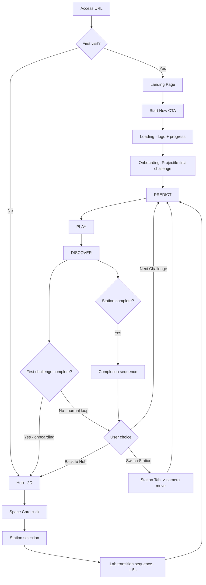

# PhysPlay -- UX Design

**Status:** Draft
**Last Updated:** 2026-03-03
**Related Docs:** [Product Brief](./product-brief.md) | [PRD](./prd.md) | [Phase 1 PRD](./prd-phase-1.md) | [Client Structure](./client-structure.md)

---

## 1. Context

### 1.1 User Goal (JTBD)

> When I encounter a science concept I don't intuitively understand, I want to predict outcomes, experiment in 3D, and see where my thinking was wrong, so I can build genuine intuition -- not just memorize formulas.

This JTBD applies across all three personas:

- **Minjun (16, student):** "I wish science was as fun as a game"
- **Jiyoung (29, developer):** "I want to build quantum mechanics intuition at my own level by experimenting hands-on"
- **Teacher Park (35, educator):** "I want to share a URL and run a class where students predict and verify"

### 1.2 User Context

| Dimension | Primary Context | Design Implication |
|-----------|----------------|-------------------|
| **Device** | PC (mouse/keyboard) -- Primary | Precision input + large screen. Spacious HUD layout. Optimal for God Hand click-drag |
| **Device** | Mobile (touch) -- Secondary | Responsive HUD, touch gesture mapping, 44px minimum target |
| **Environment** | Home/school, quiet setting | Sound ON as default is appropriate. BGM + SFX contribute to immersion |
| **Mental State** | Curiosity + mild anxiety ("science is hard") | Prediction must feel like "play," not a "test." No penalty for wrong answers |
| **Time Pressure** | Low -- exploratory sessions (5-15 min) | Short loops (1-2 min/challenge) on repeat. Can stop/resume anytime |
| **Tech Comfort** | Medium-high (browser/gaming experience) | Only basic hints needed for 3D viewport controls |

### 1.3 Design Principles (PhysPlay-specific)

UX principles derived from the PRD's core design decisions. The criteria for every screen/interaction decision.

| # | Principle | Rationale | Cognitive Basis |
|---|-----------|-----------|----------------|
| P1 | **Prediction is an invitation, not a test** | Targeting 70% prediction participation rate. If it feels like pressure, users skip | Peak-End Rule -- getting it wrong must not become a negative peak |
| P2 | **Being wrong is not punishment -- it's the start of curiosity** | 60%+ should proceed to the next challenge after a wrong answer | Cognitive Conflict -- being wrong is the catalyst for conceptual change |
| P3 | **Never leave the 3D** | The entire core loop completes within 3D + HUD | Doherty Threshold -- context switching costs 400ms+ in cognitive load |
| P4 | **God Hand feels natural** | God Hand is a tool, not a game mechanic -- it should be usable without learning | Jakob's Law -- click-drag/swipe are interactions users already know |
| P5 | **One full loop in 30 seconds** | First-time visitors complete one core loop in 30 seconds without sign-up | Goal Gradient -- a quick first success motivates the next action |
| P6 | **Like unlocking a game stage** | Entering a lab should evoke the excitement of "opening a new stage" | Aesthetic-Usability Effect -- visual quality raises perceived usability |

---

## 2. Information Architecture

### 2.1 Navigation Model

PhysPlay is divided into two distinct zones:

- **Hub (2D):** Space/station browsing, progress review, settings. 2D pages.
- **Lab (3D):** Core loop execution. Fullscreen 3D + HUD overlay. Never drops to 2D pages.

This structure follows a **Two-Zone Navigation** pattern. The Hub uses standard web navigation (clicks, page transitions); the Lab uses game-style HUD navigation (tabs, overlay panels). A transition animation between the two zones makes the boundary explicit.

**Justification:** Focused Navigation (IA Principle #7) -- 2D navigation and 3D HUD navigation are not mixed. Each zone maintains a consistent interaction model.

### 2.2 Sitemap

```
[PhysPlay]
|
+-- Landing Page [Phase 1]
|   +-- Hero (CTA -> Lab)
|   +-- Core Loop Intro
|   +-- Teacher Email Form
|
+-- Hub (2D) [Phase 1]
|   +-- Space Cards (Mechanics Lab, Molecular/Space/Quantum: locked)
|   |   +-- Station List (Station selection -> Lab entry)
|   +-- Progress Summary
|   +-- Settings (Language, Theme, Sound)
|
+-- Lab (3D + HUD) [Phase 1]
|   +-- Common HUD
|   |   +-- Station Tabs (Projectile / Energy / Wave)
|   |   +-- Progress Indicator (3/10)
|   |   +-- Settings Icon
|   |   +-- Stage Indicator (PREDICT / PLAY / DISCOVER)
|   |
|   +-- PREDICT Stage HUD
|   |   +-- Question Panel
|   |   +-- Prediction Input (trajectory / binary / pattern)
|   |   +-- Variable Info
|   |   +-- Skip Button (subtle)
|   |
|   +-- PLAY Stage HUD
|   |   +-- Action Prompt
|   |   +-- Variable Panel (real-time)
|   |   +-- Energy Bar (Energy Station)
|   |   +-- Replay Button
|   |
|   +-- DISCOVER Stage HUD
|   |   +-- Feedback (correct/incorrect)
|   |   +-- Concept Explanation (Level 1/2/3 tabs)
|   |   +-- Trajectory Comparison Overlay
|   |   +-- Action Buttons (Next Challenge / Switch Station / Back to Hub)
|   |
|   +-- Station Completion HUD
|       +-- Summary (total, accuracy, graph)
|       +-- CTA (Go to another station)
|
+-- Account System [Phase 3]
+-- Teacher Dashboard [Phase 3]
+-- Challenge Editor (UGC) [Phase 3]
+-- XR Mode [Phase 2+]
```

### 2.3 Reachability Validation

IA Principle: Core content must be reachable within 3 taps/clicks.

| Destination | Path | Taps/Clicks |
|-------------|------|-------------|
| First challenge (new user) | URL -> auto entry | **0** (automatic) |
| Challenge in a specific station (returning) | Hub -> Space Card -> Station | **2** |
| Switch between stations (inside Lab) | Station Tab click | **1** |
| Next challenge (within core loop) | "Next Challenge" CTA | **1** |
| Change settings (inside Lab) | Settings Icon -> Panel | **2** |
| Return to Hub | "Back to Hub" CTA or Settings -> Hub | **1-2** |

All critical paths within 2 clicks. Pass.

### 2.4 Entry Points

| Entry Point | User Context | Destination |
|-------------|-------------|-------------|
| **Direct URL (first visit)** | Link share, social media, search | Landing Page -> "Start Now" -> Lab (Projectile Station) |
| **Direct URL (returning)** | Browser history, bookmark | Hub (if progress exists in IndexedDB) |
| **Challenge URL [Phase 3+]** | Specific challenge shared by teacher | Lab -> directly to that challenge |
| **XR Entry [Phase 2+]** | Accessing via XR browser | Lab (XR mode) |

---

## 3. User Flows

### 3.1 Flow Diagram (Overall)



### 3.2 Onboarding Flow (First Visit -- 30 seconds)

**Goal:** Complete one core loop in 30 seconds without sign-up. (P5: One full loop in 30 seconds)

```
Step 1: Loading (0-3s)
+-----------------------------------------------+
|                                               |
|             [PhysPlay Logo]                   |
|                                               |
|          =====>======== (progress bar)        |
|            "Preparing the lab..."             |
|                                               |
+-----------------------------------------------+
```

- Logo + progress bar. Target under 3 seconds.
- Progress bar reflects actual asset loading progress (not fake).
- Background color hints at the neon lab theme even during loading (dark navy #0A0E27).
- **Doherty Threshold**: Users abandon after 3 seconds. Asset optimization + code splitting required.

```
Step 2: First Challenge - PREDICT (3-15s)
+-----------------------------------------------+
| [Projectile] [Energy] [Wave]       [Settings] |
|                                    3/10       |
|                                               |
|  +------------------------------------------+|
|  | "If you throw this ball at 45 degrees     ||
|  |  on Earth, where will it land?"           ||
|  +------------------------------------------+|
|                                               |
|          O  <-- Ball on experiment table (3D) |
|         /|\    Neon grid floor                |
|        / | \                                  |
|       ........   (gesture guide hint)         |
|                                               |
|  Gravity: 9.8 m/s^2 (Earth)  Angle: 45deg   |
|                                               |
| [PREDICT]  PLAY  DISCOVER        Skip (small)|
+-----------------------------------------------+
```

- Fullscreen 3D viewport. A ball sits on the experiment table.
- HUD question panel: semi-transparent background + question text. Top center.
- **Gesture Guide Hint** (1.5s): Animation of the mouse cursor drawing a trajectory. Shown only once on first visit.
  - With `prefers-reduced-motion`: replaced by static text hint: "Drag on the screen to draw a trajectory"
- Variable info: concise display at the bottom (gravity, angle only).
- Skip button: bottom-right, small. Not visually prominent. (P1: Prediction is an invitation, not a test)
- **Stall prevention**: After 5 seconds of no response, show additional hint: "Drag on the screen to draw a trajectory." (Cognitive Load -- provide guidance when stuck)

```
Step 3: First Challenge - PLAY (15-25s)
+-----------------------------------------------+
| [Projectile] [Energy] [Wave]       [Settings] |
|                                    3/10       |
|                                               |
|  +------------------------------------------+|
|  | "Drag and throw!"                         ||
|  +------------------------------------------+|
|                                               |
|          O --> ~~~ (predicted, translucent)    |
|         /|       ~~~ (actual, solid line)     |
|        / |                                    |
|                                               |
|                      Speed: 12.4 m/s          |
|                      Height: 3.2 m            |
|                                               |
| PREDICT  [PLAY]  DISCOVER                     |
+-----------------------------------------------+
```

- Action prompt: "Drag and throw!" -- specific and action-oriented. (UX Writing: Use specific verbs)
- Click-drag on the ball to pull back and release (slingshot UX).
- Simulation runs: predicted trajectory (translucent dashed line) and actual trajectory (solid line) render simultaneously.
- Real-time variable panel on the right (speed, height).
- **Stall prevention**: After 3 seconds of no response, gesture guide reappears.

```
Step 4: First Challenge - DISCOVER (25-30s)
+-----------------------------------------------+
| [Projectile] [Energy] [Wave]       [Settings] |
|                                    3/10       |
|                                               |
|  +------------------------------------------+|
|  | "Close! Here's what happened."            ||
|  +------------------------------------------+|
|                                               |
|  +------------------------------------------+|
|  | [Level 1] Level 2  Level 3               ||
|  |                                          ||
|  | Gravity is the force that pulls objects   ||
|  | toward the Earth. Without air, both       ||
|  | heavy and light objects fall at the same   ||
|  | speed.                                    ||
|  +------------------------------------------+|
|                                               |
|        [Next Challenge]                       |
|   Switch Station      Back to Hub             |
|                                               |
| PREDICT  PLAY  [DISCOVER]                     |
+-----------------------------------------------+
```

- Correct/incorrect feedback: different tones.
  - **Correct:** "Nailed it! [Level 1 explanation]" -- particle burst + ascending arpeggio
  - **Incorrect:** "Close! Here's what happened." -- trajectory comparison overlay + low-tone 2-note sound
  - **P2: Being wrong is not punishment -- it's the start of curiosity.** Frame as discovery, not "You got it wrong."
- Concept explanation: Level 1 shown by default. "Learn more" tabs reveal Level 2, 3 progressively.
- Action buttons: "Next Challenge" = Primary CTA (largest and most prominent). Von Restorff Effect.
  - "Switch Station", "Back to Hub" = Secondary (text link style).
- **After first challenge completion:** The Hub appears for the first time.

### 3.3 Hub Flow (Returning Visit)

```
Hub (2D Page)
+-----------------------------------------------+
|  PhysPlay                  [Language] [Settings]|
|                                               |
|  +-------------------+  +-----------------+   |
|  | Mechanics Lab      |  | Molecular Lab   |   |
|  | [UNLOCKED]        |  | [LOCKED]        |   |
|  |                   |  | (silhouette)    |   |
|  | Projectile  8/10  |  | Coming Soon     |   |
|  | Energy      3/8   |  |                 |   |
|  | Wave        0/8   |  |                 |   |
|  +-------------------+  +-----------------+   |
|                                               |
|  +-----------------+  +-----------------+     |
|  | Space           |  | Quantum         |     |
|  | Observatory     |  | Research Lab    |     |
|  | [LOCKED]        |  | [LOCKED]        |     |
|  | (silhouette)    |  | (silhouette)    |     |
|  | Coming Soon     |  | Coming Soon     |     |
|  +-----------------+  +-----------------+     |
|                                               |
|  -------------------------------------------  |
|  Total 11/26 challenges | Accuracy 68%       |
|  Most active: Projectile Station              |
+-----------------------------------------------+
```

**Hub Screen Specification:**

| Property | Value |
|----------|-------|
| **Primary action** | Space Card click -> Station selection -> Lab entry |
| **Information shown** | Unlocked/locked spaces, per-station progress, total progress summary |
| **Navigation pattern** | 2D page. Card grid layout. |

**States:**

| State | Design |
|-------|--------|
| **Empty (right after first visit)** | Only Mechanics Lab unlocked. Other 3 locked. Total progress "0/26". "Start your first experiment in the Mechanics Lab!" CTA |
| **Loaded** | Cards with progress reflected |
| **Partial Progress** | Per-station "X/Y" progress. Checkmark on completed stations |
| **All Complete [Phase 1]** | All 3 stations in Mechanics Lab completed. "New labs coming soon!" + locked space cards highlighted |
| **Offline** | Displays identically based on IndexedDB data. No network required (Phase 1 local storage). |

**Locked Space Card Design:**

- Silhouette image + space name (readable but dimmed)
- "Coming Soon" badge
- Not clickable (no cursor change, no hover effect)
- Zeigarnik Effect: the mere visibility of locked spaces creates "what's next?" motivation

### 3.4 Lab Entry Transition

The Hub (2D) -> Lab (3D) transition is the gateway to immersion.

**Transition Sequence (1.5s total target):**

```
Phase 1: Dim (0.3s)
  Hub screen gradually dims. ease-in-out.

Phase 2: 3D Load (background)
  Asset preload, WebGPU/WebGL initialization.
  Instant if cache hit.

Phase 3: Theme Fade-in (0.5s)
  Neon grid floor + lighting + ambient sound.
  3D viewport fades in. ease-out.

Phase 4: Camera Move (0.5s)
  Camera moves to the selected station's experiment table.
  ease-in-out. A smooth descent conveying spatial awareness.
```

- With `prefers-reduced-motion`: instant cut (no animation).
- If loading exceeds 3 seconds during transition: show progress bar. "Preparing the lab..." text.
- **Camera Transition**: Never teleport the camera instantly. Smooth movement maintains spatial awareness. (3D Design: "Never teleport the camera instantly")

### 3.5 Core Loop Detail

Detailed interactions per stage. Every stage completes within fullscreen 3D + HUD. (P3: Never leave the 3D)

#### 3.5.1 PREDICT Stage

**State Machine:**

```
[Idle] -> [Question Shown] -> [Input Active] -> [Input Complete] -> [Submitted]
              |                      |                                   |
              v                      v                                   v
         [Hint Shown]          [Skip Clicked]                      [-> PLAY]
         (5s no action)        (-> PLAY, no prediction)
```

**Per-Prediction-Type UX:**

| Type | Input Method | PC (Mouse) | Mobile (Touch) | Feedback |
|------|-------------|------------|----------------|----------|
| **trajectory** | Draw curve on viewport | Click+drag to place points. Spline interpolation between points. 3-20 points. | Finger drag to directly draw path (continuous stroke) | Translucent line drawn in real-time. After drawing, "Predict with this path!" confirm button |
| **binary** | Select one of 2 buttons | Click | Tap | Selected button highlighted + unselected button dimmed. Auto-submit immediately on selection (1s delay then auto-advance) |
| **pattern** | Select from 3 pattern cards | Click | Tap | Selected card enlarged + highlighted border. Unselected cards shrunk + dimmed |

**Trajectory Drawing UX Detail:**

- A translucent drawing layer activates over the 3D viewport
- Drawn trajectory appears as a translucent neon-colored (#00D4FF, Primary) line
- Undo: Ctrl+Z (PC) / back swipe (mobile) -- removes last point
- Clear all: "Redraw" button (bottom-right of drawing layer)
- Confirm: "Predict with this path!" button (bottom center, Primary CTA)
- **P1 applied:** The trajectory does not need to be a "precise curve." If the general direction and landing point are correct, it counts as right. Demanding precision would make it feel like a test.

**Variable Info Panel:**

- Concise display of key variables for the current challenge at the bottom
- Example: "Gravity: 1.6 m/s^2 (Moon) | Angle: 45deg | Mass: 1.0 kg"
- Cognitive Load: Only the minimum information needed for the decision. The rest is available in the PLAY stage's variable panel.

**Skip Button:**

- Position: bottom-right. Small text link style. "Skip"
- Visual weight: Less than Secondary. Ghost button or underline text.
- On click: Advances to PLAY without a prediction. `predict_skip` event logged.
- Von Restorff Effect applied in reverse: Making Skip inconspicuous naturally encourages prediction participation.

#### 3.5.2 PLAY Stage

**State Machine:**

```
[Awaiting Interaction] -> [Interacting] -> [Simulation Running] -> [Simulation Complete]
        |                      |                    |                        |
        v                      v                    v                        v
   [Hint Shown]         [Drag/Release]       [Real-time Overlay]     [-> DISCOVER]
   (3s no action)       (God Hand)           (predicted vs actual)
```

**God Hand Interaction Per Station:**

| Station | God Hand Action | PC | Mobile | Feedback |
|---------|----------------|-----|--------|----------|
| **Projectile** | Throw the ball (slingshot UX) | Click+drag on the ball (pull back), release to launch. Launches opposite to drag direction. Arrow previews direction/strength | Touch+swipe on the ball (pull back), release to launch | During drag: direction arrow + strength gauge. On launch: "whoosh" SFX + trail particles |
| **Energy** | Adjust cart height + launch | Drag cart to set starting height. Click "Launch" button | Touch+drag cart to adjust height. Tap "Launch" button | During height change: potential energy bar updates in real-time. On launch: "rumble" SFX |
| **Wave** | Place wave source + start | Drag wave source to position. Click "Start" button | Touch+drag wave source to position. Tap "Start" | On source placement: "plop" SFX. On simulation start: concentric circles expand |

**Simulation Running State:**

- Physics engine calculates in real-time. Results displayed in 3D rendering.
- For trajectory predictions: predicted trajectory (translucent #00D4FF) and actual trajectory (solid #39FF14) render simultaneously.
- Right-side variable panel: real-time value updates (speed, height, energy).
- After simulation completes: 1-second pause -> transition to DISCOVER.
- **Replay:** "Replay" button activates at the bottom after simulation completes. Replays the same simulation.

**Energy Bar (Energy Station only):**

```
Right HUD:
  PE [========          ] 80%  (blue)
  KE [==                ] 20%  (red)
  Heat [                ] 0%   (orange, only when friction > 0)
```

- Real-time updates. Visually demonstrates the law of energy conservation.
- Bar totals always equal 100% (without friction) -- conveying energy conservation intuitively.

#### 3.5.3 DISCOVER Stage

**State Machine:**

```
[Result Judged] -> [Feedback Shown] -> [Concept Level 1] -> [Optional: Level 2/3]
      |                 |                     |                       |
      v                 v                     v                       v
 [Correct Path]   [Incorrect Path]    ["Learn More"]          [Action Selected]
 (celebration)    (comparison overlay) (Progressive Disclosure) (-> Next/Station/Hub)
```

**Correct vs Incorrect UX:**

| | Correct | Incorrect |
|---|---------|-----------|
| **Visual** | Particle burst (neon colors). Screen edge glow. | Predicted vs actual overlay highlight. Differences emphasized. |
| **Sound** | Ascending arpeggio (bright and short) | Low-tone 2-note (soft and short -- not punishing) |
| **Heading** | ko: "Majasseo!" / en: "Nailed it!" | ko: "Aswipjiman, yeogiseo baeul ge isseo!" / en: "Close! Here's what happened." |
| **Concept** | Brief Level 1 explanation | Level matched to user (tagAccuracy-based) |
| **Primary CTA** | "Try different variables?" (next challenge) | "Next Challenge" |
| **Emotional Design** | Peak-End Rule: success becomes a positive peak | P2: Being wrong is the start of curiosity. Never a negative tone. |

**Concept Explanation Panel:**

```
+------------------------------------------+
| [Level 1]  Level 2   Level 3             |
|                                          |
| Gravity is the force that pulls objects  |
| toward the Earth. On the Moon, gravity   |
| is 1/6 of Earth's, so throwing with the  |
| same force sends objects much farther.   |
|                                          |
|              [Learn More ->]             |
+------------------------------------------+
```

- Default: Level 1 displayed (intuitive analogy).
- "Learn More" -> Level 2 (concept explanation) -> Level 3 (with formulas).
- Progressive Disclosure: Users go deeper only when they choose to. (Cognitive Load management)
- Level tabs are always visible, but the current level has an active (filled) tab. The next level is clickable (outlined tab).
- Level selection overrides the adaptive engine's default. Users can also click tabs directly.

**Action Buttons:**

```
        [Next Challenge]          <- Primary CTA: filled, large, centered
   Switch Station    Back to Hub  <- Secondary: text link style, small
```

- Von Restorff Effect: Only the Primary CTA is a filled button. Secondary items are text links.
- Fitts's Law: Primary CTA is the largest and centered.
- "Next Challenge" label varies by context: "Try different variables?" (after correct answer), "Try again?" (when repeating the same concept)

### 3.6 Station Navigation (Inside Lab)

```
+-----------------------------------------------+
| [Projectile]  [Energy]  [Wave]     ...         |
|  ^active                                       |
```

- Station tabs are positioned top-left of the HUD, 3 tabs.
- Current station: filled background + bright text. Others: outlined + dimmed text.
- Tab click -> camera moves to the corresponding station's experiment table (0.5s, ease-in-out).
- 3D environment (Mechanics Lab theme) is maintained. Only the experiment table and objects change.
- **Serial Position Effect**: The most intuitive station (Projectile) comes first (primacy), and the most visual (Wave) comes last (recency).

### 3.7 Station Completion

```
+-----------------------------------------------+
|                                               |
|        [ Large particle explosion ]           |
|        [ Full grid floor light-up ]           |
|                                               |
|  +------------------------------------------+|
|  | Projectile Station Complete!              ||
|  |                                          ||
|  | 10 challenges | 7 correct | 70% accuracy ||
|  |                                          ||
|  | [Accuracy trend graph]                    ||
|  |  #1  #2  #3  #4  #5  #6  #7  #8  #9  #10||
|  |  x   x   o   o   x   o   o   o   o   o  ||
|  |                                          ||
|  | Most missed concept: Air Resistance       ||
|  +------------------------------------------+|
|                                               |
|        [Go to Another Station!]               |
|   Back to Hub                                 |
|                                               |
+-----------------------------------------------+
```

- **Peak-End Rule applied:** Station completion is both the "End" and the highest "Peak" of the experience. Maximum visual/audio reward concentrated here.
- Large particle explosion (2s): Neon-themed particles matching the Mechanics Lab.
- Celebration sound sequence: a more elaborate arpeggio than the standard correct-answer SFX.
- Full grid floor light-up: the entire neon grid brightens.
- Summary panel: total challenges, correct count, accuracy, accuracy trend graph.
- Accuracy trend graph: Goal Gradient -- visualizes "I got many wrong at first but improved toward the end," conveying a sense of growth.
- With `prefers-reduced-motion`: particles/light-up disabled. Only the summary panel displayed.

### 3.8 Landing Page Flow [Phase 1]

The Landing Page is a 2D page (site/). Two purposes: (1) Drive B2C users to the Lab, (2) Collect B2B teacher emails.

**Screen Specification:**

| Property | Value |
|----------|-------|
| **Primary action** | "Start Now" CTA -> direct Lab entry |
| **Secondary action** | Teacher email submission |
| **Info shown** | Core loop introduction, station previews, teacher CTA |

**Sections (scroll):**

1. **Hero:** Title + 3D preview (video/GIF, autoplay, muted) + "Start Now" CTA
2. **Core Loop Introduction:** Visual walkthrough of the PREDICT -> PLAY -> DISCOVER 3-stage flow
3. **Station Previews:** Representative challenge previews for Projectile/Energy/Wave
4. **Teacher CTA:** "Use PhysPlay in your classroom" + email form
5. **FAQ:** 4 questions
6. **Footer:** Language switch, privacy policy, contact

**Landing Page States:**

| State | Design |
|-------|--------|
| **Loaded** | Full content displayed. Hero video autoplays. |
| **Loading** | Skeleton in the Hero area. Text content displayed first. |
| **Error (video load failure)** | Static image fallback. CTA functions normally. |
| **Email Submit Success** | "Thank you! We'll notify you first when teacher features are ready." Inline confirmation |
| **Email Submit Error** | "Couldn't send your email. Please try again." + retry button |

---

## 4. Interaction Design

### 4.1 God Hand Patterns

God Hand is PhysPlay's core interaction model. "I am the experimenter, and the experiment is right in front of me."

**Design Principles:**

1. **Direct Manipulation:** Grab, pull, and release objects directly. Minimize indirect controls (sliders, number inputs). (Jakob's Law: drag is an interaction users already know)
2. **Immediate Feedback:** Every manipulation gets a <100ms visual response. Real-time preview while dragging. (Doherty Threshold)
3. **Forgiving:** Mistakes are instantly reversible. Position/direction freely adjustable until release.
4. **Consistent:** The "grab -> manipulate -> release" pattern is consistent across all stations.

**Interaction Mapping:**

| Interaction | PC (Mouse) | Mobile (Touch) | XR (Hand Tracking) [Phase 2+] |
|-------------|-----------|----------------|-------------------------------|
| Grab object | Left-click + hold | Touch + hold | Pinch (thumb + index) |
| Drag | Mouse move | Finger move | Hand move |
| Release (launch) | Click release | Touch release | Pinch release |
| Camera rotate | Right-click + drag | Two-finger drag | Head rotation |
| Camera zoom | Mouse wheel | Pinch zoom | Physical movement |
| Camera reset | R key / double-click (empty area) | Double-tap (empty area) | Voice: "Reset" |

**Cursor States (PC):**

| State | Cursor | Description |
|-------|--------|-------------|
| Empty area hover | `default` | Default state |
| 3D canvas hover (interactive area) | `grab` | Implies camera rotation is available |
| Object hover | `pointer` + object highlight (outline glow) | Implies the object is grabbable |
| Object dragging | `grabbing` + object follows cursor | Manipulating |
| Trajectory drawing mode | `crosshair` | Point placement mode |
| HUD button hover | `pointer` | 2D UI interaction |

**Touch Affordance (Mobile):**

- Since hover is unavailable, add subtle idle animation to interactive objects (slight float/pulse). (3D Design: "mobile tap affordances -- subtle animation, visual hint")
- Light glow outline always visible on grabbable objects.
- Gesture hint overlay on first visit (1.5s).

### 4.2 Camera Controls

Camera controls within the Lab (3D). (See 3D Design reference)

| Control | PC | Mobile |
|---------|-----|--------|
| Orbit (rotate) | Right-click + drag (or Alt + left-click) | Two-finger drag |
| Zoom | Mouse wheel | Pinch zoom |
| Pan | Middle-click + drag | N/A (orbit is sufficient on mobile) |
| Reset | R key / double-click (empty area) | Double-tap (empty area) |

**Camera Boundaries:**

- Zoom-out limit: distance where the entire experiment table is visible.
- Zoom-in limit: just before the object surface (camera cannot enter objects).
- Vertical rotation: camera cannot go below the floor.
- Camera damping: 0.05. Smooth deceleration. (3D Design: "Movement must feel natural -- decelerate smoothly")

**Camera Focus on Station Switch:**

- On station tab click: camera moves to the optimal 3/4 view of that station in 0.5s.
- If user manipulates camera during movement: auto-movement stops immediately, control handed to user.

### 4.3 HUD Interaction Patterns

The HUD is a 2D UI overlay floating above the 3D viewport. HTML-based (React DOM).

**HUD Layering:**

```
z-order (front to back):
  4. Modal overlays (settings panel, completion summary)
  3. Action buttons (CTA, skip)
  2. Info panels (question, variables, concept explanation)
  1. Always-on elements (station tabs, progress, stage indicator)
  0. 3D Viewport (fullscreen)
```

**HUD Transparency:**

- Info panels: semi-transparent background.
  - Dark theme: `rgba(0, 0, 0, 0.7)` + `backdrop-filter: blur(8px)`
  - Light theme: `rgba(255, 255, 255, 0.85)` + `backdrop-filter: blur(8px)`
- Does not obstruct 3D simulation visibility.
- During the PLAY stage, HUD is minimized to focus on the 3D simulation. Question panel disappears. Only the variable panel on the right.

**HUD Show/Hide Transitions:**

- On stage transition, HUD elements fade in/out (200ms, ease-out).
- PREDICT -> PLAY: question panel fades out, action prompt fades in.
- PLAY -> DISCOVER: variable panel remains + feedback/concept panel slides up (300ms).
- With `prefers-reduced-motion`: instant show/hide.

### 4.4 Keyboard Shortcuts (PC)

| Key | Action | Context |
|-----|--------|---------|
| `1`, `2`, `3` | Switch station (Projectile, Energy, Wave) | Entire Lab |
| `R` | Reset camera | Entire Lab |
| `Space` / `Enter` | Execute Primary CTA (e.g., "Next Challenge", "Throw!") | All stages |
| `Escape` | Close current modal / Skip in PREDICT | Entire Lab |
| `Ctrl+Z` | Undo trajectory drawing (remove last point) | PREDICT (trajectory) |
| `Tab` | Move focus between HUD elements | Entire Lab (accessibility) |

---

## 5. Responsive Design Strategy

### 5.1 Breakpoints

| Breakpoint | Width | Category | Layout Strategy |
|-----------|-------|----------|----------------|
| **PC (Primary)** | >= 1024px | Desktop/laptop | Full HUD. Variable panel on right side. Generous margins. |
| **Tablet** | 768-1023px | Tablet | Variable panel moves to collapsible bottom. HUD element sizes maintained. |
| **Mobile** | < 768px | Smartphone | Variable panel collapsed by default. Question/button sizes enlarged. Touch targets 44px minimum. |
| **Mobile S** | < 375px | Small smartphone | Stacked layout. Question text limited to 2 lines. |

### 5.2 Layout Adaptation Per Stage

#### PREDICT Stage

```
PC (>= 1024px):
+-----------------------------------------------+
| Tabs                    Settings  3/10        |
|                                               |
|     [Question Panel - top center, max-w 600px]|
|                                               |
|              [3D Viewport]                    |
|     (trajectory drawing area / pattern cards) |
|                                               |
| Variables: left-aligned         Skip (small)  |
| [PREDICT] PLAY DISCOVER                       |
+-----------------------------------------------+

Tablet (768-1023px):
+-----------------------------------------------+
| Tabs                    Settings  3/10        |
|     [Question Panel - full width]             |
|                                               |
|              [3D Viewport]                    |
|                                               |
| [Variables - collapsible bottom, tap to expand]|
|                                       Skip    |
| [PREDICT] PLAY DISCOVER                       |
+-----------------------------------------------+

Mobile (< 768px):
+-------------------------------+
| Tabs         Settings  3/10  |
| [Question - 2 lines, 16px]   |
|                               |
|        [3D Viewport]          |
|   (touch trajectory / larger  |
|    buttons)                   |
|                               |
| [Vars collapsed]       Skip  |
| [PREDICT]                     |
+-------------------------------+
```

#### PLAY Stage

```
PC:
+-----------------------------------------------+
| Tabs                    Settings  3/10        |
|     [Action Prompt]                           |
|                                               |
|              [3D Viewport]         |Variable| |
|                                    |Panel   | |
|                                    |real-   | |
|                                    |time    | |
|                                               |
|                               [Replay]        |
| PREDICT [PLAY] DISCOVER                       |
+-----------------------------------------------+

Mobile:
+-------------------------------+
| Tabs         Settings  3/10  |
| [Action Prompt]               |
|                               |
|        [3D Viewport]          |
|                               |
| [Variable Panel - collapsible]|
|               [Replay]        |
+-------------------------------+
```

#### DISCOVER Stage

```
PC:
+-----------------------------------------------+
| Tabs                    Settings  3/10        |
|     [Feedback: "Nailed it!"]                  |
|                                               |
|  [3D Viewport          ] [Concept Panel     ] |
|  (trajectory overlay)    [Level 1/2/3 tabs  ] |
|                          [Explanation text   ] |
|                          [Learn More ->      ] |
|                                               |
|     [Next Challenge]  Switch Station  Hub     |
| PREDICT PLAY [DISCOVER]                       |
+-----------------------------------------------+

Mobile:
+-------------------------------+
| Tabs         Settings  3/10  |
| [Feedback]                    |
|                               |
|     [3D Viewport - 50%]      |
|                               |
| [Concept Panel - scrollable] |
| [Level 1/2/3 tabs]           |
| [Explanation text]            |
|                               |
| [Next Challenge] (full-width) |
| Switch Station  Back to Hub   |
+-------------------------------+
```

### 5.3 Mobile-Specific Adaptations

| Element | PC | Mobile |
|---------|-----|--------|
| Variable panel | Right side, always visible | Collapsible bottom, collapsed by default. Tap to expand |
| Question text | max-width 600px, centered | Full-width, 2 lines max |
| Prediction input (binary) | 2 buttons horizontal | 2 buttons vertical (44px height) |
| Prediction input (pattern) | 3 cards horizontal | 3 cards horizontal scroll (44px height) |
| Concept explanation panel | Right of 3D viewport, panel | Below 3D viewport, scrollable sheet |
| God Hand throw | Click+drag | Swipe (flick) |
| Camera controls | Right-click drag, wheel | Two-finger drag, pinch |
| Energy bar | Right side vertical | Bottom horizontal (inside collapsible variable panel) |
| Touch targets | 24px minimum | 44px minimum (Fitts's Law) |

### 5.4 3D Viewport vs Page Scroll Conflict (Mobile)

Preventing 3D canvas and page scroll conflicts on mobile:

- **Lab (3D fullscreen):** Page scroll disabled. 3D viewport occupies full screen. All scroll input used for camera controls.
- **Hub (2D):** Normal page scroll. No 3D.
- **Landing Page (2D + preview GIF):** GIF embedded as ``, not a 3D canvas. No scroll conflict.

---

## 6. Motion and Transition Design

### 6.1 Transition Inventory

| Transition | Duration | Easing | Sound | Reduced Motion |
|-----------|----------|--------|-------|----------------|
| **Hub -> Lab entry** | 1.5s (0.3s dim + 0.5s fade-in + 0.5s camera) | ease-in-out | Transition sound + ambient fade-in | Instant cut |
| **Lab -> Hub return** | 0.5s (camera up + dissolve) | ease-in | Transition sound + ambient fade-out | Instant cut |
| **Station switch** | 0.5s (camera horizontal) | ease-in-out | Short transition sound | Instant cut |
| **Stage transition (PREDICT -> PLAY -> DISCOVER)** | 0.2s HUD fade | ease-out | None | Instant swap |
| **Challenge correct** | 1s particle burst | n/a (physics) | Ascending arpeggio | Particles disabled, text only |
| **Challenge incorrect** | 0.5s comparison overlay fade-in | ease-out | Low-tone 2-note | Instant show |
| **Station completion** | 2s large particle + light-up | n/a (physics) | Celebration sequence | Particles/light-up disabled, summary only |
| **HUD panel appear** | 0.2s fade-in + slide-up (8px) | ease-out | None | Instant show |
| **HUD panel disappear** | 0.15s fade-out | ease-in | None | Instant hide |
| **Trajectory drawing** | Real-time (0ms) | linear | None | Same (user input) |
| **Simulation running** | Real-time (physics time) | physics | Physics SFX | Same (core content) |

### 6.2 Particle Effects Budget

| Effect | Max Particles | Duration | Mobile Adaptation |
|--------|--------------|----------|-------------------|
| Idle dust | 50 | Continuous loop | 25 particles, or disabled |
| Trajectory trail | 100 | Simulation duration | 50 particles |
| Challenge correct burst | 200 | 1s | 100 particles |
| Station completion burst | 500 | 2s | 200 particles |
| Air resistance particles | 30 | Simulation duration | 15 particles |
| Heat particles (friction) | 20 | Simulation duration | 10 particles |

- Mobile: 50% particle count reduction. Performance budget: zero frame drops from particles.
- `prefers-reduced-motion`: idle dust disabled. Bursts/trails replaced with static displays.

### 6.3 Sound Design

**Sound Layering:**

```
Layer 1 (Background):  BGM (upbeat electronic, loop, 100-120 BPM)
Layer 2 (Ambient):     Electronic hum + intermittent beeps
Layer 3 (Interaction): God Hand SFX (throw, collision, wave source, etc.)
Layer 4 (Feedback):    Correct/incorrect feedback SFX
Layer 5 (UI):          Button click "tick"
```

**Volume Defaults:**

| Layer | Default Volume | User Control |
|-------|---------------|-------------|
| BGM | 30% | 0-100% slider in settings |
| Ambient | 20% | Linked to BGM |
| Interaction SFX | 70% | 0-100% slider in settings (SFX) |
| Feedback SFX | 80% | Linked to SFX |
| UI SFX | 50% | Linked to SFX |

**Sound Controls:**

- Master sound ON/OFF toggle (HUD Settings)
- BGM volume slider
- SFX volume slider
- `soundEnabled: boolean` for global mute.
- Default: ON. Sound playback begins after first user interaction (autoplay policy compliance).

---

## 7. Error States and Edge Cases

### 7.1 Universal Screen States (Lab)

| State | What User Sees | Design |
|-------|---------------|--------|
| **Loading** | 3D assets loading | PhysPlay logo + progress bar + "Preparing the lab..." Dark navy background. Target under 3s |
| **Loaded** | Normal Lab screen | Fullscreen 3D + HUD |
| **Error (3D init failure)** | WebGPU/WebGL both fail | "This browser doesn't support 3D. Please use the latest Chrome, Safari, or Firefox." + browser icon links. Fallback to 2D page |
| **Error (asset load failure)** | Specific asset download failed | "Couldn't load the lab. Check your connection and try again." + "Try Again" button |
| **Partial** | Some assets loaded | Display basic screen with loaded assets. Missing objects shown as placeholders (wireframe). Background retry |
| **Offline** | Network disconnected (after initial load) | Phase 1 runs local simulation, so most functions work normally. Event tracking queued only. Banner: "You're offline. Progress is saved on your device." |
| **Performance Degradation** | FPS below 30 sustained | Auto quality reduction: reduce particles -> shadows OFF -> post-processing OFF. No UI notification (auto-adaptive) |

### 7.2 Hub Screen States

| State | Design |
|-------|--------|
| **Empty (right after first visit)** | Only Mechanics Lab unlocked, progress 0. "Start your first experiment in the Mechanics Lab!" CTA |
| **Loaded** | Card grid with progress reflected |
| **IndexedDB data loss** | Progress resets to initial state. "Saved data not found. Starting fresh." toast (5s). Onboarding skipped (cookie check). |
| **Browser not supported** | Displayed as 2D page. "PhysPlay works best on the latest Chrome, Safari, or Firefox." banner |

### 7.3 Prediction Edge Cases

| Edge Case | Handling |
|-----------|---------|
| Trajectory: only 1 point placed before submit | "Please draw a longer path. At least 3 points are needed." inline hint |
| Trajectory: very short trajectory (under 10% of screen) | Allowed. Respect the user's prediction. A short trajectory is still a valid prediction |
| Binary: rapid double-tap | Only the first tap recognized. 300ms debounce |
| Pattern: nothing selected after 5s | "Pick a pattern!" hint shown |
| Tab switch after prediction | State preserved. Returns to PLAY stage on return. Intermediate state saved in IndexedDB |
| Tab switch during simulation | Simulation paused. Resumes on return. (Battery saving + user expectation) |

### 7.4 IndexedDB Edge Cases

| Edge Case | Handling |
|-----------|---------|
| IndexedDB access denied (incognito mode, etc.) | Progress save warning: "Progress won't be saved in private browsing mode." banner. Core loop functions normally |
| Storage quota exceeded | Delete oldest session_meta records first. Preserve challenge_results, tag_accuracy |
| Data schema version mismatch (after update) | Run migration logic. If migration fails, reset + warning |

---

## 8. Accessibility

### 8.1 WCAG 2.1 AA Compliance

| Requirement | PhysPlay Implementation |
|-------------|------------------------|
| **Text contrast 4.5:1** | HUD text: In dark theme, white on rgba(0,0,0,0.7) = sufficient contrast. In light theme, dark on rgba(255,255,255,0.85) = sufficient contrast |
| **UI component contrast 3:1** | All buttons, tabs, icons meet 3:1+ against background |
| **Focus indicator 2px+** | `:focus-visible` with 2px solid outline, offset 2px, primary color (#00D4FF) |
| **Touch targets 44px+** | All interactive elements meet 44px minimum on mobile |
| **Text resizing 200%** | HUD text is `rem`-based. Layout verified at 200% zoom |
| **Keyboard access** | Tab navigates all HUD elements. Enter/Space activates them |

### 8.2 Color Independence

- **Correct/Incorrect:** Not distinguished by color alone.
  - Correct: green color + "Nailed it!" text + checkmark icon + ascending SFX
  - Incorrect: orange color + "Close!..." text + X icon + descending SFX
- **Energy bar:** Color (blue/red) + text labels ("PE", "KE") + position (top/bottom)
- **Trajectory comparison:** Predicted (dashed line) vs actual (solid line) -- line style (dash vs solid) also distinguishes them
- **Station tabs:** Active tab uses color + underline + bold font weight

### 8.3 Keyboard Navigation (Lab)

| Key | Action |
|-----|--------|
| `Tab` | Sequential movement between HUD elements (station tabs -> settings -> progress -> stage indicator -> primary buttons) |
| `Shift+Tab` | Reverse navigation |
| `Enter` / `Space` | Activate focused element |
| `Escape` | Close modal. If no modal, close settings panel |
| `Arrow Keys` | Navigate between pattern cards (PREDICT pattern), navigate between Level tabs (DISCOVER) |
| `1`/`2`/`3` | Direct station switch |

**Focus Management:**

- On stage transition: focus auto-moves to the new stage's Primary CTA or first interactive element.
- Settings modal opened: focus trapped inside modal. On close, returns to the trigger element.
- Station completion panel: focus moves to the summary panel's Primary CTA.

### 8.4 Screen Reader Support

| Element | aria-label / Role | Behavior |
|---------|-------------------|----------|
| Station tabs | `role="tablist"`, each tab `role="tab"` | Current: `aria-selected="true"` |
| Stage indicator | `aria-live="polite"` | Announces on change: "Current stage: PREDICT" etc. |
| Question panel | `role="heading" aria-level="2"` | Reads question text |
| Prediction buttons (binary) | `role="radiogroup"` | Each choice has `role="radio"` |
| Pattern cards (pattern) | `role="radiogroup"` | Each card has `aria-label="Pattern A: [description]"` |
| Trajectory drawing area | `role="application" aria-label="Trajectory drawing area"` | Mouse/touch-only interaction. Alt text: "Draw a trajectory with mouse in this area" |
| Feedback (correct/incorrect) | `aria-live="assertive"` | Immediately announces result: "Correct! Gravity concept explanation..." |
| Energy bar | `role="progressbar" aria-valuemin="0" aria-valuemax="100"` | "Potential energy 80%, kinetic energy 20%" |
| Settings icon | `aria-label="Open settings"` | On click, focus moves to settings panel |
| Skip button | `aria-label="Skip prediction"` | |

### 8.5 3D Content Accessibility

3D simulation is inherently visual content. Alternative text is provided:

- After simulation completes: result announced as text. "The ball landed at 12.4m. Your predicted landing point was 8.2m."
- Energy bar: real-time values set to `aria-live="off"` (no automatic announcements, but readable when screen reader users navigate to it)
- 3D viewport itself: `role="img" aria-label="3D physics simulation viewport"` + supplementary text description

### 8.6 Reduced Motion

```css
@media (prefers-reduced-motion: reduce) {
  /* Disabled */
  - Particle effects (idle, trail, burst)
  - Grid floor light-up
  - Camera transition animations -> instant cut
  - HUD fade animations -> instant show/hide
  - Gesture guide animations -> static text

  /* Preserved (core content) */
  - Simulation execution (physics animation is content)
  - Trajectory drawing real-time feedback
  - Energy bar real-time updates
}
```

---

## 9. UX Copy / Microcopy Guidelines

### 9.1 Voice and Tone

**Voice (constant):** A friendly science experiment partner. Informal, brief, action-oriented.

**Tone (variable by state):**

| User State | Tone | Example (ko) | Example (en) |
|-----------|------|-------------|-------------|
| Exploring | Curiosity-sparking, light | "Ibeoneneun dareseo deonjyeobolkka?" | "What about throwing it on the Moon?" |
| Predicting | Inviting, no pressure | "Eodie tteoreojil geot gata?" | "Where do you think it'll land?" |
| Experimenting | Concise, action-oriented | "Deuraegeuhaeseo deonjyeoboja!" | "Drag and throw!" |
| Correct answer | Celebratory, brief | "Majasseo!" | "Nailed it!" |
| Wrong answer | Encouraging, curiosity-sparking | "Aswipjiman, yeogiseo baeul ge isseo!" | "Close! Here's what happened." |
| Completion | Achievement, celebration | "Tusache seuteisyeon wanju!" | "Projectile Station Complete!" |
| Error | Calm, solution-oriented | "Silheomshireul bulleooji mothaeseumnida. Dasi sidohae juseyo." | "Couldn't load the lab. Please try again." |

### 9.2 Button Labels

All buttons start with a **specific verb**. No "Confirm", "Next", or "OK". (UX Writing: Verb Rule)

| Context | ko | en | Anti-pattern |
|---------|-----|-----|-------------|
| Prediction confirm (trajectory) | "I gwejeogeuro yecheuk!" | "Predict with this path!" | "OK" / "Confirm" |
| Start experiment | "Deonjyeoboja!" / "Balsa!" / "Sijak!" | "Throw!" / "Launch!" / "Start!" | "Next" |
| Next challenge | "Daeum chaellinji" | "Next Challenge" | "Continue" |
| Variable change challenge | "Byeonsu-reul bakkweobolkka?" | "Try different variables?" | "Next" |
| Station switch | "Dareun seuteisyeon" | "Switch Station" | "Go" |
| Back to Hub | "Heobeuro doragagi" | "Back to Hub" | "Back" |
| Replay | "Dasi bogi" | "Replay" | "Play" |
| Redraw (trajectory) | "Dasi geurigi" | "Redraw" | "Reset" |
| Skip (prediction) | "Geonneotttuigi" | "Skip" | |
| Save settings | "Jeojang" | "Save" | "OK" |
| Lab entry (Landing) | "Jigeum sijakagi" | "Start Now" | "Start" |
| Teacher email submit | "Eolli aegseseu sincheong" | "Request Early Access" | "Submit" |

### 9.3 Error Messages

**Formula:** What happened + why + how to fix it.

| Scenario | ko | en |
|----------|-----|-----|
| 3D init failure | "I beuraujeoeseo 3D-reul silhaenghal su eopsseumnida. Chrome, Safari, Firefox-ui choesin beojeon-eul sayonghae juseyo." | "This browser doesn't support 3D. Please use the latest Chrome, Safari, or Firefox." |
| Asset load failure | "Silheomshireul bulleooji mothaeseumnida. Inteonet yeongyeoreul hwaginhago dasi sidohae juseyo." | "Couldn't load the lab. Check your connection and try again." |
| IndexedDB access denied | "Sikeurit modeueseoeneun jinhaeng sanghwangi jeojangdoeji anseumnida." | "Progress won't be saved in private browsing mode." |
| Data loss | "Jeojangdoen deiteo-reul chajul su eopsseumnida. Cheo-eum-buteo sijakamnida." | "Saved data not found. Starting fresh." |
| Invalid email format | "Imeil juso-ga olbareji aneun geot gatseumnida. Dasi hwaginhae juseyo." | "That doesn't look like a valid email. Please check and try again." |
| Email submit failure | "Imeil-eul jeonsongaji motaesseumnida. Dasi sidohae juseyo." | "Couldn't send your email. Please try again." |

### 9.4 Empty States

| Context | ko | en | CTA |
|---------|-----|-----|-----|
| Hub - first visit | "Ajik silheom girog-i eopsseumnida. Yeokhak silheomshireseo cheot silheom-eul sijakae boseyo!" | "No experiments yet. Start your first experiment in the Mechanics Lab!" | "Yeokhak silheomshil sijak" / "Start Mechanics Lab" |
| Hub - all stations complete | "Yeokhak silheomshil-ui modeun seuteisyeon-eul wanjuhaesseumnida! Got saeroun silheomshil-i yeollimnnida." | "You've completed all stations in the Mechanics Lab! New labs coming soon." | None (locked space cards serve this role) |
| Offline banner | "Opeurain sangtaeimnida. Jinhaeng-eun gigieseo jeojangdoemnida." | "You're offline. Progress is saved on your device." | None (auto-recovery) |

### 9.5 Stage Labels

| Stage | ko | en | Visual |
|-------|-----|-----|--------|
| PREDICT | "Yecheuk" | "PREDICT" | Icon: crosshair/target |
| PLAY | "Silheom" | "PLAY" | Icon: flask/beaker |
| DISCOVER | "Balgyeon" | "DISCOVER" | Icon: lightbulb |

### 9.6 Hint Messages (Onboarding/Stall Prevention)

| Trigger | ko | en | Timing |
|---------|-----|-----|--------|
| Trajectory: 5s no response | "Hwamyeon-eul deuraegeuhaeseo gwejeog-eul geuryeoboseyo" | "Drag on the screen to draw a path" | 5s after question shown |
| God Hand: 3s no response | "Deuraegeuhaeseo deonjyeoboseyo!" | "Drag to throw!" | 3s after PLAY starts |
| Pattern: 5s no response | "Paeteon hana-reul gollaboseyo!" | "Pick a pattern!" | 5s after cards shown |
| Trajectory: points < 3 | "Gwejeog-eul jom deo gilge geuryeojuseyo" | "Draw a longer path" | On submit attempt |

### 9.7 i18n Strategy

- All user-facing text managed via i18n keys.
- Default language: ko (primary persona is a Korean student).
- Supported languages: ko, en.
- Language switch: Available in the Hub header or Lab Settings. Applied instantly.
- Scientific terms: Consider displaying Korean text with English original alongside. e.g., "Gravity"
- Formulas: Identical across languages. LaTeX rendering (MathJax or KaTeX).

---

## 10. Settings Panel

Overlay panel displayed when clicking the HUD Settings icon inside the Lab.

```
Settings Panel (Modal Overlay)
+------------------------------------------+
|  Settings                          [X]   |
|                                          |
|  Language                                |
|  [Korean]  [English]                     |
|                                          |
|  Theme                                   |
|  [System] [Light] [Dark]                 |
|                                          |
|  Sound                                   |
|  [ON/OFF toggle]                         |
|  BGM  [======----]  60%                  |
|  SFX  [========--]  80%                  |
|                                          |
|  ---                                     |
|  [Back to Hub]                           |
+------------------------------------------+
```

- Overlay: semi-transparent background + blur. 3D viewport paused behind it.
- Changes apply instantly (preview). No "Save" button needed. (Non-destructive -> instant application instead of undo)
- Close with Escape or X button. On close, focus returns to the Settings icon.
- "Back to Hub": bottom of settings panel. Text link style.

---

## 11. Design Rationale

### 11.1 Key Decisions Summary

| Decision | Rationale | Principle |
|----------|-----------|-----------|
| Fullscreen 3D + HUD (no 2D page transitions) | Eliminates context-switching cost during core loop | Doherty Threshold (400ms+), P3 |
| Prediction input feels like "play," not a "test" | Targeting 70% prediction participation. Pressure leads to skipping | Peak-End Rule, P1 |
| Wrong answers framed as "discovery," not "failure" | Prevent post-error abandonment. Cognitive conflict is the key to learning | Cognitive Conflict, P2 |
| Skip button kept small and inconspicuous | Naturally encourages prediction participation without forcing it | Von Restorff (reverse application), Hick's Law |
| First core loop complete within 30 seconds | Quick first success -> motivates next action | Goal Gradient, P5 |
| Concept explanation in 3-level Progressive Disclosure | Cognitive Load management. Depth only when the user wants it | Cognitive Load Theory |
| Rich visual/audio reward on correct answer | Creates a positive peak experience | Peak-End Rule, P6 |
| Hub as 2D, Lab as 3D -- separated | Resource efficiency + clear context distinction | Focused Navigation (IA #7) |
| No camera teleportation during transitions | Maintains spatial awareness | 3D Design: "Never teleport the camera" |
| God Hand interaction mapped to platform-standard gestures | Zero learning cost | Jakob's Law, P4 |
| Station tab order: Projectile > Energy > Wave | Projectile (most intuitive) -> Energy (intermediate) -> Wave (most abstract). Implies difficulty progression | Serial Position Effect |
| Maximum reward concentrated on station completion | Make the end of the experience the most memorable moment | Peak-End Rule |
| Energy bar displayed in real-time | Visually conveys the law of energy conservation intuitively | Germane Cognitive Load (load that aids understanding) |

### 11.2 What Was Removed

| Removed Element | Why | Principle |
|----------------|-----|-----------|
| Onboarding tutorial (separate screen) | The first challenge IS the onboarding. A separate tutorial causes unnecessary delay | Anti-pattern: "Unnecessary onboarding" |
| Sign-up screen | Remove entry barrier. Phase 1 uses local storage | Step Reduction |
| Track/module selection screen | No choices for first-time visitors. Auto-enter Projectile Station | Hick's Law |
| Points/badges/leaderboards | In Phase 1, core motivation is cognitive conflict. Extrinsic rewards can distort motivation | First Principles #3: "What can be removed?" |
| Character/avatar in HUD | Unnecessary in the God Hand model. Characters are attention-distracting | Cognitive Load |
| Real-time "accuracy rate" display during predictions | Makes prediction feel like a test. Accuracy shown only in station completion summary | P1: Prediction is an invitation, not a test |
| Detailed variable description (PREDICT stage) | PREDICT provides only minimum info. Details come in DISCOVER | Cognitive Load Theory |
| HUD question panel during simulation | Focus on 3D during PLAY. Minimize HUD | P3: Never leave the 3D |
| Auto-playing BGM (on first load) | Autoplay policy violation + unexpected sound | Anti-pattern: "Auto-playing sound" |
| "Are you sure?" dialogs | No irreversible actions in the core loop. All challenges can be retried | Anti-pattern: "Confirmation for non-destructive actions" |

### 11.3 Open Questions

| # | Question | Impact | Proposed Resolution |
|---|----------|--------|-------------------|
| 1 | What is the optimal error tolerance for trajectory predictions? | Too strict = most answers wrong -> frustration. Too lenient = reduced learning effect | Default 15%. Adjust via user testing during Discovery prototype |
| 2 | Is the trajectory drawing UX natural on mobile? | Inaccurate touch drawing leads to skip rate spikes | Test with 3 mobile users during Discovery prototype |
| 3 | DISCOVER panel obscures 3D simulation results | On PC, parallel layout works. On mobile, 3D and panel overlap | Mobile: 50/50 split between 3D and panel. Or use panel as bottom sheet |
| 4 | Does BGM volume/style interfere with concentration? | Minjun might enjoy it, but Teacher Park may find BGM distracting during class | Default 30% volume. Consider "Class Mode" (BGM off, SFX only) in Phase 2 |
| 5 | Is there motivation to revisit after station completion? | Nothing to do after completing 26 challenges leads to churn | Phase 2 adds vertical expansion + variable variation challenges. Phase 1 targets 15% revisit rate measurement only |
| 6 | Is the wrong-answer framing tone appropriate? | "Close! Here's what happened." -- must not be too casual or too didactic | Confirm emotional response with 5-user interviews |

---

## 12. Usability Test Protocol

5 users can uncover 85% of usability issues (Nielsen, 2000).

### 12.1 Participants

- 3: Minjun persona (age 15-18 students, currently enrolled in science classes)
- 1: Jiyoung persona (age 25-35 adult, non-major interested in science)
- 1: Teacher Park persona (educator, evaluating as a classroom tool)

### 12.2 Tasks

| # | Task (JTBD) | Success Criteria |
|---|-------------|-----------------|
| 1 | "You're visiting for the first time. Try running the first experiment." | Complete PREDICT -> PLAY -> DISCOVER loop within 30 seconds |
| 2 | "Complete 3 consecutive challenges in the Projectile Station." | 3 consecutive completions without skipping. Confirm core loop understanding |
| 3 | "Switch to the Energy Station and complete one challenge." | Successfully navigate via station tab. Understand different prediction type (binary) |
| 4 | "In a challenge you got wrong, check the concept explanation up to Level 3." | Successfully switch Level tabs in DISCOVER |
| 5 | "Change the language to English in Settings." | Successfully navigate Settings -> Language change |

### 12.3 Script

```
1. Intro (2 min):
   "We're testing the design, not testing you.
    There are no right or wrong answers. Just say what comes to mind."

2. Task (repeat for each task):
   "[Task description]. Starting from this screen, show me what you'd do."

   Observation points:
   - First touch/click location (expected? unexpected?)
   - Where they pause for 3+ seconds (= friction)
   - Where they go back (= wrong path)
   - What they said ("What is this?", "Where do I click?")

3. Post-task (1 min after each task):
   "How was that? Was anything confusing?"

4. Wrap-up (2 min):
   "Overall, anything you liked or felt was lacking?"
   (For teachers, add): "Could you see using this in class? Any concerns?"
```

### 12.4 Analysis Template

| Finding | Severity | Frequency (/5) | Action |
|---------|----------|----------------|--------|
| [Issue description] | Critical / Major / Minor | X/5 | Fix / Investigate / Defer |

---

## 13. Phase Implementation Summary

### Phase 1

**Screens:**
- Landing Page (2D)
- Hub (2D) -- only Mechanics Lab unlocked, 3 locked spaces
- Lab (3D + HUD) -- Mechanics Lab: Projectile/Energy/Wave, 3 stations
- Loading Screen
- Settings Panel (inside Lab)

**Key Flows:**
- Onboarding (first 30 seconds -> one core loop rotation)
- Core Loop (PREDICT -> PLAY -> DISCOVER -> NEXT)
- Station Navigation (HUD tabs)
- Station Completion
- Hub -> Lab transition
- Landing Page -> direct Lab entry

**Not Included:**
- Account/login
- XR mode (architecture only)
- ML-based adaptive AI
- Teacher dashboard
- UGC
- Points/badges/leaderboards

### Phase 2

**New Screens:**
- Sound/Light, Electromagnetic stations added to Lab (station tab expansion)
- XR mode entry UI ("View in VR" button in HUD)

**Flow Changes:**
- Adaptive AI v1 (ML-based) -> improved challenge recommendation accuracy
- XR transition flow: Lab -> XR mode -> God Hand = hand tracking
- HUD -> XR spatially-anchored panel mapping

### Phase 3+

**New Screens:**
- Molecular Lab (new space + new stations)
- Account/login flow
- Teacher Dashboard (per-student prediction patterns, comprehension analysis)
- Challenge Editor (UGC stage 1)
- Hub expansion: 2+ unlocked spaces

**New Flows:**
- Local data -> server migration consent flow
- Teacher: challenge creation -> URL sharing -> student results review
- Cross-engine recommendation: "The gravity you learned in Projectile applies in orbital mechanics too..."
- Space unlock condition met -> unlock animation -> new space entry

---

## Appendix: Quick Checklist Validation

### Goal and Structure
- [x] User's ONE goal clearly identified (JTBD)
- [x] Every element passes "does this help the goal?" test
- [x] Information architecture validated (2 clicks to core content)
- [x] Navigation pattern appropriate (Two-Zone: Hub 2D + Lab 3D HUD)

### Screen Design
- [x] Primary action is ONE and visually dominant per screen
- [x] Information shown is only what's needed for current decision
- [x] All 7 screen states designed (empty, loading, loaded, error, partial, refreshing, offline)
- [x] Content hierarchy: most important first

### Interaction
- [x] Feedback exists for every user action (visual + audio)
- [x] No destructive irreversible actions in core loop (undo not needed, replay available)
- [x] Loading pattern matches expected wait time (<3s target)
- [x] Gestures have visible alternatives (all gestures have button equivalents)

### Copy
- [x] Button labels are specific verbs
- [x] Error messages: what happened + how to fix
- [x] Empty states: explanation + actionable CTA
- [x] No jargon (scientific terms explained with analogies at Level 1)

### Platform and Ergonomics
- [x] Mobile: primary actions in accessible area (bottom-aligned CTAs)
- [x] Responsive: designed for 375px minimum, primary for 1024px+
- [x] Touch targets 44px+ on mobile

### Accessibility
- [x] Contrast ratios planned (4.5:1 text, 3:1 UI)
- [x] Color not sole indicator (icons + text + line style)
- [x] Focus states specified (:focus-visible, 2px outline)
- [x] Screen reader labels on all interactive elements
- [x] `prefers-reduced-motion` respected (detailed fallback table)

### 3D Specific
- [x] Loading hierarchy (poster -> progressive -> full quality)
- [x] Camera controls specified (desktop + mobile)
- [x] Camera damping, boundaries, reset
- [x] Interaction hint on first visit
- [x] Keyboard navigation for 3D viewer
- [x] Text alternative for 3D content (simulation results announced)
- [x] Performance adaptation (auto-quality reduction)

### Anti-patterns
- [x] No unnecessary onboarding screens
- [x] No confirmation dialogs for non-destructive actions
- [x] No marketing copy inside product flows
- [x] No hover-only interactions on touch devices
- [x] No auto-playing sound (user interaction first)
- [x] No instant camera teleportation

---

*Appendix: [Product Brief](./product-brief.md) | [PRD](./prd.md) | [Phase 1 PRD](./prd-phase-1.md) | [Client Structure](./client-structure.md)*
