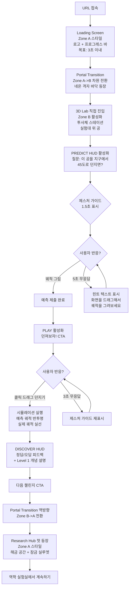
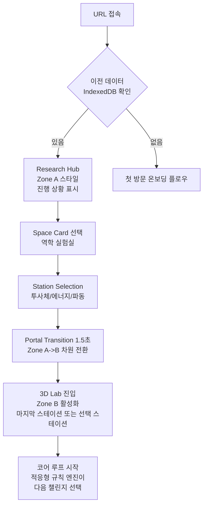
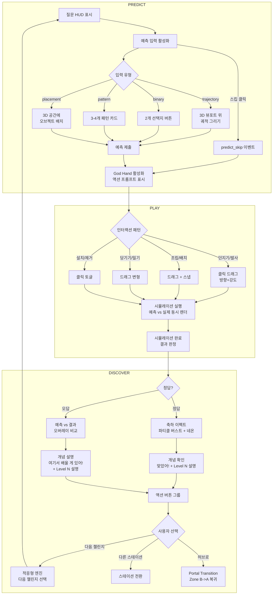
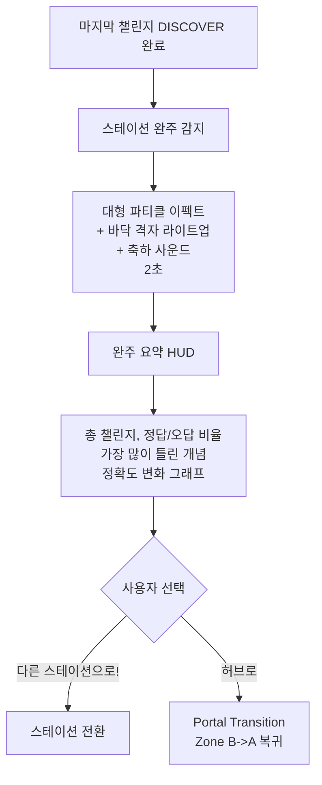

# PhysPlay UX Design

**Status:** Draft
**Last Updated:** 2026-03-04
**Related:** [PRD](./prd.md) | [Phase 1 PRD](./prd-phase-1.md) | [Product Brief](./product-brief.md) | [Client Structure](./client-structure.md)

---

## 1. Visual Design Language

PhysPlay의 비주얼 디자인 언어는 모든 화면, 인터랙션, 모션, 사운드의 근간이다. 이 섹션은 문서 전체를 관통하는 디자인 프레임워크를 정의한다.

### 1.1 디자인 비전

> **Soft-Tech Educational** 기반 교육 플랫폼 + **Portal Transition**으로 진입하는 **Semi-Stylized 3D Sandbox**(God-Hand) 게이미피케이션 학습 환경. 바깥(2D 페이지)은 **Clean & Airy**, 안쪽(3D Lab)은 **Immersive Lab**.

사용자는 신뢰감 있는 교육 플랫폼(바깥)에서 시작해, 차원 전환(Portal Transition)을 거쳐 몰입형 실험실(안쪽)로 진입한다. 두 세계는 의도적으로 다른 시각 언어를 사용하며, 그 경계가 곧 "실험실에 들어가는" 심리적 게이트다.

### 1.2 2-Zone 비주얼 전략

| Zone | 해당 화면 | 톤 | 핵심 키워드 |
|------|----------|-----|-----------|
| **Zone A: Clean & Airy** | Landing, Research Hub, Settings (2D) | 밝고 가벼운 교육 플랫폼 | 넉넉한 여백, 부드러운 라운드, 높은 명도, 교육적 신뢰감, 읽기 편안함 |
| **Zone B: Immersive Lab** | 3D Lab 풀스크린 + HUD | 어둡고 몰입적인 실험실 | 네온 액센트, 어두운 배경, 발광 요소, 반투명 HUD, 게임 스테이지 집중감 |

> 근거: Jakob's Law -- Zone A는 교육 플랫폼(Coursera, Khan Academy)의 시각 문법을, Zone B는 게임 HUD(Fortnite, Portal)의 시각 문법을 따른다. 사용자가 각 맥락에서 기대하는 시각 패턴을 존중.

#### Zone A: Clean & Airy 디자인 원칙

1. **여백이 콘텐츠다**: 요소 간 간격은 넉넉하게. 정보 밀도보다 가독성 우선
2. **부드러운 형태**: border-radius 12-16px. 각진 요소 지양. 카드 기반 레이아웃
3. **밝은 표면**: 배경은 밝은 그레이/화이트 계열. 텍스트 대비 4.5:1 이상 보장
4. **절제된 색상**: Primary 블루 하나 + Neutral 그레이 계열. 네온 컬러는 사용하지 않음
5. **교육적 신뢰감**: 명확한 타이포그래피 계층, 일관된 그리드, 예측 가능한 레이아웃

#### Zone B: Immersive Lab 디자인 원칙

1. **어둠이 무대다**: 어두운 배경이 3D 오브젝트와 네온 이펙트를 돋보이게 함
2. **네온이 언어다**: 정보 계층을 네온 컬러의 밝기/크기로 전달. 가장 중요한 것이 가장 밝음
3. **반투명 레이어**: HUD는 3D 뷰포트 위에 반투명 오버레이. 3D가 항상 주인공
4. **최소 HUD**: 화면의 80% 이상이 3D 뷰포트. HUD는 현재 단계에 필요한 것만 표시
5. **발광과 깊이**: 네온 글로우, 파티클, 그리드 라인이 공간감과 활력을 제공

### 1.3 Portal Transition -- 차원 전환 설계

Portal Transition은 Zone A(2D)에서 Zone B(3D)로의 전환을 극적으로 연출하여 "실험실에 들어가는" 심리적 경험을 만든다. 단순한 페이지 전환이 아니라 세계관 전환이다.

**전환 시퀀스 (Hub -> Lab 진입, 1.5초):**

```
[1] 0.0-0.3초: 화면 디졸브
    Zone A의 밝은 2D 화면이 서서히 어두워진다
    카드/텍스트 요소가 fade out

[2] 0.3-0.8초: 차원 게이트
    네온 격자 바닥이 어둠 속에서 페이드인
    원근감 있는 그리드 라인이 깊이를 형성
    Zone B의 어두운 공간이 열림

[3] 0.8-1.3초: 실험실 착지
    카메라가 스테이션을 향해 부드럽게 하강
    실험대 오브젝트가 페이드인
    3D 공간 완성

[4] 1.3-1.5초: HUD 등장
    HUD 요소들이 순차적으로 fade in
    BGM 페이드인 시작
    사용자 인터랙션 활성화
```

**역방향 전환 (Lab -> Hub 복귀, 0.5초):**
- 카메라 상승 0.3초 + 화면 디졸브 0.2초
- Zone B의 어둠에서 Zone A의 밝음으로 빠르게 전환
- 진입보다 짧은 시간: 복귀는 탐험이 아니라 이동이므로

**Portal Transition 설계 원칙:**
1. **비대칭 시간**: 진입(1.5초) > 복귀(0.5초). 진입은 기대감 조성, 복귀는 효율 우선
2. **연속적 변환**: 순간 텔레포트 금지. 공간 인지가 유지되어야 함
3. **감각 전환**: 밝음->어둠, 정적->동적, 무음->BGM의 복합적 전환
4. **Reduced Motion 대응**: `prefers-reduced-motion` 시 전환 연출 생략, 즉시 컷

> 근거: Doherty Threshold -- 400ms 이상의 맥락 전환은 몰입을 파괴하지만, 의도적 연출이 있는 전환은 예외. Portal Transition은 "기다림"이 아니라 "경험"이다. Peak-End Rule -- 실험실 진입 순간이 세션의 첫 인상이 되므로, 긍정적 감정으로 설계.

### 1.4 컬러 시스템

#### Zone A 컬러 (2D 페이지)

| 역할 | Dark Theme | Light Theme | 용도 |
|------|-----------|-------------|------|
| 배경 | #0A0E27 (다크 네이비) | #F8F9FA (밝은 그레이) | 페이지 배경 |
| 카드 표면 | #1A1E3A | #FFFFFF | 카드, 섹션 배경 |
| 텍스트 Primary | #FFFFFF | #1A1E3A | 제목, 본문 |
| 텍스트 Secondary | #A0A8C0 | #6B7280 | 보조 텍스트, 캡션 |
| Primary Action | #00D4FF (네온 블루) | #0099CC (진한 블루) | CTA 버튼 |
| 테두리 | #2A2E4A | #E5E7EB | 카드 테두리, 구분선 |

> Zone A의 Dark Theme도 네온 글로우를 사용하지 않는다. 발광 없는 솔리드 컬러로 Zone B와 차별화.

#### Zone B 컬러 (3D Lab)

| 역할 | Dark (기본) | Light | 용도 |
|------|-----------|-------|------|
| Skybox | #0A0E27 + 미세 그리드 | #F0F2F5 + 미세 그리드 | 3D 배경 |
| 네온 라인 | 이미시브 발광 | 채도 낮춘 실선 (발광 없음) | 그리드, 궤적, 가이드 |
| HUD 배경 | `rgba(0,0,0,0.7)` | `rgba(255,255,255,0.85)` | HUD 패널 |
| HUD 텍스트 | #FFFFFF | #1A1E3A | HUD 내 텍스트 |
| 파티클 | 밝은 네온 컬러 | 채도 낮춘 파스텔 | 이펙트 |
| 오브젝트 | 세미 광택 | 동일 (대비 유지) | 3D 오브젝트 |

#### 네온 팔레트 (Zone B 전용)

| 역할 | Color | Dark 사용 | Light 사용 |
|------|-------|----------|-----------|
| Primary | #00D4FF (네온 블루) | 이미시브 글로우 | 솔리드 액센트 |
| Accent | #39FF14 (네온 그린) | 이미시브 글로우 | 솔리드 액센트 |
| Warm | #FF6EC7 (네온 핑크) | 이미시브 글로우 | 솔리드 액센트 |
| BG | #0A0E27 (다크 네이비) | 배경 | 사용 안 함 |
| Correct | #39FF14 + 텍스트 + 아이콘 | 정답 피드백 | 채도 조정 |
| Incorrect | #FF6EC7 + 텍스트 + 아이콘 | 오답 피드백 | 채도 조정 |

> Light 테마에서 네온 컬러는 채도를 낮추고 발광을 제거하여 밝은 배경에서의 가독성을 확보한다.

#### 컬러 접근성 규칙

- 텍스트 대비: 4.5:1 이상 (일반), 3:1 이상 (대형 18pt+)
- UI 컴포넌트 대비: 3:1 이상
- 색상이 유일한 상태 표시가 되지 않음: 정답(초록 + 텍스트 + 아이콘), 오답(핑크 + 텍스트 + 아이콘)
- 에너지 바: 색상 + 텍스트 라벨 (위치에너지: 파랑 + "PE", 운동에너지: 빨강 + "KE")
- 색약 대응: protanopia/deuteranopia에서 네온 팔레트 구분 가능 검증 필수

### 1.5 타이포그래피

#### Zone A (2D 페이지)

| 레벨 | 크기 (PC) | 크기 (모바일) | 두께 | 용도 |
|------|----------|-------------|------|------|
| Display | 48px / 3rem | 32px / 2rem | Bold (700) | Landing Hero 타이틀 |
| H1 | 32px / 2rem | 24px / 1.5rem | Bold (700) | 페이지 타이틀 |
| H2 | 24px / 1.5rem | 20px / 1.25rem | Semibold (600) | 섹션 타이틀 |
| H3 | 20px / 1.25rem | 18px / 1.125rem | Semibold (600) | 서브 섹션 |
| Body | 16px / 1rem | 16px / 1rem | Regular (400) | 본문 |
| Caption | 14px / 0.875rem | 14px / 0.875rem | Regular (400) | 보조 텍스트 |
| Small | 12px / 0.75rem | 12px / 0.75rem | Regular (400) | 법적 고지, 각주 |

#### Zone B (3D Lab HUD)

| 레벨 | 크기 (PC) | 크기 (모바일) | 두께 | 용도 |
|------|----------|-------------|------|------|
| HUD Title | 24px / 1.5rem | 20px / 1.25rem | Bold (700) | 피드백 헤드라인 ("맞았어!") |
| HUD Question | 18px / 1.125rem | 18px / 1.125rem | Medium (500) | 챌린지 질문 |
| HUD Body | 16px / 1rem | 16px / 1rem | Regular (400) | 개념 설명 |
| HUD Label | 14px / 0.875rem | 14px / 0.875rem | Medium (500) | 변수 라벨, 탭 텍스트 |
| HUD Value | 14px / 0.875rem | 14px / 0.875rem | Mono, Regular | 실시간 수치 |
| HUD Button | 16px / 1rem | 16px / 1rem | Semibold (600) | CTA 버튼 텍스트 |

**타이포그래피 규칙:**
- 모든 텍스트는 `rem` 단위 (브라우저 줌 200% 대응)
- HUD 텍스트 최소: 14px (PC), 14px (모바일)
- 질문 텍스트 최소: 16px (PC), 18px (모바일)
- 수식은 언어 독립적 (LaTeX/MathML)
- Zone A: 넉넉한 line-height (1.6-1.8). 읽기 편안함 우선
- Zone B: 타이트한 line-height (1.3-1.4). 정보 밀도와 공간 효율 우선

### 1.6 간격 & 그리드

#### Zone A 간격 체계

| 토큰 | 값 | 용도 |
|------|-----|------|
| space-xs | 4px | 아이콘-텍스트 간격 |
| space-sm | 8px | 인라인 요소 간격 |
| space-md | 16px | 카드 내부 패딩 |
| space-lg | 24px | 섹션 내 요소 간격 |
| space-xl | 32px | 카드 간 간격 |
| space-2xl | 48px | 섹션 간 간격 |
| space-3xl | 64px | 대형 섹션 간격 (Landing) |

- 그리드: 12컬럼, max-width 1200px, 좌우 패딩 24px (모바일 16px)
- 카드: border-radius 12-16px, 내부 패딩 space-md ~ space-lg

#### Zone B 간격 체계

| 토큰 | 값 | 용도 |
|------|-----|------|
| hud-gap-xs | 4px | HUD 내부 아이콘-텍스트 |
| hud-gap-sm | 8px | HUD 내부 요소 간격 |
| hud-gap-md | 12px | HUD 패널 내부 패딩 |
| hud-gap-lg | 16px | HUD 요소 그룹 간격 |
| hud-safe | 16px | HUD-뷰포트 가장자리 여백 |

- HUD safe area: 상하좌우 최소 16px. 모바일에서는 system UI와 겹치지 않도록 추가 여백
- HUD 총 면적: 화면의 20% 이하

### 1.7 아이코노그래피

#### Zone A 아이콘

- 스타일: Outline (1.5px stroke), Rounded ends
- 크기: 20px (기본), 24px (네비게이션)
- 컬러: 텍스트와 동일 (Primary / Secondary)
- 교육 플랫폼의 친근하고 명확한 느낌

#### Zone B 아이콘

- 스타일: Filled 또는 Outline+Glow
- 크기: 20px (기본), 24px (HUD 네비게이션)
- 컬러: 네온 팔레트 또는 화이트
- Dark에서 글로우 효과, Light에서 솔리드
- 게임 HUD의 즉각적 인지성 우선

### 1.8 Zone별 모션 원칙

#### Zone A 모션

- **목적**: 부드러운 상태 전환. 사용자에게 현재 위치와 변화를 알림
- **속도**: 보통 (200-300ms). 급하지 않은 느낌
- **이징**: ease-out 기본
- **범위**: 페이드, 슬라이드, 스케일 정도. 과한 연출 없음
- **키워드**: 안정적, 예측 가능, 부드러움

#### Zone B 모션

- **목적**: 물리적 피드백 + 보상 이펙트. 조작의 체감과 성취의 쾌감
- **속도**: 빠름 (<100ms 피드백) + 연출 (1-2초 이펙트)
- **이징**: spring/bounce (물리 시뮬레이션 기반)
- **범위**: 파티클, 글로우, 카메라 무브, 오브젝트 물리 반응
- **키워드**: 즉각적, 역동적, 보상적

#### 공통 Reduced Motion 대응

`prefers-reduced-motion: reduce` 감지 시 양쪽 Zone 모두:
- 시스템 주도 모션: 제거 또는 즉시 전환
- 사용자 주도 모션(시뮬레이션): 유지
- Portal Transition: 즉시 컷으로 대체

### 1.9 머티리얼 & 표면

#### Zone A 표면

- **카드**: 밝은 표면 + 미세 그림자 (elevation 1-2). 플랫에 가까운 미니멀
- **배경**: 단색 또는 미세 그라데이션. 패턴/텍스처 없음
- **테두리**: 1px 실선, 낮은 대비. 구분은 하되 강조하지 않음
- **형태**: 라운드 코너 12-16px. 각진 요소 없음

#### Zone B 표면 -- Semi-Stylized 정의

"Semi-Stylized"는 사실적(Photorealistic)과 만화적(Cartoon) 사이의 의도적 중간 지점이다.

- **3D 오브젝트**: 실제 물리 법칙을 따르지만, 텍스처와 셰이딩은 약간 양식화. 세미 광택(semi-glossy) 표면
- **실험대**: 미니멀한 기하학적 형태. 과도한 디테일 없이 기능에 집중
- **배경**: 네온 그리드 바닥 + 어두운 공간. 과학 실험실의 추상적 표현
- **이펙트**: 파티클, 트레일, 글로우는 네온 컬러로 통일. 사실적 연기/불 효과 대신 양식화된 에너지 표현
- **일관성 기준**: "교과서 삽화를 3D로 구현한 느낌". 친근하지만 신뢰감 있는 수준

> 근거: Aesthetic-Usability Effect -- 시각적으로 매력적인 인터페이스가 더 사용하기 쉽다고 인지됨. Semi-Stylized는 사실적 3D의 언캐니밸리를 회피하면서 게임적 매력을 유지.

---

## 2. Design Principles

PhysPlay의 UX 설계를 관통하는 핵심 원칙. 모든 설계 결정은 이 원칙에 근거한다. Visual Design Language(섹션 1)가 이 원칙들의 시각적 구현이다.

### 2.1 예측이 먼저다 (Prediction First)

모든 인터랙션의 시작은 "사용자의 예측"이다. 버튼을 누르기 전에 생각하게 만든다. 예측 없는 실험은 PhysPlay가 아니다. 이 원칙은 코어 루프(Predict -> Play -> Discover)의 존재 이유이며, 모든 HUD와 플로우 설계의 최우선 기준이다.

> 근거: Cognitive Conflict Theory -- 인지적 갈등이 개념 변화의 핵심 동인. 예측은 갈등의 전제 조건.

**시각 표현:** Zone B에서 PREDICT 단계의 질문 패널이 시각적으로 가장 먼저, 가장 크게 표시된다.

### 2.2 손이 기억한다 (Embodied Interaction)

God Hand는 슬라이더가 아니다. 던지고, 잡고, 배치하는 물리적/체감적 조작이다. 모든 PLAY 단계의 인터랙션은 "손으로 하는 느낌"을 유지해야 한다. 추상적 UI 컨트롤(슬라이더, 숫자 입력)은 직접 조작이 불가능한 경우에만 사용한다.

> 근거: 3D 인터페이스 설계 원칙 -- 3D 공간에서의 직접 조작(Direct Manipulation)이 간접 컨트롤보다 높은 engagement를 제공.

**시각 표현:** Zone B의 Semi-Stylized 오브젝트는 조작 가능 신호(미세 글로우 + 호버 아웃라인)를 통해 "만질 수 있는 것"임을 전달.

### 2.3 몰입을 깨지 않는다 (Immersion Continuity)

코어 루프(Predict -> Play -> Discover) 전체가 풀스크린 3D + HUD 안에서 완결된다. 2D 페이지로 빠지는 순간 몰입이 끊긴다. HUD는 게임에서 검증된 패턴이며, 필요한 정보만 최소한으로 표시한다. 3D 뷰포트의 가시성을 해치는 HUD는 실패한 HUD다.

> 근거: Doherty Threshold + Flow State -- 400ms 이상의 맥락 전환은 몰입을 파괴. HUD는 맥락 전환 비용이 제로.

**시각 표현:** Zone B의 반투명 HUD(20% 이하 면적)와 Portal Transition이 이 원칙의 핵심 구현. Zone A와 Zone B의 명확한 분리가 "실험실 안/밖"의 경계를 강화.

### 2.4 틀려도 괜찮다 (Safe to Fail)

오답은 벌이 아니라 학습 기회다. 오답 시 비난하지 않고, 예측과 결과의 차이를 시각적으로 보여주며, "왜 다른지"를 설명한다. 모든 오류 상태는 회복 경로를 제공한다. 스킵은 허용하되 시각적으로 부각하지 않는다.

> 근거: Peak-End Rule -- 가장 고통스러운 순간이 전체 경험을 결정. 오답 순간을 학습 기회로 전환하면 부정적 peak를 제거.

**시각 표현:** 오답 이펙트는 네온 핑크(#FF6EC7)의 차분한 하이라이트. 정답의 화려한 파티클 버스트와 대비되지만, 부정적이지 않은 톤.

### 2.5 다음이 궁금하다 (Curiosity Engine)

매 챌린지 완료 후 "다음에는 뭐가 다를까?"라는 호기심을 유발한다. 잠긴 공간의 실루엣, 변수 변경 제안, 난이도 상승 -- 모두 호기심을 자극하는 장치다.

> 근거: Goal Gradient Effect + Zeigarnik Effect -- 목표에 가까워질수록 동기 증가 + 미완료 과제에 대한 기억이 강화.

**시각 표현:** Zone A(Hub)에서 잠긴 공간은 실루엣+Coming Soon으로 탐험 욕구 자극. Zone B에서 "다음 챌린지" CTA가 Von Restorff로 시각적 최우선.

### 2.6 제로 장벽 (Zero Barrier)

URL 하나로 시작. 회원가입, 앱 설치, 트랙 선택 없이 30초 안에 첫 코어 루프를 완료한다. 모든 추가 정보(설정, 진도, 허브)는 첫 루프 이후에 노출한다.

> 근거: Cognitive Load Theory -- 첫 진입 시 인지 부하를 최소화. 선택지가 많을수록 이탈률 증가(Hick's Law).

**시각 표현:** 첫 방문 시 Zone A를 건너뛰고 Portal Transition 후 즉시 Zone B로 진입. 최소한의 로딩 화면만 거침.

---

## 3. 사용자 컨텍스트

### 3.1 JTBD (Jobs to Be Done)

**Primary Job:**
> 과학 개념을 공부할 때, 내가 예측하고 직접 실험해서 맞는지 확인하고 싶다. 그래야 진짜 이해한 느낌이 들고, 다음 개념이 궁금해져서 계속하게 된다.

**Supporting Jobs:**
- 수업 후 복습할 때, 교과서 수식 대신 직접 체험하며 직관을 잡고 싶다 (민준)
- 새로운 분야를 독학할 때, 내 수준에서 시작해서 점진적으로 이해하고 싶다 (지영)
- 수업에서 학생 참여형 실험을 URL 하나로 공유하고 싶다 (박 선생님)

### 3.2 Proto-Personas

#### 민준 (Primary)
```
Name:           민준 (16세, 고1)
Role:           과학 수업을 듣는 학생
Goal:           과학이 게임처럼 재밌으면 좋겠다
Context:        수업 후 집에서 PC로 / 쉬는 시간 모바일로
Frustrations:   수식이 먼저 나와서 포기, PhET은 목표가 없어서 지루
Tech comfort:   High (게임, YouTube, 소셜 미디어 능숙)
```

#### 지영 (Secondary)
```
Name:           지영 (29세, 개발자)
Role:           양자역학에 관심 있는 커리어 전환자
Goal:           수식 장벽 없이 양자역학 직관을 잡고 싶다
Context:        퇴근 후 노트북으로 / 카페에서
Frustrations:   교과서는 수식 벽, 강의는 수동적
Tech comfort:   Very High
```

#### 박 선생님 (Secondary)
```
Name:           박 선생님 (35세, 물리 교사)
Role:           수업에서 학생 참여형 도구를 쓰고 싶은 교사
Goal:           "이러면 어떻게 될까?" 후 학생들이 예측하고 확인하는 수업
Context:        교실에서 프로젝터/태블릿으로
Frustrations:   물리 실험은 준비 시간/비용, PPT는 수동적
Tech comfort:   Medium
```

### 3.3 디바이스 컨텍스트

| 디바이스 | 우선순위 | 사용 환경 | 핵심 고려사항 |
|---------|---------|----------|-------------|
| PC (마우스+키보드) | Primary | 집, 교실 | 정밀 입력, 넓은 화면, 풀 HUD |
| 태블릿 | Secondary | 교실, 소파 | 터치, 중간 화면, HUD 재배치 |
| 모바일 | Secondary | 이동 중, 쉬는 시간 | 터치, 작은 화면, 최소 HUD |

---

## 4. Information Architecture

### 4.1 네비게이션 구조

PhysPlay는 **2D+3D 하이브리드** 구조다. Zone A(2D 페이지, `site/`)는 허브, 랜딩, 설정 등 실험실 바깥 화면. Zone B(3D 경험, `experience/`)는 풀스크린 3D 뷰포트 + HUD 오버레이. Portal Transition이 두 Zone을 연결한다.

> 근거: IA Principle of Focused Navigation -- 2D 네비게이션과 3D 내 네비게이션을 혼합하지 않는다. 각 레이어가 독립적 네비게이션 시스템을 가진다.

**Zone A (site/)**: Stack Navigation -- 랜딩 -> 허브 -> 스테이션 선택 -> Portal Transition
**Zone B (experience/)**: HUD Tab Navigation -- 스테이션 탭으로 수평 이동, 코어 루프는 선형 진행

### 4.2 Sitemap

```
[PhysPlay]
|
+-- Landing Page (Zone A, 2D) [Phase 1]
|   +-- Hero + CTA
|   +-- Core Loop 소개
|   +-- 스테이션 미리보기
|   +-- 교사 CTA
|   +-- FAQ
|
+-- Research Hub (Zone A, 2D) [Phase 1]
|   +-- Space Cards (해금/잠금)
|   |   +-- Mechanics Lab (해금) [Phase 1]
|   |   +-- Molecular Lab (잠금) [Phase 3]
|   |   +-- Space Observatory (잠금) [Phase 4]
|   |   +-- Quantum Lab (잠금) [Phase 5]
|   +-- Station Selection (공간 내)
|   +-- Progress Summary
|
+-- [Portal Transition] -- Zone A -> Zone B 차원 전환
|
+-- 3D Lab (Zone B, 풀스크린) [Phase 1]
|   +-- [HUD] Station Tabs
|   |   +-- Projectile Station [Phase 1]
|   |   +-- Energy Station [Phase 1]
|   |   +-- Wave Station [Phase 1]
|   +-- [HUD] Core Loop
|   |   +-- PREDICT (질문 + 예측 입력)
|   |   +-- PLAY (God Hand + 시뮬레이션)
|   |   +-- DISCOVER (피드백 + 개념 설명)
|   +-- [HUD] Settings Overlay
|   +-- [HUD] Station Completion
|
+-- Settings (Zone A Overlay / Zone B HUD 내) [Phase 1]
|   +-- Sound (on/off + volume)
|   +-- Language (en/ko)
|   +-- Theme (Light/Dark/System)
|   +-- Back to Hub
|
+-- Teacher Dashboard (Zone A, 2D) [Phase 3]
+-- Challenge Editor (Zone A + Zone B) [Phase 3]
+-- Community Hub (Zone A, 2D) [Phase 5+]
```

### 4.3 네비게이션 도달성 검증

| 목적지 | 경로 | 탭/클릭 수 |
|--------|------|-----------|
| 첫 챌린지 시작 | URL -> (자동) -> Portal -> 3D Lab | 0 (자동 진입) |
| 특정 스테이션 진입 | Hub -> Space Card -> Station Select -> Portal | 2 |
| 스테이션 간 이동 (3D 내) | HUD Tab 클릭 | 1 |
| 설정 변경 | HUD 설정 아이콘 -> 설정 항목 | 2 |
| 허브로 복귀 | HUD 설정 -> "허브로" / Discover -> "허브로" | 1-2 |
| 랜딩 페이지 | 브라우저 URL 직접 접근 | 1 |

> 검증 결과: 모든 핵심 콘텐츠에 3탭 이내 도달 가능. IA Principle 통과.

---

## 5. User Flows

### 5.1 첫 방문 온보딩 플로우 (Critical Path)

이 플로우는 PhysPlay의 가장 중요한 30초다. 사용자가 URL을 열고 첫 코어 루프를 완료할 때까지. 첫 방문자는 Zone A를 건너뛰고 Portal Transition을 거쳐 즉시 Zone B로 진입한다.



**설계 근거:**
- 회원가입/선택 스킵: Zero Barrier 원칙 + Cognitive Load 최소화
- 30초 목표: Doherty Threshold -- 첫 의미 있는 경험까지의 시간이 재방문을 결정
- Portal Transition으로 즉시 Zone B 진입: Zone A(Hub)는 첫 루프 완료 후에 등장
- 제스처 가이드 1.5초: 3D 뷰어 onboarding 패턴 -- 첫 방문 시 짧은 가이드 후 첫 인터랙션에 dismiss
- Stall 대응(5초/3초): 이탈 방지를 위한 점진적 힌트. 힌트는 행동 지시가 아닌 가능성 제안
- 첫 루프 후 Hub 등장: Peak-End Rule -- 성취 후 전체 맵 공개가 긍정적 ending. Zone B에서 Zone A로의 전환이 "실험실에서 나오는" 느낌

### 5.2 재방문 플로우



**설계 근거:**
- 재방문 시 Hub(Zone A)가 홈: Zeigarnik Effect -- 미완료 스테이션의 진도 표시가 재개 동기
- 마지막 위치 기억: 맥락 보존 -- IndexedDB의 station_progress에서 읽기
- Portal Transition이 매번 "실험실 진입"의 의식을 제공: 심리적 모드 전환

### 5.3 코어 루프 상세 플로우

하나의 챌린지를 시작부터 완료까지의 전체 플로우. 전체가 Zone B(3D Lab + HUD) 안에서 완결된다.



### 5.4 스테이션 완주 플로우



### 5.5 에러/엣지 케이스 플로우

| 상황 | 대응 | Zone | 근거 |
|------|------|------|------|
| 3D 로딩 3초 초과 | 프로그레스 바 + 컨텍스트 텍스트 ("실험실을 준비하고 있어요...") | A->B 전환 | Loading 패턴: 3-10초는 progress + context 필수 |
| WebGPU 미지원 | WebGL fallback 자동 전환. 사용자에게 알리지 않음 | B | Progressive Enhancement: 에러 메시지 대신 graceful fallback |
| IndexedDB 접근 불가 | 세션 내 메모리 저장. "브라우저 설정에서 저장 공간이 차단되어 있어요. 진도가 저장되지 않습니다." 배너 | A | Error State: 무엇이 문제 + 영향 설명 |
| 모바일에서 FPS 30 미달 | LOD 자동 감소 + 파티클 감소. 사용자에게 알리지 않음 | B | 3D 모바일 UX: 자동 품질 적응 |
| 브라우저 데이터 삭제 | 진도 초기화. Hub에서 "새로운 실험자네요! 처음부터 시작합니다" | A | 빈 상태: 설명 + CTA |
| 오프라인 상태 | 캐시된 에셋으로 시뮬레이션 실행 가능. 이벤트 트래킹만 큐잉 | B | Offline State: 가능한 기능은 유지, 불가한 부분만 큐잉 |
| 궤적 그리기 중 실수 | "다시 그리기" 버튼 제공. 이전 궤적 클리어 | B | Forgiveness: 모든 액션은 되돌릴 수 있어야 함 |
| 시뮬레이션 중 의도치 않은 조작 | 시뮬레이션 실행 중 God Hand 비활성화. 리플레이로 재실행 가능 | B | Error Prevention: 실행 중 조작 방지 |

---

## 6. Screen Specifications

### 6.1 Loading Screen

**Route:** `/` (첫 방문 시 자동 표시)
**Zone:** A -> B 전환 준비
**Primary Action:** 없음 (자동 진행)
**Duration:** 목표 3초 이내

```
+-----------------------------------------------+
|                                               |
|           (Zone A 배경: 밝은 표면)              |
|                                               |
|              [PhysPlay Logo]                  |
|                                               |
|          =====[========]======                |
|              Loading 67%                      |
|                                               |
|                                               |
|                                               |
+-----------------------------------------------+
```

**States:**

| 상태 | 표시 | 상세 |
|------|------|------|
| Loading (0-3초) | 로고 + 프로그레스 바 + 퍼센트 | 프로그레스 바는 실제 에셋 로딩 진행률 반영. Zone A의 Clean & Airy 스타일 |
| Loading (3초+) | + 컨텍스트 텍스트 | "실험실을 준비하고 있어요..." |
| Error | 로고 + 에러 메시지 + 재시도 | "연결에 문제가 있어요. 다시 시도해주세요." + [다시 시도] 버튼 |
| Offline | 로고 + 오프라인 안내 | 캐시 있으면 진행, 없으면 "인터넷 연결이 필요해요" |

**UX Copy:**
- 로딩 중: (텍스트 없음 -- 3초 이내이므로 프로그레스 바만)
- 3초 초과 시: "실험실을 준비하고 있어요..."
- 에러: "연결에 문제가 있어요. 다시 시도해주세요." + [다시 시도]

**접근성:**
- 프로그레스 바: `role="progressbar"` + `aria-valuenow` + `aria-valuemin/max`
- 상태 변경: `aria-live="polite"`로 로딩 완료/에러 알림
- `prefers-reduced-motion`: 프로그레스 바 애니메이션 제거, 숫자만 표시

---

### 6.2 Landing Page (Zone A, 2D)

**Route:** `/` 또는 `/landing`
**Zone:** A (Clean & Airy)
**Primary Action:** "지금 시작하기" CTA (Portal Transition -> 실험실 직행)
**Secondary Actions:** 교사 이메일 수집, FAQ, 언어 전환

```
+-----------------------------------------------+
| [Logo]                        [ko|en] [시작]  |
|-----------------------------------------------|
|                                               |
|   예측하고, 실험하고, 발견하라                    |
|   3D 과학 게이미피케이션 플랫폼                   |
|                                               |
|   [3D 시뮬레이션 미리보기 영상/GIF]              |
|                                               |
|          [ 지금 시작하기 ]                      |
|                                               |
|-----------------------------------------------|
|                                               |
|   어떻게 배우나요?                               |
|                                               |
|   [PREDICT]    [PLAY]     [DISCOVER]          |
|   예측하기  ->  실험하기 ->  발견하기             |
|   (설명+GIF)   (설명+GIF)  (설명+GIF)          |
|                                               |
|-----------------------------------------------|
|                                               |
|   무엇을 실험할 수 있나요?                       |
|                                               |
|   [투사체]     [에너지]     [파동]              |
|   (미리보기)   (미리보기)   (미리보기)            |
|                                               |
|-----------------------------------------------|
|                                               |
|   교실에서 PhysPlay를 사용해보세요               |
|                                               |
|   [이메일 입력]  [교사 얼리액세스 신청]           |
|   학교명(선택)  과목(선택)  학년(선택)            |
|                                               |
|-----------------------------------------------|
|                                               |
|   자주 묻는 질문                                |
|   > PhysPlay란?                               |
|   > 무료인가요?                                 |
|   > 어떤 디바이스에서 사용할 수 있나요?            |
|   > 교사로서 어떻게 활용하나요?                   |
|                                               |
|-----------------------------------------------|
| [Logo]  [개인정보처리방침]  [문의]  [ko|en]      |
+-----------------------------------------------+
```

**Zone A 디자인 노트:**
- 넉넉한 여백, 부드러운 라운드 카드, 밝은 배경
- 네온 컬러는 사용하지 않음. Primary 블루(#0099CC Light / #00D4FF Dark)만 CTA에 사용
- 3D 미리보기 영상/GIF는 Zone B의 맛보기 -- Immersive Lab의 시각적 힌트를 줌

**States:**

| 상태 | 처리 |
|------|------|
| Empty | 해당 없음 (정적 페이지) |
| Loading | 스켈레톤: Hero 영역 placeholder + 섹션 구조 |
| Loaded | 전체 콘텐츠 표시 |
| Error | Hero 영역 이미지/영상 로드 실패 시 정적 일러스트 fallback |
| Offline | 캐시된 페이지 표시. 교사 이메일 폼은 "오프라인에서는 제출할 수 없어요" |

**UX Copy:**

| 요소 | ko | en |
|------|-----|-----|
| Hero 타이틀 | 예측하고, 실험하고, 발견하라 | Predict. Play. Discover. |
| Hero 서브 | 3D 과학 게이미피케이션 플랫폼 | 3D Science Gamification Platform |
| Primary CTA | 지금 시작하기 | Start Now |
| Core Loop 섹션 | 어떻게 배우나요? | How does it work? |
| Stations 섹션 | 무엇을 실험할 수 있나요? | What can you experiment with? |
| Teacher CTA | 교실에서 PhysPlay를 사용해보세요 | Bring PhysPlay to your classroom |
| Teacher 버튼 | 교사 얼리액세스 신청 | Request Teacher Early Access |
| Teacher 성공 | 감사합니다! 교사용 기능이 준비되면 가장 먼저 알려드리겠습니다. | Thanks! We'll notify you first when teacher features are ready. |
| FAQ 섹션 | 자주 묻는 질문 | FAQ |

**접근성:**
- Hero 영상: `aria-label` + 정적 poster image fallback
- 영상 자동재생: `autoplay muted playsinline` (소리 없이, 접근성 가이드 준수)
- FAQ: `<details>/<summary>` 또는 Accordion 패턴, 키보드 Enter/Space로 토글
- 교사 폼: 각 입력에 `<label>` 연결, 인라인 validation
- 언어 전환: `<select>` 또는 버튼 그룹, `aria-label="언어 선택"`
- 대비: 4.5:1 이상 (텍스트), 3:1 이상 (UI 컴포넌트)

---

### 6.3 Research Hub (Zone A, 2D)

**Route:** `/hub`
**Zone:** A (Clean & Airy)
**Primary Action:** 공간 카드 선택 -> Portal Transition -> 3D Lab 진입
**Secondary Actions:** 잠긴 공간 열람, 진도 확인

```
+-----------------------------------------------+
| [Logo] Research Hub            [Settings]     |
|-----------------------------------------------|
|                                               |
|  나의 연구소                                    |
|                                               |
|  +-------------+  +-------------+             |
|  | [Mechanics] |  | [Molecular] |             |
|  | 역학 실험실  |  |  분자 실험실  |             |
|  |             |  |  (silhouette)|             |
|  | 투사체 8/10 |  |             |             |
|  | 에너지 3/8  |  | Coming Soon |             |
|  | 파동   0/8  |  |             |             |
|  | [실험하기]   |  |             |             |
|  +-------------+  +-------------+             |
|                                               |
|  +-------------+  +-------------+             |
|  | [Space Obs] |  | [Quantum]   |             |
|  | 우주 관측소  |  |  양자 연구소  |             |
|  | (silhouette)|  | (silhouette)|             |
|  | Coming Soon |  | Coming Soon |             |
|  +-------------+  +-------------+             |
|                                               |
|-----------------------------------------------|
|  전체 진도                                      |
|  완료: 11/26 | 정확도: 64% | 최다: 투사체       |
+-----------------------------------------------+
```

**Zone A 디자인 노트:**
- 카드 기반 레이아웃, border-radius 12-16px
- 해금된 카드: 밝은 표면 + 미세 그림자. 스테이션별 진도 바
- 잠긴 카드: 실루엣 일러스트 + 낮은 대비. 호기심 자극하지만 클릭 유도하지 않음
- [실험하기] 클릭 시 Portal Transition 발동

**States:**

| 상태 | 처리 |
|------|------|
| Empty (첫 방문 후) | 역학 실험실 해금, 나머지 잠금. "첫 번째 연구 공간이 열렸어요!" |
| Loading | 스켈레톤 카드 4개 + 진도 바 placeholder |
| Loaded | 카드 + 진도 데이터 (IndexedDB에서 읽기) |
| Partial | 일부 진도 데이터 손상 시: 해당 스테이션 "진도를 확인할 수 없어요" 표시, 나머지는 정상 |
| Error | IndexedDB 읽기 실패: "진도 데이터를 불러올 수 없어요. 새로 시작할 수 있어요." + [새로 시작] |
| Offline | 로컬 데이터로 정상 표시 (IndexedDB는 오프라인 가능) |

**인터랙션 상세:**

| 요소 | 인터랙션 | 피드백 |
|------|---------|--------|
| 해금된 Space Card | 클릭/탭 | 카드 확대 + Station Selection 표시 |
| 잠긴 Space Card | 클릭/탭 | 미세한 흔들림 + "Coming Soon" 툴팁 |
| Station 선택 | 클릭/탭 | Portal Transition 시작 (1.3 참조) |
| Settings 아이콘 | 클릭/탭 | Settings overlay 표시 |

**UX Copy:**

| 요소 | ko | en |
|------|-----|-----|
| 타이틀 | 나의 연구소 | My Research Lab |
| 해금 카드 CTA | 실험하기 | Experiment |
| 잠금 레이블 | Coming Soon | Coming Soon |
| 첫 방문 empty | 첫 번째 연구 공간이 열렸어요! | Your first research space is unlocked! |
| 진도 라벨 | 전체 진도 | Overall Progress |
| 완료 | 완료: 11/26 | Completed: 11/26 |
| 정확도 | 정확도: 64% | Accuracy: 64% |
| 최다 스테이션 | 최다: 투사체 | Most played: Projectile |

**접근성:**
- Space Card: `role="button"`, `aria-label="역학 실험실, 투사체 8/10 에너지 3/8 파동 0/8"`
- 잠긴 카드: `aria-disabled="true"`, `aria-label="분자 실험실, 준비 중"`
- 진도 바: `role="progressbar"` + `aria-valuenow`
- 키보드: Tab으로 카드 순회, Enter로 선택

---

### 6.4 3D Lab -- HUD System (공통)

3D Lab에 진입하면(Portal Transition 완료 후) 풀스크린 3D 뷰포트 위에 HUD가 오버레이된다. 이 섹션은 모든 단계에서 공통으로 표시되는 Zone B의 HUD 요소를 정의한다.

```
+-----------------------------------------------+
| [투사체][에너지][파동]   [3/10] [Settings]      |
|                                               |
|                                               |
|           (3D Viewport - 풀스크린)              |
|           (Zone B: Immersive Lab)             |
|                                               |
|                                               |
| [PREDICT]                                     |
+-----------------------------------------------+
```

**공통 HUD 요소:**

| 위치 | 요소 | 설명 | 항상 표시 |
|------|------|------|---------|
| 좌상단 | Station Tabs | [투사체] [에너지] [파동] -- 현재 스테이션 하이라이트 | Yes |
| 우상단 | Progress | "3/10" -- 현재 스테이션 진도 | Yes |
| 우상단 | Settings Icon | 클릭 시 설정 오버레이 | Yes |
| 좌하단 | Stage Indicator | PREDICT / PLAY / DISCOVER -- 현재 단계 표시 | Yes |

**HUD 디자인 규칙 (Zone B 원칙 구현):**
1. **반투명 배경**: Dark 테마 `rgba(0,0,0,0.7)`, Light 테마 `rgba(255,255,255,0.85)`. 3D 뷰포트 가시성 유지
2. **최소 면적**: HUD는 화면의 20% 이하. 3D 뷰포트가 주인공
3. **단계별 표시**: 각 단계(PREDICT/PLAY/DISCOVER)에 필요한 HUD만 표시. 불필요한 요소는 fade out
4. **시선 유도**: Primary Action은 항상 시각적으로 가장 두드러지게 (Von Restorff Effect). 네온 블루(#00D4FF)로 강조
5. **safe area**: 상하좌우 최소 16px 여백. 모바일에서는 system UI와 겹치지 않도록

**Station Tab 인터랙션:**

| 동작 | 반응 |
|------|------|
| 탭 클릭 | 카메라 0.5초 수평 이동 + 오브젝트 크로스페이드 |
| 현재 탭 재클릭 | 무반응 (이미 활성) |
| 키보드 좌/우 화살표 | 탭 간 이동 |

**Settings Overlay (Zone B 내):**

```
+-------------------------+
|  Settings           [X] |
|-------------------------|
|  Sound     [====O---]   |
|  Language  [ko] / [en]  |
|  Theme     [D] [L] [S]  |
|  ---------------------  |
|  [허브로 돌아가기]        |
+-------------------------+
```

| 설정 | 컨트롤 | 기본값 |
|------|--------|--------|
| Sound | 토글 + 볼륨 슬라이더 | ON, 70% |
| Language | 세그먼트 컨트롤 (ko/en) | 브라우저 언어 감지 |
| Theme | 세그먼트 컨트롤 (Dark/Light/System) | System |
| 허브 복귀 | 텍스트 버튼 -> Portal Transition 역방향 | -- |

---

### 6.5 3D Lab -- PREDICT Stage HUD

**Zone:** B (Immersive Lab)
**Primary Action:** 예측 제출 (유형별 입력 완료)
**Secondary Action:** 스킵 (시각적으로 부각하지 않음)

```
PC Layout (>= 1024px):
+-----------------------------------------------+
| [투사체][에너지][파동]   [3/10] [Settings]      |
|                                               |
|     +-----------------------------------+     |
|     | 이 공을 지구에서 45도로 던지면       |     |
|     | 어디에 떨어질까?                    |     |
|     +-----------------------------------+     |
|                                               |
|           (3D Viewport)                       |
|           (궤적 그리기 / 선택지 /              |
|            배치 모드 활성)                      |
|                                               |
|  +-------------------------------+            |
|  | 중력: 9.8 m/s^2 | 각도: 45도  |   [건너뛰기]|
|  +-------------------------------+            |
| [PREDICT]                                     |
+-----------------------------------------------+

Mobile Layout (< 768px):
+---------------------------+
| [투][에][파]  [3/10] [Set]|
|                           |
| +----------------------+  |
| | 이 공을 지구에서      |  |
| | 45도로 던지면         |  |
| | 어디에 떨어질까?      |  |
| +----------------------+  |
|                           |
|     (3D Viewport)         |
|     (입력 활성)           |
|                           |
| +----------------------+  |
| | 중력: 9.8 | 각도: 45 |  |
| +----------------------+  |
| [건너뛰기]                |
| [PREDICT]                 |
+---------------------------+
```

**예측 유형별 입력 UI:**

#### Trajectory (궤적 그리기)
- 3D 뷰포트 위에 드로잉 레이어 활성화
- 마우스 드래그 / 터치 스와이프로 포인트 생성 (최소 3, 최대 20)
- 그린 궤적: 반투명 곡선으로 실시간 표시 (네온 블루 #00D4FF)
- [다시 그리기] 버튼: 궤적 초기화
- [예측 완료] 버튼: 3포인트 이상일 때 활성화
- 키보드: Ctrl+Z로 마지막 포인트 undo

#### Binary (이진 선택)
- HUD 중앙-하단에 2개 버튼
- 선택 시: 선택된 버튼 하이라이트(네온 블루) + 미선택 버튼 dim
- 선택 후 1초 대기 -> 자동 제출 (실수 방지를 위한 잠시 확인 시간)
- 키보드: 1/2 숫자키 또는 좌/우 화살표

#### Pattern (패턴 선택)
- HUD에 3-4개 이미지 카드 수평 배열
- PC: 호버 시 확대 프리뷰. 클릭으로 선택
- 모바일: 탭으로 선택. 선택 시 테두리 하이라이트 (네온 블루)
- 선택 후 [예측 완료] 버튼 활성화
- 키보드: 1/2/3/4 숫자키 또는 좌/우 화살표 + Enter

#### Placement (3D 배치)
- 3D 뷰포트 내에서 오브젝트를 직접 드래그 배치
- 스냅 포인트 근접 시 자석 효과 + 가이드 라인 (네온 그린 #39FF14)
- 배치된 오브젝트: 반투명 고스트로 표시
- [배치 완료] 버튼으로 확정
- [초기화] 버튼으로 배치 리셋
- 키보드: Tab으로 배치 가능 위치 순회, Enter로 배치

**변수 정보 패널:**
- 하단에 현재 챌린지의 핵심 변수 표시
- 예: "중력: 9.8 m/s^2 (지구)" / "각도: 45도" / "질량: 1 kg"
- 모바일: 접이식 (탭으로 펼치기)
- Zone B 스타일: 반투명 배경 + HUD Label 타이포그래피

**스킵 버튼:**
- 우하단, 작은 텍스트 버튼 ("건너뛰기")
- 시각적으로 부각하지 않음: 낮은 대비, 작은 크기
- 클릭 시 즉시 PLAY로 전환. 예측 데이터 없이 시뮬레이션 실행
- `predict_skip` 이벤트 기록

> 근거: 스킵은 허용하되 유도하지 않는다. 예측 참여가 학습의 핵심이므로 스킵을 시각적으로 장려하면 코어 루프가 무력화된다. 단, 접근성과 사용자 자율성을 위해 완전히 숨기지는 않는다.

---

### 6.6 3D Lab -- PLAY Stage HUD

**Zone:** B (Immersive Lab)
**Primary Action:** God Hand 인터랙션 (던지기/배치/당기기/설치)
**Secondary Action:** 없음 (시뮬레이션 중에는 관찰만)

```
PC Layout:
+-----------------------------------------------+
| [투사체][에너지][파동]   [3/10] [Settings]      |
|                                               |
|     +-----------------------------------+     |
|     | 드래그해서 던져보세요!               |     |
|     +-----------------------------------+     |
|                                               |
|           (3D Viewport)            +--------+ |
|           (God Hand 활성화)        | 속도    | |
|           (시뮬레이션 실행 중:      | 23 m/s | |
|            예측=반투명              | 높이    | |
|            실제=실선)              | 12.4 m | |
|                                   | 에너지  | |
|                                   | KE: 265J| |
|                                   +--------+ |
|                            [다시 보기]        |
| [PLAY]                                        |
+-----------------------------------------------+

Tablet Layout (768-1023px):
+-----------------------------------------------+
| [투사체][에너지][파동]   [3/10] [Settings]      |
|                                               |
|     드래그해서 던져보세요!                       |
|                                               |
|           (3D Viewport)                       |
|           (God Hand / 시뮬레이션)              |
|                                               |
| +------------------------------------------+ |
| | 속도: 23 m/s | 높이: 12.4 m | KE: 265 J | |
| +------------------------------------------+ |
|                            [다시 보기]        |
| [PLAY]                                        |
+-----------------------------------------------+

Mobile Layout (< 768px):
+---------------------------+
| [투][에][파]  [3/10] [Set]|
|                           |
| 드래그해서 던져보세요!      |
|                           |
|     (3D Viewport)         |
|     (God Hand / 시뮬)     |
|                           |
| [v 변수 보기]              |
|              [다시 보기]   |
| [PLAY]                    |
+---------------------------+
```

**God Hand 인터랙션 패턴 상세:**

#### 던지기/발사 (투사체, 에너지 일부)
| 디바이스 | 인풋 | 피드백 |
|---------|------|--------|
| PC | 오브젝트 위 클릭 -> 드래그(방향+거리=강도) -> 릴리스 | 드래그 중: 방향 화살표 + 강도 게이지. 릴리스: 오브젝트 발사 + 트레일 파티클 (네온 블루) |
| 모바일 | 오브젝트 위 터치 -> 스와이프 -> 릴리스 | 동일 시각적 피드백, 터치 영역 확대 (min 48px) |
| 키보드 | Space로 잡기, 화살표로 방향, Space로 발사 | 방향 화살표 표시, 강도는 Space 누른 시간 |

#### 조립/배치 (파동, 에너지 트랙 빌더)
| 디바이스 | 인풋 | 피드백 |
|---------|------|--------|
| PC | 오브젝트 클릭 드래그 -> 위치 이동 -> 스냅 포인트 근접 시 흡착 | 드래그 중: 반투명 고스트. 스냅 근접: 자석 효과 + 네온 그린 하이라이트 |
| 모바일 | 롱프레스 -> 드래그 -> 릴리스 | 동일, 롱프레스 0.3초 후 드래그 모드 진입 |

#### 당기기/밀기 (진자, 피스톤)
| 디바이스 | 인풋 | 피드백 |
|---------|------|--------|
| PC | 오브젝트 클릭 드래그 -> 변형/이동 | 실시간 변형 시각 피드백 + 힘 벡터 표시 |
| 모바일 | 터치 드래그 | 동일, 터치 영역 확대 |

#### 설치/제거 (검출기, 촉매)
| 디바이스 | 인풋 | 피드백 |
|---------|------|--------|
| PC | 클릭으로 토글 ON/OFF, 드래그로 위치 조정 | 설치: 오브젝트 활성화 애니메이션 (네온 글로우). 제거: 페이드 아웃 |
| 모바일 | 탭으로 토글, 롱프레스+드래그로 이동 | 동일 |

**변수 패널 (우측):**
- 시뮬레이션 변수 실시간 업데이트: 속도, 높이, 에너지 등
- 에너지 스테이션 전용: 에너지 바 그래프 (위치에너지=파랑 #0066FF, 운동에너지=빨강 #FF3333)
- 반응형: PC=우측 사이드, 태블릿=하단 접이식, 모바일=접기 기본
- Zone B 스타일: 반투명 배경, HUD Value(Mono) 타이포그래피, 네온 액센트 라벨

**리플레이 버튼:**
- 시뮬레이션 완료 후 하단에 [다시 보기] 활성화
- 클릭 시 동일 조건으로 시뮬레이션 재실행 (예측 궤적 포함)
- 키보드: R 키

**시뮬레이션 중 오버레이:**
- trajectory: 예측 궤적(반투명, 점선, 네온 블루 dim) + 실제 궤적(실선, 네온 블루 bright) 동시 렌더링
- placement: 예측 위치(반투명 고스트) + 정답 위치(실선) 동시 표시
- binary/pattern: 선택한 답 하이라이트 + 실제 결과 표시

---

### 6.7 3D Lab -- DISCOVER Stage HUD

**Zone:** B (Immersive Lab)
**Primary Action:** "다음 챌린지" CTA
**Secondary Actions:** "다른 스테이션" / "허브로" / "더 알아보기"

```
PC Layout -- 정답:
+-----------------------------------------------+
| [투사체][에너지][파동]   [3/10] [Settings]      |
|                                               |
|     +-----------------------------------+     |
|     |  맞았어!                           |     |
|     +-----------------------------------+     |
|                                               |
|     +-----------------------------------+     |
|     | 지구의 중력은 물체를 아래로           |     |
|     | 잡아당기는 힘이야.                   |     |
|     | [Level 1] [Level 2] [Level 3]      |     |
|     |                                    |     |
|     | 변수를 바꿔볼까?                     |     |
|     +-----------------------------------+     |
|                                               |
|  (3D: 예측 vs 실제 궤적 오버레이 유지)          |
|                                               |
|  [허브로]  [다른 스테이션]  [ 다음 챌린지 ]     |
| [DISCOVER]                                    |
+-----------------------------------------------+

PC Layout -- 오답:
+-----------------------------------------------+
| [투사체][에너지][파동]   [3/10] [Settings]      |
|                                               |
|     +-----------------------------------+     |
|     |  아쉽지만, 여기서 배울 게 있어!      |     |
|     +-----------------------------------+     |
|                                               |
|     +-----------------------------------+     |
|     | (예측 vs 결과 오버레이 비교 뷰)      |     |
|     | 여기가 달라졌어 (오차 하이라이트)      |     |
|     +-----------------------------------+     |
|     +-----------------------------------+     |
|     | 달에서는 중력이 지구의 1/6이라       |     |
|     | 공이 훨씬 멀리 날아가.              |     |
|     | [Level 1] [Level 2] [Level 3]      |     |
|     +-----------------------------------+     |
|                                               |
|  [허브로]  [다른 스테이션]  [ 다음 챌린지 ]     |
| [DISCOVER]                                    |
+-----------------------------------------------+
```

**개념 설명 패널:**

Discover 콘텐츠는 concept-level 라이브러리에서 참조. 챌린지의 `discover.relatedConcepts`로 연결.

| 깊이 | 표시 조건 | 스타일 | 예시 |
|------|----------|--------|------|
| Level 1 | 기본 표시 (tagAccuracy.rate < 0.4) | 큰 텍스트, 비유적 언어 | "지구가 공을 잡아당기는 힘" |
| Level 2 | tagAccuracy.rate 0.4-0.7 또는 "더 알아보기" 클릭 | 중간 텍스트, 변수 관계 설명 | "질량이 클수록, 가까울수록 강해진다" |
| Level 3 | tagAccuracy.rate >= 0.7 또는 "더 알아보기" 클릭 | 수식 포함, 정량적 | "F = GMm/r^2" |

- 탭 UI로 Level 전환: [Level 1] [Level 2] [Level 3]
- 현재 추천 레벨 탭이 기본 활성화 (네온 블루 하이라이트)
- 사용자는 자유롭게 다른 레벨 탭을 탐색 가능

**피드백 이펙트 (Zone B 모션 원칙 적용):**

| 결과 | 시각 이펙트 | 사운드 |
|------|-----------|--------|
| 정답 | 결과 지점에서 네온 파티클 버스트(#39FF14 + #00D4FF) + 화면 가장자리 네온 글로우 (1초) | 상승 아르페지오 |
| 오답 | 예측/실제 궤적 차이 구간 네온 핑크(#FF6EC7) 하이라이트 + 미세한 카메라 셰이크 (0.3초) | 낮은 톤 2음 |

**액션 버튼 그룹:**

| 버튼 | 스타일 | 동작 |
|------|--------|------|
| 다음 챌린지 | Primary (네온 블루 #00D4FF, 가장 큰 크기) | 적응형 엔진이 다음 챌린지 선택 -> PREDICT |
| 다른 스테이션 | Secondary (아웃라인) | 스테이션 선택 UI 표시 |
| 허브로 | Tertiary (텍스트 링크) | Portal Transition 역방향 -> Research Hub(Zone A) |

> 근거: Von Restorff Effect -- Primary CTA("다음 챌린지")만 시각적으로 두드러지게. Secondary/Tertiary는 접근 가능하지만 경쟁하지 않음. Serial Position Effect -- Primary CTA를 우측(마지막 위치)에 배치.

**UX Copy:**

| 상태 | ko | en |
|------|-----|-----|
| 정답 헤드 | 맞았어! | You got it! |
| 오답 헤드 | 아쉽지만, 여기서 배울 게 있어! | Not quite, but there's something to learn! |
| 정답 서브 | 변수를 바꿔볼까? | Want to try different variables? |
| 더 알아보기 | 더 알아보기 | Learn more |
| 다음 챌린지 | 다음 챌린지 | Next Challenge |
| 다른 스테이션 | 다른 스테이션 | Other Station |
| 허브로 | 허브로 | Back to Hub |

---

### 6.8 Station Completion Screen

**Zone:** B (Immersive Lab)
**Primary Action:** "다른 스테이션으로!" CTA

```
+-----------------------------------------------+
|                                               |
|  (대형 파티클 폭발 + 바닥 격자 라이트업)         |
|  (Zone B 최대 보상 이펙트)                      |
|                                               |
|     +-----------------------------------+     |
|     |  투사체 스테이션 완주!              |     |
|     |                                    |     |
|     |  총 챌린지: 10                      |     |
|     |  정답: 7  |  오답: 3               |     |
|     |  가장 많이 틀린 개념: 공기저항        |     |
|     |                                    |     |
|     |  [정확도 변화 그래프]                |     |
|     |  #1 ----x--- #10                   |     |
|     |        (우상향 트렌드)               |     |
|     +-----------------------------------+     |
|                                               |
|     [허브로]        [ 다른 스테이션으로! ]       |
|                                               |
+-----------------------------------------------+
```

**정확도 변화 그래프:**
- X축: 챌린지 순서 (#1 ~ #N)
- Y축: 정답/오답 (이진) + 트렌드 라인 (네온 그린)
- 시각적으로 "성장"을 보여주는 것이 목적

> 근거: Goal Gradient Effect -- 완주 시점에서 성장 시각화가 성취감 극대화. Peak-End Rule -- 완주 순간이 스테이션 경험의 "End"이므로, 긍정적 감정으로 마무리.

---

### 6.9 Settings Screen

Settings는 Zone B(3D Lab) 내에서는 HUD 오버레이로, Zone A(Hub)에서는 별도 섹션으로 접근. 두 Zone에서 동일한 기능이지만 시각 스타일은 각 Zone을 따른다.

**항목:**

| 설정 | 컨트롤 | 기본값 | 저장 |
|------|--------|--------|------|
| Sound | 토글 ON/OFF + 볼륨 슬라이더 (0-100%) | ON, 70% | IndexedDB user_profile |
| Language | 세그먼트 [ko] [en] | 브라우저 감지 | IndexedDB user_profile |
| Theme | 세그먼트 [Dark] [Light] [System] | System | IndexedDB user_profile |

**UX Copy:**

| 요소 | ko | en |
|------|-----|-----|
| 타이틀 | 설정 | Settings |
| Sound | 소리 | Sound |
| Language | 언어 | Language |
| Theme | 테마 | Theme |
| Dark | 어둡게 | Dark |
| Light | 밝게 | Light |
| System | 시스템 | System |
| 허브 복귀 | 허브로 돌아가기 | Back to Hub |

---

## 7. Interaction Design Patterns

### 7.1 God Hand 인터랙션 원칙

God Hand는 PhysPlay의 핵심 인터랙션 모델이다. 모든 PLAY 단계(Zone B)는 이 모델을 따른다.

**원칙:**
1. **직접 조작**: 오브젝트를 직접 잡고, 던지고, 배치한다. 슬라이더나 숫자 입력이 아님
2. **물리적 피드백**: 드래그 방향/강도가 물리량에 직접 매핑. 드래그하면서 결과를 예측 가능
3. **시각적 어포던스**: 조작 가능한 오브젝트는 시각적으로 구분 (미세한 네온 글로우 + 호버 시 아웃라인). Zone B의 발광 언어를 활용
4. **일관된 패턴**: 모든 스테이션에서 동일한 조작 문법 (드래그=이동/던지기, 클릭=선택/토글)
5. **실수 허용**: 시뮬레이션 전에는 조작 취소/재설정 가능. 시뮬레이션 후에는 리플레이

**커서/포인터 상태:**

| 상태 | PC 커서 | 모바일 | 의미 |
|------|---------|--------|------|
| 3D 뷰포트 기본 | `grab` | -- | 회전/패닝 가능 |
| 조작 가능 오브젝트 위 | `pointer` | 오브젝트 네온 글로우 | 인터랙션 가능 |
| 오브젝트 잡은 상태 | `grabbing` | 오브젝트 확대 | 드래그 중 |
| HUD 요소 위 | `pointer` | -- | 클릭 가능 |
| 시뮬레이션 실행 중 | `default` | -- | 관찰 모드 |

### 7.2 카메라 컨트롤

3D Lab(Zone B) 내 카메라는 3D 설계 원칙의 카메라 인터랙션 패턴을 따른다.

**PC (마우스+키보드):**

| 동작 | 인풋 | 제약 |
|------|------|------|
| 회전 (Orbit) | 우클릭 드래그 | 수직 회전 제한: -10도 ~ 80도 (지면 아래/수직 뒤집힘 방지) |
| 줌 | 마우스 휠 / 트랙패드 핀치 | 최소/최대 줌 레벨 설정. 오브젝트 내부 진입 방지 |
| 패닝 | 미들 클릭 드래그 | 실험대 주변으로 제한 |
| 리셋 | 더블클릭 또는 Home 키 | 초기 카메라 위치로 0.5초 이동 |

> 좌클릭은 God Hand 인터랙션(오브젝트 선택/조작)에 할당. 카메라 회전은 우클릭으로 분리하여 충돌 방지.

**모바일 (터치):**

| 동작 | 제스처 | 제약 |
|------|--------|------|
| 회전 | 빈 공간 한 손가락 드래그 | PC와 동일 제한 |
| 줌 | 두 손가락 핀치 | PC와 동일 제한 |
| 패닝 | 두 손가락 드래그 | PC와 동일 제한 |
| 리셋 | 빈 공간 더블탭 | 0.5초 이동 |

**카메라 전환 (스테이션 이동):**
- 수평 이동: 0.5초, ease-in-out
- 오브젝트 크로스페이드: 0.3초
- 절대 순간 텔레포트하지 않음 (공간 인지 파괴 방지)

**카메라 초기 위치:**
- 3/4 뷰 (약간 위에서, 약간 비스듬히): 실험대 전체가 보이는 구도
- 스테이션별 최적 시점으로 자동 조정

> 근거: 3D 카메라 설계 -- 사용자가 카메라를 제어한다. 자동 카메라 이동은 Portal Transition 진입 애니메이션에서만 허용. 이후 100% 사용자 제어. 부드러운 감속(damping)으로 기계적 느낌 방지.

### 7.3 키보드 단축키

3D Lab(Zone B)에서 사용 가능한 키보드 단축키.

| 키 | 동작 | 단계 |
|----|------|------|
| Space | 예측 제출 / 오브젝트 잡기-놓기 | PREDICT / PLAY |
| Enter | CTA 활성화 (다음 챌린지) | DISCOVER |
| R | 리플레이 | PLAY (완료 후) |
| Escape | 설정 오버레이 토글 / 모달 닫기 | 전체 |
| 1, 2, 3 | 스테이션 전환 | 전체 |
| Home | 카메라 리셋 | 전체 |
| Ctrl+Z | 궤적 포인트 Undo | PREDICT (trajectory) |
| Tab | 포커스 이동 | 전체 |
| Arrow Keys | 카메라 회전 (3D) / 선택지 탐색 (HUD) | 전체 |

### 7.4 시스템 피드백 패턴

| 이벤트 | 피드백 유형 | 상세 |
|--------|-----------|------|
| 예측 제출 | 인라인 확인 | 예측 궤적/선택이 고정 + "예측 완료" 짧은 텍스트 (0.5초 후 fade) |
| God Hand 잡기 | 즉각 시각 | 오브젝트 스케일 105% + 네온 아웃라인. <100ms |
| God Hand 놓기 | 시뮬레이션 시작 | 오브젝트 발사 + 트레일 파티클(네온). <100ms |
| 시뮬레이션 완료 | 상태 전환 | PLAY -> DISCOVER. 결과 이펙트 + HUD 전환 |
| 정답 | 시각+사운드 | 네온 파티클 버스트(#39FF14) + 상승 아르페지오 |
| 오답 | 시각+사운드 | 차이 하이라이트(#FF6EC7) + 낮은 톤 2음 |
| 스테이션 전환 | 카메라 이동 | 0.5초 수평 이동 + 크로스페이드 (Zone B 내) |
| 설정 변경 | Optimistic UI | 즉시 적용 (소리, 테마, 언어). 실패 시 revert + toast |
| 스테이션 완주 | 대형 이펙트 | 파티클 폭발 + 격자 라이트업 + 사운드 시퀀스 (2초, Zone B 최대 보상) |

---

## 8. Responsive Design

### 8.1 Breakpoint 정의

| Breakpoint | 범위 | 디바이스 | Zone A 전략 | Zone B HUD 전략 |
|-----------|------|---------|-------------|----------------|
| Desktop | >= 1024px | PC, 대형 태블릿 | 12컬럼 그리드, max-width 1200px | Full HUD. 변수 패널 우측 사이드 |
| Tablet | 768-1023px | 태블릿 | 8컬럼 그리드 | 변수 패널 하단 접이식. HUD 요소 크기 유지 |
| Mobile | < 768px | 모바일 | 4컬럼 그리드 | 최소 HUD. 변수 패널 접기 기본. 터치 타겟 min 44px |

### 8.2 Breakpoint별 HUD 적응 (Zone B)

#### Desktop (>= 1024px)
- 전체 HUD 표시
- Station Tabs: 텍스트 라벨 포함 [투사체] [에너지] [파동]
- 변수 패널: 우측 사이드 (항상 표시)
- 질문 패널: 상단 중앙, 적정 크기
- 액션 버튼: 하단 중앙, 여유 있는 간격

#### Tablet (768-1023px)
- Station Tabs: 축약 가능 [투사] [에너지] [파동]
- 변수 패널: 하단 접이식 바로 이동. 기본 접힘, 탭으로 펼치기
- 질문 패널: 크기 유지, 좌우 여백 줄임
- 액션 버튼: 크기 유지, 간격 축소

#### Mobile (< 768px)
- Station Tabs: 아이콘 + 축약 텍스트 [투][에][파]
- 변수 패널: 기본 접힘. [변수 보기] 버튼으로 펼치기
- 질문 패널: 폰트 크기 확대 (가독성), 패널 높이 확대
- 액션 버튼: 풀 너비, 높이 확대 (min 48px), 간격 확대
- 스킵 버튼: 크기 유지 (여전히 작게)
- 카메라 컨트롤: 터치 제스처 영역과 HUD 영역 명확히 분리

### 8.3 Breakpoint별 Zone A 적응 (2D 페이지)

#### Desktop (>= 1024px)
- 12컬럼 그리드, max-width 1200px
- Space Cards: 2x2 그리드
- Landing 섹션: 넉넉한 여백, Display 타이포그래피

#### Tablet (768-1023px)
- 8컬럼 그리드
- Space Cards: 2x2 유지, 카드 크기 축소
- Landing 섹션: 여백 축소, H1 타이포그래피

#### Mobile (< 768px)
- 4컬럼 그리드
- Space Cards: 1컬럼 세로 스택
- Landing 섹션: 최소 여백, 세로 스택 레이아웃

### 8.4 3D 뷰포트 적응 (Zone B)

| 디바이스 | 뷰포트 비율 | 렌더 품질 |
|---------|-----------|---------|
| Desktop | 풀스크린 (HUD 오버레이) | High: WebGPU 우선, 풀 파티클, 높은 LOD |
| Tablet | 풀스크린 (HUD 오버레이) | Medium: 파티클 50% 감소, 중간 LOD |
| Mobile | 풀스크린 (HUD 오버레이) | Low: 파티클 70% 감소, 낮은 LOD, 포스트프로세싱 최소화 |

### 8.5 터치 vs 마우스 인터랙션 매핑 (Zone B)

| 인터랙션 | PC (마우스) | 모바일 (터치) |
|---------|-----------|-------------|
| 오브젝트 선택 | 좌클릭 | 탭 |
| 오브젝트 드래그 | 좌클릭+드래그 | 롱프레스+드래그 (0.3초) |
| 던지기 | 좌클릭+드래그+릴리스 | 스와이프 릴리스 |
| 궤적 그리기 | 좌클릭+드래그 | 터치+드래그 |
| 카메라 회전 | 우클릭+드래그 | 빈 공간 한 손가락 드래그 |
| 카메라 줌 | 마우스 휠 | 두 손가락 핀치 |
| 카메라 팬 | 미들 클릭+드래그 | 두 손가락 드래그 |
| 호버 프리뷰 | 마우스 호버 | 해당 없음 (탭 시 선택과 동시에 정보 표시) |

> 근거: 3D 모바일 UX -- 터치와 3D 인터랙션의 충돌을 방지하기 위해, 오브젝트 위 터치는 God Hand, 빈 공간 터치는 카메라로 명확히 분리. 호버는 모바일에 없으므로 탭 기반 대안 제공.

---

## 9. Motion & Transition Design

### 9.1 Portal Transition (Zone 간 전환)

Zone A <-> Zone B 전환의 상세 시퀀스. 섹션 1.3에서 정의한 원칙의 구현.

| 전환 | 소요 시간 | 연출 | easing |
|------|----------|------|--------|
| Hub -> Lab 진입 (Portal) | 1.5초 | (1) 화면 디졸브 0.3초: Zone A 요소 fade out, 배경 어두워짐 (2) 네온 격자 바닥 페이드인 0.5초: Zone B 공간 형성 (3) 카메라 스테이션으로 하강 0.5초: 실험대 등장 (4) HUD 페이드인 0.2초: Zone B UI 활성화 | ease-out |
| Lab -> Hub 복귀 (역Portal) | 0.5초 | 카메라 상승 0.3초 + 화면 디졸브 0.2초: Zone B 어둠 -> Zone A 밝음 | ease-in |

### 9.2 Zone B 내부 전환

| 전환 | 소요 시간 | 연출 | easing |
|------|----------|------|--------|
| 스테이션 간 이동 | 0.5초 | 카메라 수평 이동 + 실험대 오브젝트 크로스페이드 | ease-in-out |
| PREDICT -> PLAY 전환 | 0.3초 | PREDICT HUD 요소 fade out + PLAY HUD 요소 fade in | ease-out |
| PLAY -> DISCOVER 전환 | 0.5초 | 시뮬레이션 결과 freeze + DISCOVER HUD fade in | ease-out |
| 챌린지 성공 리워드 | 1초 | 결과 지점 네온 파티클 버스트(#39FF14 + #00D4FF) + 가장자리 글로우 | ease-out |
| 스테이션 완주 리워드 | 2초 | 대형 파티클 폭발 + 바닥 격자 전체 라이트업 + 사운드 시퀀스 | ease-out |
| 설정 오버레이 | 0.2초 | 우상단에서 slide down + fade in | ease-out |

### 9.3 마이크로 인터랙션

| 트리거 | 반응 | 시간 | Zone | 목적 |
|--------|------|------|------|------|
| 버튼 프레스 | 스케일 95% -> 100% | 100ms | A, B | 터치 인식 확인 |
| 탭 전환 | 배경색 슬라이드 + 텍스트 컬러 전환 | 200ms | B | 현재 위치 확인 |
| 토글 스위치 | 슬라이드 + 컬러 전환 | 150ms | A, B | 상태 변경 확인 |
| 진도 업데이트 | 숫자 카운트 업 + 바 fill | 300ms | A | 성취 피드백 |
| 오브젝트 호버 (PC) | 네온 아웃라인 글로우 fade in | 150ms | B | 인터랙션 가능 신호 |
| God Hand 잡기 | 스케일 105% + 드래그 커서 | <100ms | B | 잡은 상태 확인 |
| 패턴 카드 호버 (PC) | 카드 확대 110% + 그림자 강화 | 150ms | B | 프리뷰 |
| Space Card 호버 (PC) | 미세 elevation 증가 + 그림자 강화 | 150ms | A | 클릭 가능 신호 |

### 9.4 Reduced Motion 대응

`prefers-reduced-motion: reduce` 감지 시:

| 기본 | Reduced Motion | Zone |
|------|---------------|------|
| Portal Transition 1.5초 연출 | 즉시 컷 (Zone A -> Zone B) | A->B |
| 전환 애니메이션 | 즉시 전환 (fade 0.01ms) | A, B |
| 파티클 이펙트 | 정적 글로우로 대체 | B |
| 카메라 이동 | 즉시 컷 (텔레포트) | B |
| 유휴 부유 파티클 | 비활성화 | B |
| 자동 회전 (idle) | 비활성화 | B |
| 마이크로 인터랙션 (버튼 프레스 등) | 즉시 상태 전환, 스케일 변화 제거 | A, B |
| 시뮬레이션 | 유지 (사용자 의도 동작) | B |

> 근거: Ergonomics -- `prefers-reduced-motion` 존중은 필수. 시스템 주도 모션은 모두 제거/최소화, 사용자 주도 모션(시뮬레이션)은 유지. Portal Transition도 시스템 주도이므로 즉시 컷으로 대체.

---

## 10. Sound Design

### 10.1 사운드 원칙

사운드는 Zone B(Immersive Lab)의 몰입감을 강화하는 핵심 요소다. Zone A에서는 사운드를 사용하지 않는다 (교육 플랫폼의 조용한 신뢰감).

1. **배경은 배경답게**: BGM과 앰비언트는 대화/효과음을 방해하지 않는 배경 음량
2. **피드백은 즉각적으로**: 사용자 액션에 대한 효과음은 <100ms 내 재생
3. **정답/오답은 감정으로**: 정답 = 밝고 상승하는 음, 오답 = 차분하고 낮은 음 (비난하지 않는 톤)
4. **기본 ON, 사용자 제어 보장**: 소리는 기본 켜져 있되, 설정에서 쉽게 끄거나 조절 가능
5. **스킵은 무음**: 스킵 버튼에는 효과음 없음 (청각적 보상 제거로 스킵 비유도)

### 10.2 사운드 맵

#### BGM (Zone B 전용)
- 경쾌한 일렉트로닉/신스웨이브 -- Zone B의 네온 비주얼과 톤 매칭
- 루프 재생, 100-120 BPM
- 음량: -20dB (배경 수준)
- 페이드인: Portal Transition으로 Lab 진입 시 0.5초 (Zone 전환과 동기화)
- 페이드아웃: Lab 퇴장 시(역Portal) 0.5초

#### 앰비언트 (Zone B 전용)
- 미세한 전자 험(hum) + 간헐적 데이터 비프음
- 연속 재생, BGM보다 더 낮은 음량
- Zone B의 "실험실" 공간감을 청각적으로 보강

#### 효과음

| 이벤트 | 효과음 | 음량 | Zone |
|--------|--------|------|------|
| 투사체 던지기 | "휙" 바람 소리 (속도 비례 피치) | Normal | B |
| 투사체 착지 | "탁" 충격음 | Normal | B |
| 에너지 카트 출발 | "드르륵" 가속음 | Normal | B |
| 에너지 루프 통과 | "슈웅" | Normal | B |
| 에너지 충돌 | 탄성: "딱!" / 비탄성: "퍽" | Normal | B |
| 파동 파원 생성 | "뚝" 물방울 | Normal | B |
| 도플러 | 실시간 피치 변화 | Normal | B |
| 정답 | 상승 아르페지오 (3음) | Elevated | B |
| 오답 | 낮은 톤 2음 (비난 아님, 차분한 톤) | Normal | B |
| 스테이션 완주 | 축하 사운드 시퀀스 (2초) | Elevated | B |
| UI 버튼 클릭 | 가벼운 "틱" | Low | B |
| 스테이션 전환 | 짧은 트랜지션 "우웅" | Low | B |
| Portal Transition 진입 | 차원 전환 사운드: 저음 -> 고음 sweep | Normal | A->B |
| Portal Transition 복귀 | 고음 -> 저음 sweep (짧게) | Low | B->A |
| 스킵 | (무음) | -- | B |

### 10.3 사운드 접근성

- 모든 사운드 피드백에는 대응하는 시각적 피드백이 있음 (사운드가 유일한 피드백 수단이 아님)
- 음량 조절: 0-100% 슬라이더
- 전체 음소거: 원클릭 토글
- 자동 재생 음성/음악은 없음 (BGM은 Portal Transition으로 Lab 진입 시 시작, 사용자가 능동적으로 진입)

---

## 11. Accessibility

### 11.1 WCAG 2.1 AA 준수 항목

#### 색상 & 대비
- 텍스트 대비: 4.5:1 이상 (일반 텍스트), 3:1 이상 (대형 텍스트 18pt+)
- UI 컴포넌트 대비: 3:1 이상 (버튼, 입력 필드, 아이콘)
- 색상이 유일한 상태 표시 수단이 되지 않음: 정답(초록+텍스트+아이콘), 오답(빨강+텍스트+아이콘)
- 에너지 바: 색상 + 텍스트 라벨 (위치에너지: 파랑 + "PE", 운동에너지: 빨강 + "KE")
- 색약 대응: 네온 팔레트의 대비가 protanopia/deuteranopia에서도 구분 가능하도록 검증
- Zone A/B 모두 동일 기준 적용

#### 키보드 네비게이션
- Zone A (2D 페이지): 모든 인터랙티브 요소 Tab 접근 가능
- Zone B (3D Lab HUD): Tab으로 HUD 요소 순회, Enter/Space로 활성화
- Zone B (3D 뷰포트): Tab으로 포커스 -> Arrow Keys로 카메라 회전 -> +/-로 줌 -> Enter로 오브젝트 선택 -> Escape로 포커스 해제
- 모달/오버레이: 포커스 트랩 (Settings 열림 시 Tab이 Settings 내부에서만 순환, Escape로 닫기)
- 포커스 순서: 시각적 순서 = DOM 순서

#### 포커스 상태
- 모든 포커스 가능 요소: 2px 아웃라인
- Zone A: Primary 블루 아웃라인
- Zone B: 네온 블루(#00D4FF) 아웃라인
- `outline-offset: 2px`
- `:focus-visible`만 적용 (마우스 클릭 시에는 아웃라인 숨김)

#### 스크린 리더
- Zone A (2D 페이지): 시멘틱 HTML (`<main>`, `<nav>`, `<header>`, `<footer>`, 올바른 heading 계층)
- Zone B HUD 요소: `aria-label` (예: Settings 아이콘 = "설정 열기")
- Zone B 3D 뷰포트: `aria-label="3D 시뮬레이션 뷰포트"` + 주요 상태 변경을 `aria-live="polite"`로 알림
- 상태 변경 알림: "예측 제출 완료", "시뮬레이션 시작", "정답! 중력 개념 설명", "오답. 예측과 실제 결과를 비교해보세요"
- 진도: "투사체 스테이션, 10개 중 3개 완료"
- Station Tab: `role="tablist"` + `role="tab"` + `aria-selected`

#### 텍스트 크기
- 모든 텍스트: `rem` 단위 사용 (브라우저 줌 200% 대응)
- Zone B HUD 텍스트: 최소 14px (PC), 16px (모바일)
- Zone B 질문 텍스트: 최소 16px (PC), 18px (모바일)
- 200% 줌에서 레이아웃 깨짐 없음 검증

### 11.2 3D 접근성 (Zone B)

3D 콘텐츠는 본질적으로 시각 의존적이다. 완전한 스크린 리더 대응은 불가능하지만, 가능한 수준의 대안을 제공한다.

- 각 챌린지의 질문/설명/결과는 모두 텍스트(HUD)로 제공 -- 3D 시각화는 보조 수단
- 개념 설명(Discover Level 1/2/3)은 텍스트로 완전히 제공
- 정답/오답 판정은 텍스트 + 사운드 + 시각 이펙트 3중으로 전달
- 키보드로 모든 God Hand 인터랙션 가능 (Space=잡기, Arrow=방향, Space=놓기)
- `prefers-reduced-motion` 존중 (9.4 참조)
- `prefers-contrast: more` 감지 시: HUD 배경 불투명도 증가, 테두리 추가

### 11.3 i18n 접근성

- 언어 전환 시 `<html lang="">` 속성 업데이트
- 모든 사용자 대면 텍스트는 i18n 키로 관리 (하드코딩 텍스트 없음)
- 한국어/영어 텍스트 길이 차이에 따른 레이아웃 테스트 (한국어가 보통 더 짧음, 영어 버튼 라벨이 더 길 수 있음)
- 수식은 언어 독립적 (LaTeX/MathML)

---

## 12. Component Inventory

### 12.1 HUD Components (Zone B, 3D Lab 내)

| 컴포넌트 | 위치 | 사용 단계 | 설명 |
|---------|------|---------|------|
| StationTabs | 좌상단 | 전체 | [투사체][에너지][파동] 탭 그룹 |
| ProgressIndicator | 우상단 | 전체 | "3/10" 텍스트 |
| SettingsIcon | 우상단 | 전체 | 기어 아이콘, 클릭 시 SettingsOverlay |
| StageIndicator | 좌하단 | 전체 | PREDICT / PLAY / DISCOVER 3단계 표시 |
| QuestionPanel | 상단 중앙 | PREDICT | 반투명 패널 + 질문 텍스트 |
| VariableInfo | 하단 | PREDICT | 챌린지 변수 표시 (중력, 각도 등) |
| SkipButton | 우하단 | PREDICT | 작은 텍스트 버튼 "건너뛰기" |
| TrajectoryDrawLayer | 뷰포트 오버레이 | PREDICT (trajectory) | 궤적 그리기 인터페이스 |
| BinaryChoiceButtons | 중앙 하단 | PREDICT (binary) | 2개 선택지 버튼 |
| PatternCards | 중앙 하단 | PREDICT (pattern) | 3-4개 이미지 카드 |
| PlacementControls | 뷰포트 내 | PREDICT (placement) | 오브젝트 배치 + 완료/초기화 버튼 |
| ActionPrompt | 상단 중앙 | PLAY | 액션 가이드 텍스트 |
| VariablePanel | 우측 (PC) / 하단 (태블릿+) | PLAY | 실시간 변수 표시 |
| EnergyBar | 우측 (에너지 스테이션) | PLAY | 위치/운동에너지 실시간 바 |
| ReplayButton | 하단 | PLAY (완료 후) | "다시 보기" 버튼 |
| FeedbackHeader | 상단 중앙 | DISCOVER | 정답/오답 피드백 텍스트 |
| ConceptPanel | 중앙 | DISCOVER | 개념 설명 + Level 탭 |
| TrajectoryComparison | 뷰포트 오버레이 | DISCOVER (trajectory) | 예측 vs 실제 궤적 비교 |
| ActionButtonGroup | 하단 | DISCOVER | Primary/Secondary/Tertiary CTA |
| CompletionSummary | 중앙 | 스테이션 완주 | 완주 요약 정보 + 그래프 |
| SettingsOverlay | 우상단 드롭다운 | 전체 | 사운드/언어/테마/허브복귀 |
| GestureGuide | 중앙 | 온보딩 | 제스처 안내 애니메이션 (1.5초) |
| HintToast | 하단 | PREDICT (stall 시) | 힌트 텍스트 (5초 후 표시) |

### 12.2 2D Page Components (Zone A, site/)

| 컴포넌트 | 페이지 | 설명 |
|---------|--------|------|
| TopNav | Landing, Hub | 로고 + 언어 전환 + CTA. Zone A 스타일 |
| HeroSection | Landing | 타이틀 + 영상 + CTA. Zone B 미리보기 포함 |
| CoreLoopSection | Landing | PREDICT/PLAY/DISCOVER 3단계 설명 |
| StationPreviewCards | Landing | 투사체/에너지/파동 미리보기 카드 |
| TeacherCTASection | Landing | 이메일 입력 폼 |
| FAQAccordion | Landing | 접이식 FAQ |
| Footer | Landing, Hub | 언어, 개인정보처리방침, 문의 |
| SpaceCard | Hub | 공간 카드 (해금/잠금 상태). Zone A 카드 스타일 |
| StationSelector | Hub | 공간 내 스테이션 목록 |
| ProgressSummary | Hub | 전체 진도 요약 바 |
| LoadingScreen | 진입 시 | 로고 + 프로그레스 바. Zone A 스타일 |

### 12.3 공유 컴포넌트

| 컴포넌트 | 사용처 | 설명 |
|---------|--------|------|
| Button (Primary) | 전체 | Zone A: 솔리드 블루. Zone B: 네온 블루 글로우. 가장 눈에 띄는 스타일 |
| Button (Secondary) | 전체 | 아웃라인, 중간 강조 |
| Button (Tertiary) | 전체 | 텍스트 링크, 최소 강조 |
| SegmentControl | Settings | ko/en, Dark/Light/System 전환 |
| Toggle | Settings | 소리 ON/OFF |
| Slider | Settings | 볼륨 조절 |
| ProgressBar | Loading, Hub | 로딩/진도 표시 |
| Toast | 전체 | 일시적 알림 (3-5초 auto-dismiss) |
| Tooltip | Hub | 잠긴 카드 "Coming Soon" |

> 공유 컴포넌트는 Zone A/B에 따라 시각 스타일이 달라진다. 기능과 API는 동일하되, Zone에 따라 컬러/표면/글로우 등을 테마로 분기.

---

## 13. Design Rationale

### 13.1 핵심 결정과 근거

| 결정 | 근거 (원칙) | 대안 검토 |
|------|-----------|---------|
| 2-Zone 비주얼 전략 (Clean & Airy / Immersive Lab) | Jakob's Law: 교육 플랫폼(Zone A)과 게임(Zone B)의 시각 문법을 각각 존중. Aesthetic-Usability Effect: 각 맥락에 맞는 시각 언어가 사용성 인지를 높임 | 전체 네온 톤 통일 -> 제거: 교육 플랫폼 신뢰감 부족. 전체 밝은 톤 통일 -> 제거: 3D Lab 몰입감 부족 |
| Portal Transition으로 Zone 전환 | Doherty Threshold: 의도적 연출 전환은 기다림이 아닌 경험. Peak-End Rule: 진입 순간이 세션 첫 인상 | 즉시 전환 -> 제거: "실험실 진입"의 심리적 의식 상실. 긴 로딩 화면 -> 제거: 단순 대기 |
| 온보딩 = 첫 챌린지 직행 (Zone A 스킵) | Cognitive Load Theory: 선택지 제거로 인지 부하 최소화. Hick's Law: 결정 포인트 0개 | 트랙 선택 -> 스테이션 선택 -> 챌린지. 제거: 2단계 결정이 이탈 유발 |
| HUD 오버레이 (Zone B 내 2D 전환 없음) | Doherty Threshold: 맥락 전환 비용 제로. Jakob's Law: 게임 HUD 패턴 | 코어 루프 중 2D 페이지 전환. 제거: 몰입 파괴, Portal의 의미 무력화 |
| 스킵 버튼 작게 | Von Restorff Effect: Primary Action(예측 제출)만 시각적 강조 | 스킵 버튼 숨기기 -> 접근성 위반. 스킵 크게 -> 예측 참여율 하락 |
| 오답 시 비난 없는 톤 + 네온 핑크 (빨강 아님) | Peak-End Rule: 부정적 peak 제거. UX Writing: 비난 대신 학습 기회. Zone B 컬러 체계 일관성 | "틀렸습니다" + 빨강 -> 제거: 학습 동기 파괴, 벌의 느낌 |
| 정답/오답 3중 피드백 (시각+사운드+텍스트) | 접근성: 단일 채널 의존 금지. Feedback 원칙: 모든 액션에 즉각 반응 | 시각만 -> 제거: 사운드 OFF 사용자, 시각 장애 사용자 미대응 |
| Hub를 2D(Zone A)로 | 3D 뷰어 설계: 3D가 필요 없는 곳은 2D. 성능: 리소스 절약. 2-Zone 전략: Hub는 "실험실 바깥"이므로 Zone A | Hub도 3D -> 제거: 불필요한 성능 부담, 3D가 정보 전달에 기여 없음, Zone 경계 모호화 |
| Station Tab을 HUD 상단에 | Serial Position Effect: 첫/마지막 항목이 기억됨. Fitts's Law: 항상 보이는 위치에 배치 | 드롭다운 메뉴 -> 제거: 탐색 비용 증가 |
| 카메라 좌클릭=God Hand, 우클릭=회전 | 3D 인터랙션 설계: 오브젝트 조작과 카메라 제어 분리 필수 | 좌클릭=회전 -> 제거: God Hand가 주요 인터랙션이므로 좌클릭에 할당 |
| 변수 패널 모바일 접이식 | Cognitive Load: 작은 화면에서 정보 과부하 방지. Progressive Disclosure | 항상 표시 -> 제거: 3D 뷰포트 면적 감소, Zone B 핵심 경험 방해 |
| Concept Level 자동 선택 | Adaptive Learning: 사용자 수준에 맞는 설명 깊이. Cognitive Load: 과다 정보 방지 | 항상 Level 1 -> 제거: 숙련 사용자에게 지루. 항상 Level 3 -> 제거: 초보자에게 수식 장벽 |

### 13.2 제거한 것들

| 제거 항목 | 제거 근거 |
|----------|----------|
| 첫 방문 시 트랙/공간 선택 화면 | Hick's Law: 결정 포인트 추가 = 이탈 증가. 첫 챌린지 직행이 더 효과적. Zone A를 건너뛰고 즉시 Portal Transition |
| 온보딩 튜토리얼 (별도 슬라이드) | Removal Test: "첫 챌린지가 곧 튜토리얼"이므로 별도 튜토리얼 불필요. Onboarding Rule: UI가 자명하면 스킵 |
| PLAY 단계에서 슬라이더 조작 | Design Principle 2.2: God Hand는 직접 조작. 슬라이더는 PhET의 한계를 반복 |
| 포인트/배지/리더보드 (Phase 1) | Non-Goal: 핵심 동기는 인지적 갈등. 외적 보상은 Phase 2+ |
| 정답 시 "축하합니다!" 모달 | Removal Test: HUD 내 인라인 피드백이 충분. 모달은 흐름 차단. Zone B 몰입 원칙 위반 |
| 확인 다이얼로그 (스테이션 전환) | Anti-pattern: 비파괴적 액션에 확인 불필요. 되돌리기 가능 (다시 전환하면 됨) |
| "다음으로" 일반 버튼 라벨 | UX Writing: 구체적 동사 사용. "다음 챌린지"가 "다음으로"보다 명확 |
| Hub에서 상세 통계 대시보드 | Phase 1 Scope: 최소 진도 표시로 충분. 상세 통계는 Phase 3 교사 대시보드 |
| Zone A에서 네온 컬러 사용 | 2-Zone 전략: Zone A는 Clean & Airy. 네온은 Zone B 전용. 경계 모호화 방지 |

### 13.3 미결 사항 (사용자 테스트 필요)

| 항목 | 가설 | 테스트 방법 |
|------|------|-----------|
| 궤적 그리기 UX | 3포인트 최소 요구가 적절한가? 사용자가 직관적으로 그릴 수 있는가? | 사용자 5명 think-aloud: 궤적 그리기 성공률, 소요 시간, 좌절 포인트 관찰 |
| God Hand 던지기 강도 매핑 | 드래그 거리 = 강도가 직관적인가? | 프로토타입 테스트: 의도한 강도 vs 실제 발사 강도 일치율 |
| HUD 투명도 | 0.7/0.85 투명도가 Zone B 3D 가시성을 해치지 않는가? | A/B: 투명도 0.5 vs 0.7 vs 0.9에서 시뮬레이션 관찰 만족도 |
| 스킵 버튼 인지도 | 너무 작아서 못 찾는 사용자가 있는가? | 사용자 테스트: 스킵 옵션을 안내 없이 발견하는 비율 |
| 오답 피드백 톤 | "아쉽지만, 여기서 배울 게 있어!" 가 위로가 되는가, 아닌가? | 사용자 인터뷰: 오답 시 감정 반응 |
| 모바일 God Hand | 터치 스와이프 던지기가 자연스러운가? | 모바일 사용자 5명 테스트: 성공률, 만족도 |
| Portal Transition 체감 | 1.5초 연출이 기대감을 주는가, 답답한가? | A/B: 0.5초 즉시 전환 vs 1.5초 연출에서 몰입도/만족도 비교 |
| Zone A/B 시각 대비 | 두 Zone의 시각 차이가 "세계관 전환"으로 인지되는가? | 사용자 인터뷰: "실험실에 들어가는 느낌" 여부 |

---

## 14. Usability Test Protocol

### 14.1 테스트 설정

- **참가자**: 5명 (민준 프로필 3명, 지영 프로필 1명, 박 선생님 프로필 1명)
- **과제**: 3개 핵심 과제
- **형식**: Think-aloud protocol
- **시간**: 20-30분/세션

### 14.2 과제

**과제 1: 첫 챌린지 완료** (온보딩 + Portal Transition 검증)
> "이 웹사이트에 처음 왔다고 생각해주세요. 화면에 나오는 것을 보고 자유롭게 행동해주세요."

관찰 포인트:
- Portal Transition이 기대감을 주는가?
- Zone B 진입 후 궤적 그리기를 안내 없이 시도하는가?
- 제스처 가이드를 이해하는가?
- 던지기 인터랙션이 자연스러운가?
- 30초 안에 첫 루프를 완료하는가?

**과제 2: 다른 스테이션 이동** (네비게이션 + Zone 전환 검증)
> "에너지 스테이션에서 실험해보고 싶습니다. 어떻게 가시겠어요?"

관찰 포인트:
- Station Tab을 즉시 발견하는가?
- Hub를 경유하는가, 직접 탭을 클릭하는가?
- 전환이 자연스러운가?

**과제 3: 개념 더 알아보기** (Discover 검증)
> "방금 나온 설명을 더 자세히 알고 싶습니다. 어떻게 하시겠어요?"

관찰 포인트:
- Level 탭을 발견하는가?
- "더 알아보기"를 클릭하는가?
- 설명 깊이 전환이 자연스러운가?

### 14.3 분석 프레임워크

| 발견 | 심각도 | 빈도 (out of 5) | 조치 |
|------|--------|----------------|------|
| [이슈] | Critical / Major / Minor | X/5 | Fix / Investigate / Defer |

심각도 기준:
- **Critical**: 과제 완료 불가 (출시 전 수정)
- **Major**: 상당한 어려움을 겪으며 완료 (이번 iteration에서 수정)
- **Minor**: 인지하지만 우회 가능 (다음 iteration에서 수정)

---

## 15. Phase Implementation Summary

### Phase 1
**Screens:**
- Loading Screen (Zone A)
- Landing Page (Zone A, 2D)
- Research Hub (Zone A, 2D) -- 역학 실험실만 해금, 나머지 실루엣
- Portal Transition (Zone A -> B)
- 3D Lab (Zone B, 풀스크린) -- 역학 실험실 테마 "네온 실험 놀이터"
- Settings Overlay (Zone B HUD 내)

**Key Flows:**
- 첫 방문 온보딩 (URL -> Portal Transition -> 투사체 스테이션 직행 -> 코어 루프 1회 -> 역Portal -> Hub)
- 재방문 (Hub -> Station 선택 -> Portal Transition -> 3D Lab)
- 코어 루프 (PREDICT -> PLAY -> DISCOVER -> Next Challenge, Zone B 내 완결)
- 스테이션 간 이동 (HUD Tab, Zone B 내)
- 스테이션 완주

**Scope:**
- 3개 스테이션 (투사체 10 + 에너지 8 + 파동 8 = 26 챌린지)
- 4가지 예측 유형 (trajectory, binary, pattern, placement)
- God Hand 패턴 (던지기, 조립/배치, 당기기/밀기, 설치/제거)
- 2-Zone 비주얼 시스템 (Clean & Airy + Immersive Lab) + Portal Transition
- i18n (en/ko), Dark/Light/System 테마
- IndexedDB 로컬 저장 (계정 없음)
- 교사 이메일 수집 (Landing, Zone A)

### Phase 2
**New Screens:**
- 역학 실험실에 소리/빛, 전자기 스테이션 추가 (Zone B HUD Tab 확장)

**Flow Changes:**
- 적응형 AI v1 적용 (ML 모델로 전환)
- Station Tab에 새 스테이션 추가

### Phase 3
**New Screens:**
- 분자 실험실 (새 공간 테마 + Zone B 3D Lab)
- 계정/로그인 UI (Zone A, 2D)
- 교사 대시보드 (Zone A, 2D)
- 챌린지 에디터 (Zone A + Zone B)

**Flow Changes:**
- Hub(Zone A)에서 분자 실험실 해금 -> Portal Transition으로 진입
- 로그인 후 진도 서버 동기화
- 교사: 대시보드 -> 챌린지 생성 -> URL 공유

### Phase 4
**New Screens:**
- 우주 관측소 (새 공간 테마 + Zone B 3D Lab)
- 스테이션/미션 에디터 (UGC 2단계)

**Flow Changes:**
- Hub(Zone A)에서 우주 관측소 해금
- NASA API 실시간 데이터 연동

### Phase 5+
**New Screens:**
- 양자 연구소 (새 공간 테마 + Zone B 3D Lab)
- 커뮤니티 Hub (Zone A, 2D)
- 공간 에디터 (UGC 3단계)

**Flow Changes:**
- Hub(Zone A)에서 양자 연구소 해금
- UGC 탐색 -> 커뮤니티 챌린지 플레이
- 공간 생성 -> 스테이션 배치 -> 공유

---

## Appendix

### A. Quick Checklist 검증 결과

#### Goal & Structure
- [x] User's ONE goal: 과학 개념을 예측-실험-발견으로 직관적으로 이해
- [x] 모든 요소가 코어 루프를 지원
- [x] 핵심 콘텐츠 3탭 이내 도달
- [x] Zone A(Stack) + Zone B(HUD Tab) 적절한 네비게이션 패턴

#### Visual Design Language
- [x] 2-Zone 비주얼 전략 정의 (Clean & Airy / Immersive Lab)
- [x] Portal Transition 설계 (진입 1.5초, 복귀 0.5초)
- [x] 컬러 시스템: Zone A/B별 팔레트 정의
- [x] 타이포그래피: Zone A/B별 스케일 정의
- [x] 간격 & 그리드: Zone A/B별 토큰 정의
- [x] 아이코노그래피: Zone별 스타일 구분
- [x] 머티리얼 & 표면: Semi-Stylized 정의

#### Screen Design
- [x] 화면당 Primary Action 1개
- [x] 현재 결정에 필요한 정보만 표시
- [x] 7가지 상태 설계 (Loading Screen, Hub, 3D Lab 각각)
- [x] 콘텐츠 계층: 가장 중요한 것이 먼저

#### Interaction
- [x] 모든 사용자 액션에 피드백 (시각 + 사운드)
- [x] 파괴적 액션 없음 (Phase 1에서 삭제 기능 없음)
- [x] 로딩 패턴: 3초 이내 목표, 초과 시 progress + context
- [x] 제스처에 가시적 대안 제공 (키보드 단축키)

#### Copy
- [x] 버튼 라벨: 구체적 동사 ("다음 챌린지", "던져보자!", "실험하기")
- [x] 에러 메시지: 무엇이 문제 + 어떻게 해결
- [x] 빈 상태: 설명 + CTA
- [x] 전문 용어 없음 (Level 3 수식 제외)

#### Platform & Ergonomics
- [x] 모바일: 터치 타겟 44px 이상, 주요 액션 하단 배치
- [x] 반응형: Desktop/Tablet/Mobile 3단계 (Zone A, B 모두)
- [x] 웹 표준 패턴 준수

#### Accessibility
- [x] 대비 4.5:1 (텍스트), 3:1 (UI) -- Zone A, B 모두
- [x] 색상이 유일한 상태 표시가 아님
- [x] 포커스 상태 가시적 (Zone A: Primary 블루, Zone B: 네온 블루)
- [x] 키보드 네비게이션 완전
- [x] 스크린 리더 라벨
- [x] `prefers-reduced-motion` 존중 (Portal Transition 포함)

#### Anti-patterns
- [x] Anti-pattern 목록 대조 완료 -- 해당 없음
- [x] 핵심 결정에 인지 원칙 인용
- [x] Zone A에서 네온 컬러 미사용 확인

#### 3D
- [x] 로딩: Zone A 스타일 로딩 -> Portal Transition -> Zone B 3D
- [x] 카메라: 데스크톱/모바일 모두 동작, damping 적용
- [x] 리셋 뷰 제공 (더블클릭/더블탭)
- [x] 카메라 경계 설정 (오브젝트 내부/지면 아래 방지)
- [x] 3D와 스크롤 충돌 없음 (Zone B 풀스크린 뷰포트)
- [x] 인터랙션 가능 신호 (네온 글로우, 제스처 가이드)
- [x] 2D 컨트롤(HUD)이 3D 뷰포트 위에 오버레이
- [x] 키보드 네비게이션 동작
- [x] 텍스트 대안 제공 (질문/설명 모두 텍스트)
- [x] `prefers-reduced-motion` 존중
